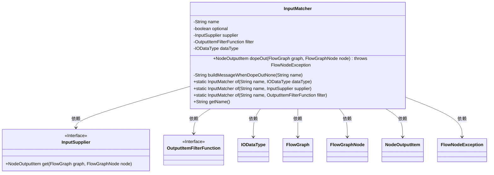
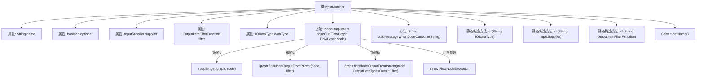

# 基础信息

|      |      |
|------|------|
| 名称 | InputMatcher |
| 编码语言 | .java |
| 代码路径 | WeFe/board/board-service/src/main/java/com/welab/wefe/board/service/component/base/io/InputMatcher.java |
| 包名 | com.welab.wefe.board.service.component.base.io |
| 依赖项 | ['com.welab.wefe.board.service.component.base.filter.OutputDataTypesOutputFilter', 'com.welab.wefe.board.service.component.base.filter.OutputItemFilterFunction', 'com.welab.wefe.board.service.exception.FlowNodeException', 'com.welab.wefe.board.service.model.FlowGraph', 'com.welab.wefe.board.service.model.FlowGraphNode', 'com.welab.wefe.common.wefe.enums.ComponentType'] |
| 概述说明 | InputMatcher类用于匹配输入节点，包含名称、可选性、三种匹配策略（直接供应、过滤查找、数据类型匹配），未找到时抛出异常并提供错误信息。 |

# 说明

InputMatcher类用于匹配流程图中节点的输入项，包含名称、是否可选、三种匹配策略（直接供应、适配检查、数据类型搜索）等属性。dopeOut方法按优先级尝试三种策略获取输入节点，失败时抛出异常并生成对应错误信息。提供三种静态工厂方法创建不同策略的匹配器，支持获取名称等基础操作。错误信息针对不同场景定制，如分箱模型、训练数据集等未找到时的提示。

# 类列表 Class Summary

| 名称   | 类型  | 说明 |
|-------|------|-------------|
| InputMatcher | class | InputMatcher类用于匹配流程图中节点的输入，支持三种策略：直接通过supplier获取、使用filter筛选或按数据类型自动搜索。若匹配失败且非可选参数，抛出异常并生成相应错误信息。 |

## 类 InputMatcher

|      |      |
|------|------|
| 访问范围 | public |
| 类型 | class |
| 名称 | InputMatcher |
| 说明 | InputMatcher类用于匹配流程图中节点的输入，支持三种策略：直接通过supplier获取、使用filter筛选或按数据类型自动搜索。若匹配失败且非可选参数，抛出异常并生成相应错误信息。 |

### UML类图

这段代码描述了一个输入匹配器类InputMatcher，它通过三种优先级策略（供应商直接提供、过滤器匹配、数据类型自动搜索）来查找流程图中的前置节点输出项。类包含核心方法dopeOut()实现三级查找策略，私有方法buildMessageWhenDopeOutNone()生成未找到节点的错误信息，以及三个静态工厂方法用于不同策略的实例创建。该类与多个接口和类存在依赖关系，包括输入供应商接口、输出项过滤器接口、数据类型类等，共同构成了一个灵活的节点匹配系统。

### 内部方法调用关系图

流程图描述了InputMatcher类的结构和主要方法调用关系。该类通过三种优先级策略（供应商直接获取、过滤器匹配、数据类型自动搜索）推测输入节点，若均失败且非可选参数则抛出异常。构造方法支持不同策略初始化，异常消息生成逻辑包含多种业务场景的定制化提示。整体展现了多策略组合的灵活输入匹配机制。

### 字段列表 Field List

| 名称  | 类型  | 说明 |
|-------|-------|------|
| name | String | 声明一个私有字符串变量name。 |
| dataType | IODataType | 私有IO数据类型变量dataType。 |
| filter | OutputItemFilterFunction | 私有过滤器函数变量filter。 |
| optional | boolean | 布尔类型私有变量optional，表示可选状态。 |
| supplier | InputSupplier | 私有输入供应接口实例。 |

### 方法列表

| 名称  | 类型  | 说明 |
|-------|-------|------|
| buildMessageWhenDopeOutNone | String | 方法根据输入name返回不同提示信息：分箱模型未找到、训练数据集未检查流程、验证数据集需用分段生成、数据集未检查流程，默认返回未找到提示。 |
| of | InputMatcher | 创建一个InputMatcher实例，设置名称和数据类型后返回。 |
| dopeOut | NodeOutputItem | 方法dopeOut通过三种策略获取节点输出：优先使用supplier，其次filter，最后按数据类型自动搜索。若未找到且非可选则抛出异常。 |
| of | InputMatcher | 创建InputMatcher实例，设置名称和supplier后返回。 |
| of | InputMatcher | 创建一个名为InputMatcher的静态方法，接收名称和过滤函数参数，初始化并返回InputMatcher对象。 |
| getName | String | 获取名称的方法，返回字符串类型的name变量值。 |

