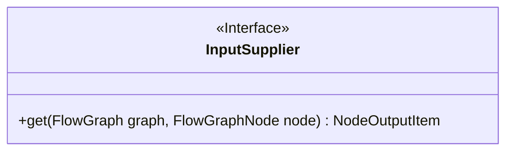
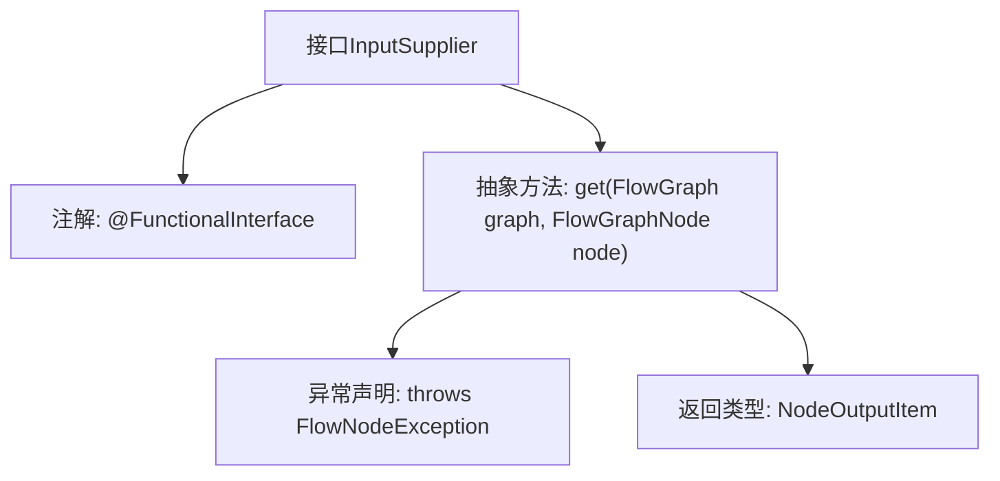

# 基础信息

|      |      |
|------|------|
| 名称 | InputSupplier |
| 编码语言 | .java |
| 代码路径 | WeFe/board/board-service/src/main/java/com/welab/wefe/board/service/component/base/io/InputSupplier.java |
| 包名 | com.welab.wefe.board.service.component.base.io |
| 依赖项 | ['com.welab.wefe.board.service.exception.FlowNodeException', 'com.welab.wefe.board.service.model.FlowGraph', 'com.welab.wefe.board.service.model.FlowGraphNode'] |
| 概述说明 | 功能接口InputSupplier定义方法get，根据图和节点获取输入项，可能抛出异常。 |

# 说明

这是一个名为InputSupplier的函数式接口，使用@FunctionalInterface注解标记。它定义了一个抽象方法get，该方法接收FlowGraph和FlowGraphNode两个参数，返回NodeOutputItem对象，并可能抛出FlowNodeException异常。接口的文档说明指出get方法需要独立于图结构查找输入节点。该接口简洁明了，符合函数式编程范式，适用于需要动态获取节点输入的场景。

# 类列表 Class Summary

| 名称   | 类型  | 说明 |
|-------|------|-------------|
| InputSupplier | interface | 功能接口InputSupplier定义方法get，根据graph和node获取NodeOutputItem，可能抛出FlowNodeException。 |

## 类 InputSupplier

|      |      |
|------|------|
| 访问范围 | @FunctionalInterface;public |
| 类型 | interface |
| 名称 | InputSupplier |
| 说明 | 功能接口InputSupplier定义方法get，根据graph和node获取NodeOutputItem，可能抛出FlowNodeException。 |

### UML类图

这段类图描述了一个函数式接口`InputSupplier`，它定义了单一抽象方法`get()`，该方法接收`FlowGraph`和`FlowGraphNode`参数，返回`NodeOutputItem`并可能抛出`FlowNodeException`。作为函数式接口，它主要用于Lambda表达式或方法引用，为流程图的节点提供输入数据获取的标准化方式。接口设计体现了依赖注入思想，将图结构和节点作为参数传入，使实现类无需绑定具体上下文。

### 内部方法调用关系图

该流程图展示了InputSupplier接口的结构，这是一个函数式接口（由@FunctionalInterface标注），核心是定义了get抽象方法。该方法接收FlowGraph和FlowGraphNode参数，返回NodeOutputItem对象，并可能抛出FlowNodeException异常。图中清晰呈现了接口的注解、方法签名、返回类型和异常声明的层级关系，符合函数式接口的单抽象方法特征。

### 字段列表 Field List

| 名称  | 类型  | 说明 |
|-------|-------|------|

### 方法列表

| 名称  | 类型  | 说明 |
|-------|-------|------|
| get | NodeOutputItem | 获取节点输出项，需传入流程图和节点参数，可能抛出节点异常。 |

