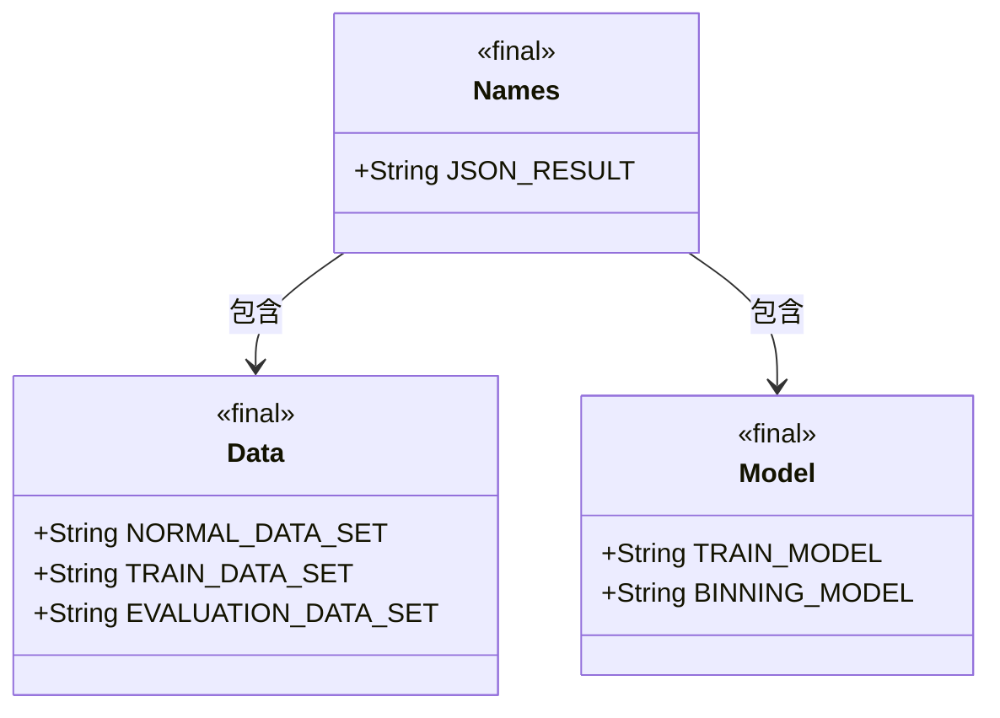
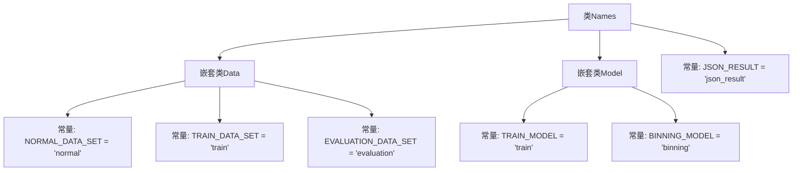

# 基础信息

|      |      |
|------|------|
| 名称 | Names |
| 编码语言 | .java |
| 代码路径 | WeFe/board/board-service/src/main/java/com/welab/wefe/board/service/component/base/io/Names.java |
| 包名 | com.welab.wefe.board.service.component.base.io |
| 依赖项 | [] |
| 概述说明 | Java类Names包含静态嵌套类Data和Model，分别定义数据集和模型类型的常量字符串，以及一个JSON结果常量。 |

# 说明

这是一个名为Names的Java公共类，包含三个主要部分。第一部分是Data静态嵌套类，定义了三个字符串常量：NORMAL_DATA_SET表示普通数据集，TRAIN_DATA_SET表示训练数据集，EVALUATION_DATA_SET表示评估数据集。第二部分是Model静态嵌套类，定义了两个字符串常量：TRAIN_MODEL表示训练模型，BINNING_MODEL表示分箱模型。第三部分是一个独立的字符串常量JSON_RESULT，表示JSON格式的结果。整个类用于集中管理项目中使用的各种名称常量。

# 类列表 Class Summary

| 名称   | 类型  | 说明 |
|-------|------|-------------|
| Names | class | Java类Names包含静态嵌套类Data和Model，分别定义数据集和模型类型的常量字符串，以及一个JSON结果常量。 |

## 类 Names

|      |      |
|------|------|
| 访问范围 | public |
| 类型 | class |
| 名称 | Names |
| 说明 | Java类Names包含静态嵌套类Data和Model，分别定义数据集和模型类型的常量字符串，以及一个JSON结果常量。 |

### UML类图

这段代码定义了一个名为Names的类，其中包含两个静态内部类Data和Model，以及一个静态常量JSON_RESULT。Data类定义了三种数据集类型的常量字符串，Model类定义了两种模型类型的常量字符串。Names类作为容器，通过包含关系组织这些常量定义，便于统一管理和访问。所有类和字段都被声明为final，表明它们是不可变的常量定义。

### 内部方法调用关系图

该流程图展示了Names类的结构，包含两个嵌套静态类Data和Model，以及一个顶级常量JSON_RESULT。Data类定义了三个数据集类型常量，Model类包含两个模型类型常量。所有成员均为public static final类型，表明这是一个不可变的常量定义类，用于集中管理项目中的字符串常量。

### 字段列表 Field List

| 名称  | 类型  | 说明 |
|-------|-------|------|
| JSON_RESULT = "json_result" | String | 定义静态常量JSON_RESULT，值为"json_result"。 |

### 方法列表

| 名称  | 类型  | 说明 |
|-------|-------|------|

