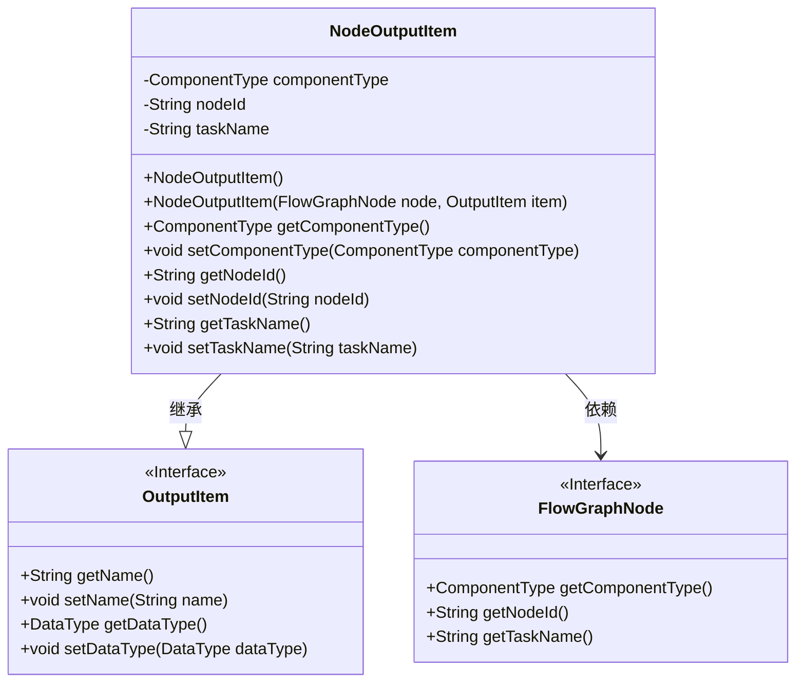
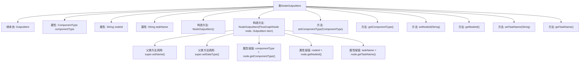

# 基础信息

|      |      |
|------|------|
| 名称 | NodeOutputItem |
| 编码语言 | .java |
| 代码路径 | WeFe/board/board-service/src/main/java/com/welab/wefe/board/service/component/base/io/NodeOutputItem.java |
| 包名 | com.welab.wefe.board.service.component.base.io |
| 依赖项 | ['com.welab.wefe.board.service.model.FlowGraphNode', 'com.welab.wefe.common.wefe.enums.ComponentType'] |
| 概述说明 | NodeOutputItem继承OutputItem，包含组件类型、节点ID和任务名称属性，提供构造方法和getter/setter。 |

# 说明

NodeOutputItem类继承自OutputItem，用于封装节点输出项的相关信息。该类包含三个私有属性：componentType表示组件类型，nodeId表示节点ID，taskName表示任务名称。提供了无参构造函数和基于FlowGraphNode与OutputItem的构造方法，后者会设置父类的name和dataType属性，并初始化本类的三个属性。同时提供了这三个属性的getter和setter方法，用于获取和设置对应的属性值。

# 类列表 Class Summary

| 名称   | 类型  | 说明 |
|-------|------|-------------|
| NodeOutputItem | class | NodeOutputItem继承OutputItem，包含组件类型、节点ID和任务名称属性，提供构造方法和getter/setter。 |

## 类 NodeOutputItem

|      |      |
|------|------|
| 访问范围 | public |
| 类型 | class |
| 名称 | NodeOutputItem |
| 说明 | NodeOutputItem继承OutputItem，包含组件类型、节点ID和任务名称属性，提供构造方法和getter/setter。 |

### UML类图

这段代码定义了一个`NodeOutputItem`类，继承自`OutputItem`接口，并包含与节点相关的属性（`componentType`、`nodeId`、`taskName`）。该类通过构造函数从`FlowGraphNode`和`OutputItem`实例中初始化这些属性，同时提供了相应的getter和setter方法。类图清晰地展示了继承关系和依赖关系，`NodeOutputItem`作为具体实现类扩展了基础接口的功能，并与流程图的节点结构进行交互。

### 内部方法调用关系图

这段代码展示了一个继承自OutputItem的NodeOutputItem类，主要用于封装节点输出信息。类中包含两个构造方法（默认构造方法和带参数的构造方法），以及三个属性的getter/setter方法。带参数的构造方法通过FlowGraphNode和OutputItem对象初始化自身属性，同时调用父类方法设置名称和数据类型。流程图清晰地展示了类的继承关系、属性、方法调用链和构造过程中的赋值逻辑。

### 字段列表 Field List

| 名称  | 类型  | 说明 |
|-------|-------|------|
| nodeId | String | 私有字符串类型变量nodeId |
| taskName | String | 私有字符串变量taskName，用于存储任务名称。 |
| componentType | ComponentType | 私有组件类型变量componentType。 |

### 方法列表

| 名称  | 类型  | 说明 |
|-------|-------|------|
| setTaskName | void | 这是一个Java方法，用于设置任务名称。方法接收一个字符串参数taskName，并将其赋值给类的成员变量taskName。 |
| setNodeId | void | 设置节点ID的方法，将参数nodeId赋值给当前对象的nodeId属性。 |
| getNodeId | String | 获取节点ID的方法，返回字符串类型的nodeId。 |
| getComponentType | ComponentType | 获取组件类型的方法，返回componentType属性值。 |
| getTaskName | String | 获取任务名称的方法，返回字符串类型的taskName。 |
| setComponentType | void | 设置组件类型的方法，将参数componentType赋值给当前对象的componentType属性。 |

