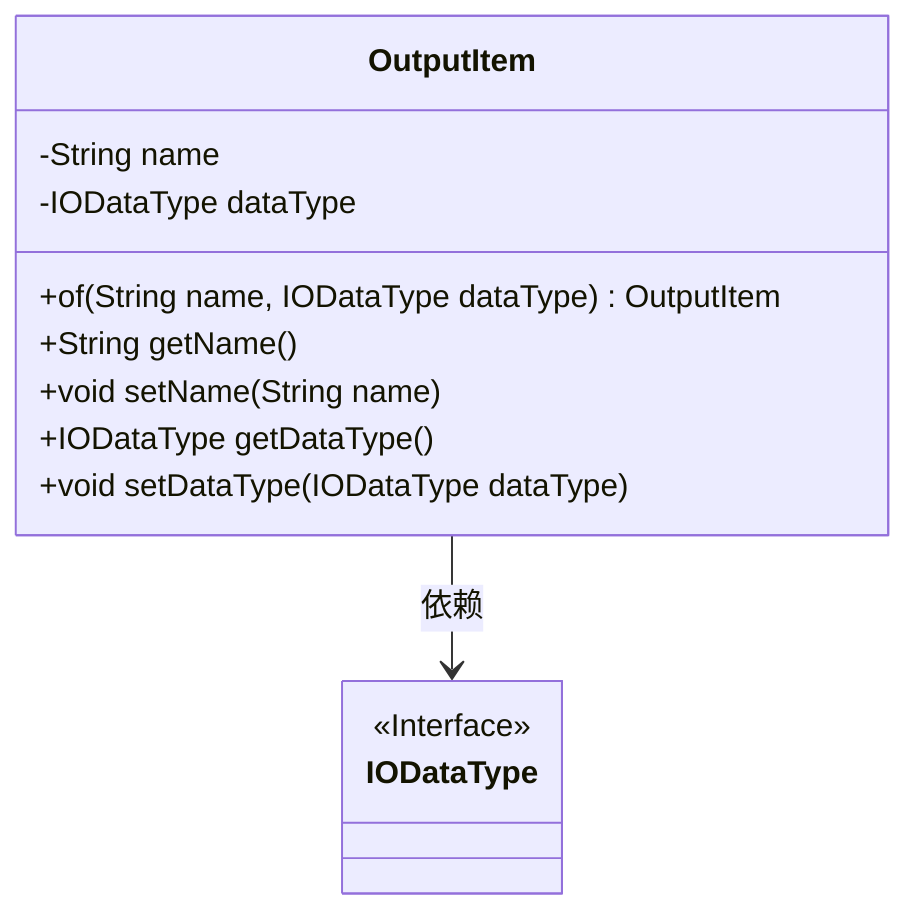
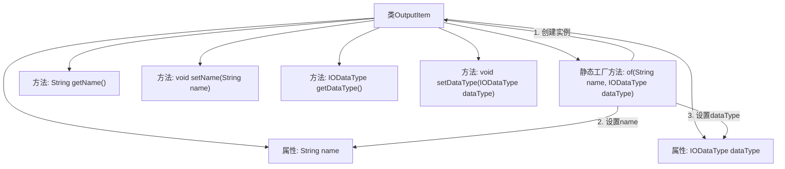

# 基础信息

|      |      |
|------|------|
| 名称 | OutputItem |
| 编码语言 | .java |
| 代码路径 | WeFe/board/board-service/src/main/java/com/welab/wefe/board/service/component/base/io/OutputItem.java |
| 包名 | com.welab.wefe.board.service.component.base.io |
| 依赖项 | [] |
| 概述说明 | OutputItem类包含name和dataType属性，提供静态创建方法及getter/setter。 |

# 说明

OutputItem类是一个用于封装输出项的Java类，包含两个私有属性：name（字符串类型）和dataType（IODataType类型）。该类提供了静态工厂方法of，用于快速创建实例并初始化属性值。同时提供了标准的getter和setter方法，用于访问和修改这两个属性。整体设计简洁，符合Java Bean规范，便于管理和操作输出项数据。

# 类列表 Class Summary

| 名称   | 类型  | 说明 |
|-------|------|-------------|
| OutputItem | class | OutputItem类包含name和dataType属性，提供静态创建方法及getter/setter。 |

## 类 OutputItem

|      |      |
|------|------|
| 访问范围 | public |
| 类型 | class |
| 名称 | OutputItem |
| 说明 | OutputItem类包含name和dataType属性，提供静态创建方法及getter/setter。 |

### UML类图

这段代码定义了一个名为OutputItem的类，用于封装输出项的名称和数据类型。该类包含两个私有字段name和dataType，其中dataType依赖于IODataType接口。提供了静态工厂方法of()用于创建实例，以及标准的getter/setter方法。类图清晰地展示了OutputItem与IODataType之间的依赖关系，体现了通过接口实现数据类型解耦的设计思路。

### 内部方法调用关系图

该流程图展示了OutputItem类的结构，包含两个私有属性和五个方法。核心是静态工厂方法of()，它通过三步创建并初始化对象：首先实例化OutputItem，然后分别设置name和dataType属性，最后返回构建好的对象。其他四个方法用于属性的读写操作，遵循标准的JavaBean规范。类设计简洁，通过工厂方法封装了对象创建逻辑。

### 字段列表 Field List

| 名称  | 类型  | 说明 |
|-------|-------|------|
| name | String | 声明一个私有字符串变量name。 |
| dataType | IODataType | 私有数据类型变量dataType。 |

### 方法列表

| 名称  | 类型  | 说明 |
|-------|-------|------|
| of | OutputItem | 静态方法`of`创建并返回`OutputItem`实例，设置名称和数据类型属性。 |
| setName | void | 设置对象名称的方法，将参数name赋值给当前对象的name属性。 |
| getDataType | IODataType | 获取数据类型的方法，返回IODataType对象。 |
| setDataType | void | 设置数据类型的方法，将输入参数赋值给类的dataType属性。 |
| getName | String | 方法返回字符串类型的name变量值。 |

