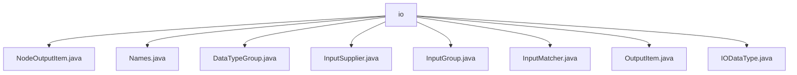

# 基础信息

|      |      |
|------|------|
| 名称 | io |
| 编码语言 | .java |
| 代码路径 | WeFe/board/board-service/src/main/java/com/welab/wefe/board/service/component/base/io |
| 包名 | docs.board.board-service.src.main.java.com.welab.wefe.board.service.component.base.io |
| 概述说明 | NodeOutputItem继承OutputItem，封装节点输出信息，含组件类型、节点ID、任务名称属性。Names类管理数据集、模型等名称常量。DataTypeGroup枚举定义数据分组类型。InputSupplier是获取节点输入的函数式接口。InputGroup管理输入数据分组并转为JSON。InputMatcher匹配节点输入项，支持三种策略。OutputItem封装输出项，含名称和数据类型。IODataType枚举定义各类数据类型及分组。 |

# 说明

## 概述  
该模块核心职责是管理联邦学习流程图中节点的输入输出数据，包括类型定义、匹配策略和结构化转换。接口规范涵盖InputSupplier函数式接口（类似工厂模式）和InputMatcher的三种匹配策略（直接供应/适配检查/数据类型搜索）。关键数据结构包括NodeOutputItem（封装节点输出）、InputGroup（JSON结构化）和枚举类IODataType/DataTypeGroup（类型分类）。外部依赖仅FlowGraph相关类。例如NodeOutputItem继承OutputItem扩展节点信息，Names类集中管理常量如TRAIN_DATA_SET。

## 主要业务场景  
模块主要处理流程图节点间的数据交互，例如训练数据集匹配或模型传递。完整流程包含：1）通过InputMatcher按优先级策略查找输入；2）使用InputGroup将数据转换为内核所需的JSON结构；3）通过IODataType校验类型合法性。典型应用如分箱模型匹配，错误提示会区分TRAIN_MODEL或BINNING_MODEL。API集成案例包括InputSupplier动态获取节点输入，类似回调机制。交互模式统一为"匹配-转换-校验"三步流程。

### 包内部结构视图

该流程图展示了WeFe项目中board-service组件的基础IO模块结构。io目录下包含8个Java文件，分别处理不同类型的输入输出操作，包括节点输出项、数据类型组、输入供应器、输入匹配器等核心功能类。这些文件共同构成了组件间数据交互的基础设施。

# 文件列表

| 名称   | 类型  | 说明 |
|-------|------|-------------|
| [NodeOutputItem.java](NodeOutputItem.md) | file | NodeOutputItem继承OutputItem，包含组件类型、节点ID和任务名称属性，提供构造方法和getter/setter。 |
| [Names.java](Names.md) | file | Java类Names包含静态嵌套类Data和Model，分别定义数据集和模型类型的常量字符串，以及一个JSON结果常量。 |
| [DataTypeGroup.java](DataTypeGroup.md) | file | 枚举DataTypeGroup定义了三种数据类型：Data（键为"data"）、Model（键为"model"）和Other（键为"json"），通过getKey()方法获取键值。 |
| [InputSupplier.java](InputSupplier.md) | file | 功能接口InputSupplier定义方法get，根据图和节点获取输入项，可能抛出异常。 |
| [InputGroup.java](InputGroup.md) | file | InputGroup类包含DataTypeGroup和NodeOutputItem列表，提供toJsonNode方法将数据转换为内核所需的JSON结构，并包含getter/setter方法。 |
| [InputMatcher.java](InputMatcher.md) | file | InputMatcher类用于匹配输入节点，包含名称、可选性、三种匹配策略（直接供应、过滤查找、数据类型匹配），未找到时抛出异常并提供错误信息。 |
| [OutputItem.java](OutputItem.md) | file | OutputItem类包含name和dataType属性，提供静态创建方法及getter/setter。 |
| [IODataType.java](IODataType.md) | file | 枚举IODataType定义了数据类型，包括原始数据集、加载数据集、逻辑回归模型、XGBoost模型、分箱模型、深度学习模型和Json结果，每个类型有标签和分组属性。 |

