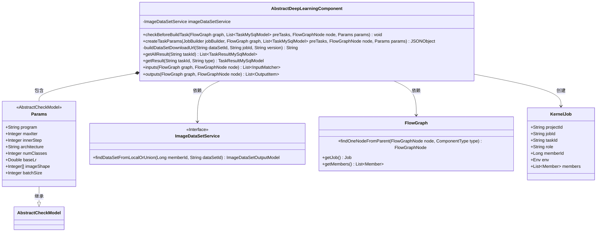
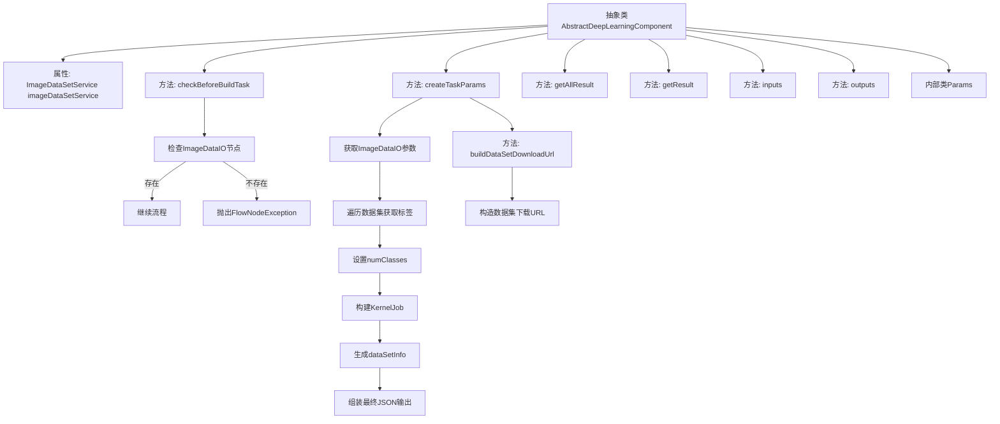

# 基础信息

|      |      |
|------|------|
| 名称 | AbstractDeepLearningComponent |
| 编码语言 | .java |
| 代码路径 | WeFe/board/board-service/src/main/java/com/welab/wefe/board/service/component/deep_learning/AbstractDeepLearningComponent.java |
| 包名 | com.welab.wefe.board.service.component.deep_learning |
| 依赖项 | ['com.alibaba.fastjson.JSONObject', 'com.welab.wefe.board.service.api.data_resource.image_data_set.ImageDataSetDownloadApi', 'com.welab.wefe.board.service.component.base.AbstractComponent', 'com.welab.wefe.board.service.component.base.io.InputMatcher', 'com.welab.wefe.board.service.component.base.io.OutputItem', 'com.welab.wefe.board.service.database.entity.job.TaskMySqlModel', 'com.welab.wefe.board.service.database.entity.job.TaskResultMySqlModel', 'com.welab.wefe.board.service.dto.entity.data_resource.output.DataResourceOutputModel', 'com.welab.wefe.board.service.dto.entity.data_resource.output.ImageDataSetOutputModel', 'com.welab.wefe.board.service.dto.kernel.Member', 'com.welab.wefe.board.service.dto.kernel.deep_learning.Env', 'com.welab.wefe.board.service.dto.kernel.deep_learning.KernelJob', 'com.welab.wefe.board.service.exception.FlowNodeException', 'com.welab.wefe.board.service.model.FlowGraph', 'com.welab.wefe.board.service.model.FlowGraphNode', 'com.welab.wefe.board.service.model.JobBuilder', 'com.welab.wefe.board.service.service.CacheObjects', 'com.welab.wefe.board.service.service.data_resource.image_data_set.ImageDataSetService', 'com.welab.wefe.board.service.service.data_resource.image_data_set.data_set_parser.AbstractImageDataSetParser', 'com.welab.wefe.board.service.service.globalconfig.GlobalConfigService', 'com.welab.wefe.common.exception.StatusCodeWithException', 'com.welab.wefe.common.fieldvalidate.AbstractCheckModel', 'com.welab.wefe.common.fieldvalidate.annotation.Check', 'com.welab.wefe.common.util.JObject', 'com.welab.wefe.common.util.StringUtil', 'com.welab.wefe.common.web.Launcher', 'com.welab.wefe.common.web.api.base.Api', 'com.welab.wefe.common.wefe.dto.global_config.BoardConfigModel', 'com.welab.wefe.common.wefe.enums.ComponentType', 'org.springframework.beans.factory.annotation.Autowired', 'java.util.HashSet', 'java.util.List', 'java.util.Set'] |
| 概述说明 | 抽象深度学习组件类，继承自AbstractComponent，包含数据集检查、任务参数创建、结果获取等方法。Params类定义算法类型、迭代次数等必填参数。核心功能包括验证数据集存在性、构建任务参数JSON、生成数据集下载URL等。 |

# 说明

这是一个名为AbstractDeepLearningComponent的抽象类，继承自AbstractComponent，用于深度学习组件的基础实现。该类主要包含以下功能：1. 在构建任务前检查是否已选择数据集；2. 创建任务参数，包括数据集信息、算法配置等；3. 提供获取任务结果的方法；4. 定义了一个Params内部类，包含深度学习算法所需的各类参数，如算法类型、迭代次数、学习率等。该类通过自动注入的imageDataSetService处理数据集相关操作，并提供了构建数据集下载URL的方法。

# 类列表 Class Summary

| 名称   | 类型  | 说明 |
|-------|------|-------------|
| AbstractDeepLearningComponent | class | 抽象深度学习组件类，包含数据集检查、任务参数创建及结果获取功能，定义算法参数如类型、迭代次数等。 |

## 类 AbstractDeepLearningComponent

|      |      |
|------|------|
| 访问范围 | public abstract |
| 类型 | class |
| 名称 | AbstractDeepLearningComponent |
| 说明 | 抽象深度学习组件类，包含数据集检查、任务参数创建及结果获取功能，定义算法参数如类型、迭代次数等。 |

### UML类图

该代码展示了一个深度学习组件的抽象基类，主要处理与图像数据集相关的任务参数构建和验证。类图包含6个核心类：AbstractDeepLearningComponent作为主类，通过依赖注入使用ImageDataSetService服务，继承自泛型化的AbstractComponent；包含静态内部类Params用于存储算法配置参数；与FlowGraph交互获取节点信息；创建KernelJob对象封装任务参数。组件实现了任务前置检查、参数生成、结果查询等核心方法，体现了深度学习任务处理流程的关键逻辑。

### 内部方法调用关系图

该流程图展示了抽象类AbstractDeepLearningComponent的核心结构，重点描述了数据验证和任务参数创建流程。类通过checkBeforeBuildTask确保数据集节点存在，createTaskParams方法负责构建深度学习任务参数，包括数据集处理、作业配置和结果组装。内部类Params定义了算法所需的参数校验规则，整体实现了深度学习组件的核心功能逻辑。

### 字段列表 Field List

| 名称  | 类型  | 说明 |
|-------|-------|------|
| imageDataSetService | ImageDataSetService | 代码片段使用@Autowired自动注入ImageDataSetService实例。 |

### 方法列表

| 名称  | 类型  | 说明 |
|-------|-------|------|
| getAllResult | List<TaskResultMySqlModel> | 这是一个Java方法重写，通过调用taskResultService的listAllResult方法，根据taskId获取所有任务结果并返回列表。 |
| checkBeforeBuildTask | void | 检查构建任务前确保存在数据集节点，否则抛出未选择数据集异常。 |
| createTaskParams | JSONObject | 该方法为深度学习任务创建参数，包括数据集标签处理、任务信息封装及输出配置。主要步骤：提取数据集标签并计算类别数，构建任务核心参数，整合数据集下载信息，最终生成包含算法配置的JSON输出。 |
| buildDataSetDownloadUrl | String | 构建数据集下载URL方法：通过注解获取路径，结合配置内网基础URI，拼接数据集ID、任务ID和版本参数生成完整URL。 |
| getResult | TaskResultMySqlModel | 重写方法，根据任务ID和类型查询MySQL结果。 |
| inputs | List<InputMatcher> | Java方法重写，返回空输入匹配器列表。 |
| outputs | List<OutputItem> | 重写outputs方法，返回空值，接收FlowGraph和FlowGraphNode参数，可能抛出FlowNodeException异常。 |

