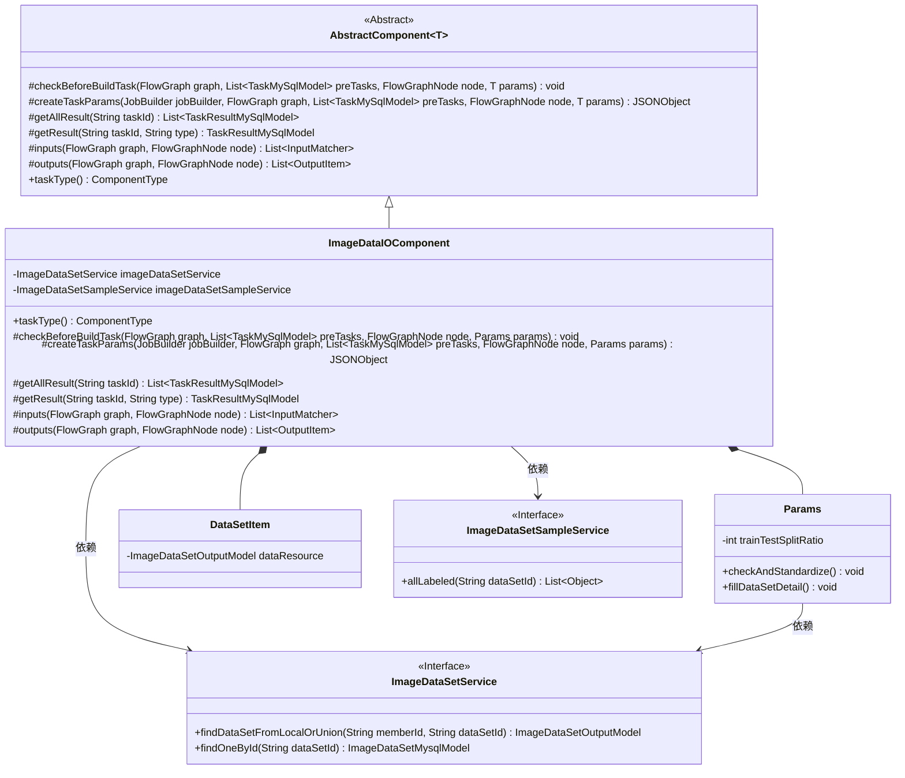
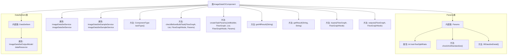

# 基础信息

|      |      |
|------|------|
| 名称 | ImageDataIOComponent |
| 编码语言 | .java |
| 代码路径 | WeFe/board/board-service/src/main/java/com/welab/wefe/board/service/component/deep_learning/ImageDataIOComponent.java |
| 包名 | com.welab.wefe.board.service.component.deep_learning |
| 依赖项 | ['com.alibaba.fastjson.JSONObject', 'com.welab.wefe.board.service.component.base.AbstractComponent', 'com.welab.wefe.board.service.component.base.dto.AbstractDataIOParam', 'com.welab.wefe.board.service.component.base.dto.AbstractDataSetItem', 'com.welab.wefe.board.service.component.base.io.InputMatcher', 'com.welab.wefe.board.service.component.base.io.OutputItem', 'com.welab.wefe.board.service.database.entity.data_resource.ImageDataSetMysqlModel', 'com.welab.wefe.board.service.database.entity.job.JobMemberMySqlModel', 'com.welab.wefe.board.service.database.entity.job.TaskMySqlModel', 'com.welab.wefe.board.service.database.entity.job.TaskResultMySqlModel', 'com.welab.wefe.board.service.dto.entity.data_resource.output.ImageDataSetOutputModel', 'com.welab.wefe.board.service.exception.FlowNodeException', 'com.welab.wefe.board.service.model.FlowGraph', 'com.welab.wefe.board.service.model.FlowGraphNode', 'com.welab.wefe.board.service.model.JobBuilder', 'com.welab.wefe.board.service.service.CacheObjects', 'com.welab.wefe.board.service.service.data_resource.image_data_set.ImageDataSetSampleService', 'com.welab.wefe.board.service.service.data_resource.image_data_set.ImageDataSetService', 'com.welab.wefe.board.service.service.data_resource.image_data_set.data_set_parser.AbstractImageDataSetParser', 'com.welab.wefe.common.StatusCode', 'com.welab.wefe.common.exception.StatusCodeWithException', 'com.welab.wefe.common.fieldvalidate.annotation.Check', 'com.welab.wefe.common.util.JObject', 'com.welab.wefe.common.util.StringUtil', 'com.welab.wefe.common.web.Launcher', 'com.welab.wefe.common.wefe.enums.ComponentType', 'com.welab.wefe.common.wefe.enums.JobMemberRole', 'org.apache.commons.collections4.CollectionUtils', 'org.springframework.beans.factory.annotation.Autowired', 'org.springframework.stereotype.Service', 'java.util.List'] |
| 概述说明 | ImageDataIOComponent是处理图像数据集的组件，用于联邦学习任务。主要功能包括：检查数据集有效性（成员数、数据集数、标签一致性）、生成数据集文件、管理任务结果。参数验证包括数据集切割比例（1-99）。适用于多成员协作场景，确保数据合规性。 |

# 说明

ImageDataIOComponent是一个用于处理图像数据集输入输出的服务组件，继承自AbstractComponent。它通过imageDataSetService和imageDataSetSampleService进行数据集操作。主要功能包括：在构建任务前检查数据集有效性，要求至少两个成员和数据集，确保promoter角色存在且数据集标签一致；创建任务时生成数据集文件并设置版本；提供获取任务结果的方法。Params类定义了数据集切割比例参数并验证其范围，DataSetItem类包含数据集资源信息。该组件确保联邦学习任务中数据集的有效性和一致性。

# 类列表 Class Summary

| 名称   | 类型  | 说明 |
|-------|------|-------------|
| ImageDataIOComponent | class | ImageDataIOComponent是一个处理图像数据集输入输出的组件，继承自AbstractComponent。主要功能包括：检查数据集有效性（成员数量、标签一致性等）、生成数据集文件、管理任务结果。Params类定义了数据集切割比例等参数，并进行校验。 |

## 类 ImageDataIOComponent

|      |      |
|------|------|
| 访问范围 | @Service;public |
| 类型 | class |
| 名称 | ImageDataIOComponent |
| 说明 | ImageDataIOComponent是一个处理图像数据集输入输出的组件，继承自AbstractComponent。主要功能包括：检查数据集有效性（成员数量、标签一致性等）、生成数据集文件、管理任务结果。Params类定义了数据集切割比例等参数，并进行校验。 |

### UML类图

类图描述：该图展示了ImageDataIOComponent及其相关类的结构。ImageDataIOComponent继承自泛型抽象类AbstractComponent，包含Params和DataSetItem两个内部类，并依赖ImageDataSetService和ImageDataSetSampleService接口。主要功能包括数据集的验证、任务参数创建和结果处理，涉及联邦学习场景下的多成员数据集协调与标签一致性检查。

### 内部方法调用关系图

这段代码定义了一个名为ImageDataIOComponent的服务类，继承自AbstractComponent，主要用于处理图像数据的输入输出操作。该类包含多个方法，如检查任务构建前的条件、创建任务参数、获取任务结果等。其中，checkBeforeBuildTask方法负责验证数据集的有效性和一致性，createTaskParams方法用于生成任务参数并处理数据集文件。此外，该类还包含两个内部类Params和DataSetItem，分别用于定义数据集的参数和数据集项。Params类包含数据集切割比例等属性，并提供了参数检查和标准化方法；DataSetItem类则包含数据资源属性。整体上，该类设计用于联邦学习场景下的图像数据处理和任务管理。

### 字段列表 Field List

| 名称  | 类型  | 说明 |
|-------|-------|------|
| imageDataSetSampleService | ImageDataSetSampleService | 自动注入ImageDataSetSampleService实例。 |
| imageDataSetService | ImageDataSetService | 使用@Autowired自动注入ImageDataSetService实例。 |

### 方法列表

| 名称  | 类型  | 说明 |
|-------|-------|------|
| inputs | List<InputMatcher> | 重写方法inputs返回空列表，参数为graph和node。 |
| getResult | TaskResultMySqlModel | 重写方法，通过任务ID和类型查询结果。 |
| getAllResult | List<TaskResultMySqlModel> | 该方法重写父类逻辑，通过调用taskResultService的listAllResult方法获取指定taskId对应的所有任务结果列表。 |
| taskType | ComponentType | 方法重写，返回组件类型为ImageDataIO。 |
| createTaskParams | JSONObject | 方法根据任务参数创建JSON对象，筛选匹配的数据集配置，解析样本生成数据集文件，并设置版本到jobBuilder。返回包含数据集信息的JObject。 |
| outputs | List<OutputItem> | 重写outputs方法，返回空值，接收FlowGraph和FlowGraphNode参数，可能抛出FlowNodeException异常。 |
| checkBeforeBuildTask | void | 方法检查联邦学习任务构建前的条件：成员至少2个且含promoter，数据集需多个且有效，标签列表需一致，否则抛出异常。 |

