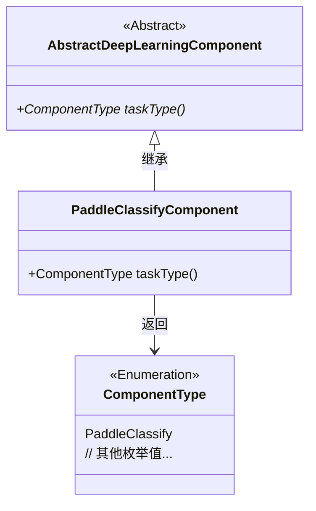
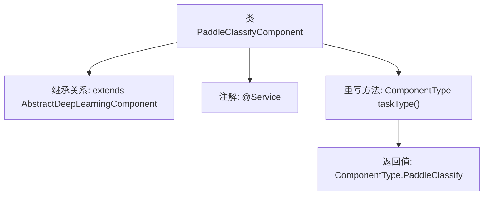

# 基础信息

|      |      |
|------|------|
| 名称 | PaddleClassifyComponent |
| 编码语言 | .java |
| 代码路径 | WeFe/board/board-service/src/main/java/com/welab/wefe/board/service/component/deep_learning/PaddleClassifyComponent.java |
| 包名 | com.welab.wefe.board.service.component.deep_learning |
| 依赖项 | ['com.welab.wefe.common.wefe.enums.ComponentType', 'org.springframework.stereotype.Service'] |
| 概述说明 | 这是一个名为PaddleClassifyComponent的Java服务类，继承自AbstractDeepLearningComponent，重写taskType方法返回PaddleClassify类型。 |

# 说明

该代码片段定义了一个名为PaddleClassifyComponent的服务类，继承自AbstractDeepLearningComponent抽象类。该类通过@Service注解标识为Spring框架的服务组件，并重写了taskType方法，返回ComponentType枚举中的PaddleClassify类型，表明这是一个基于Paddle框架的分类任务组件。

# 类列表 Class Summary

| 名称   | 类型  | 说明 |
|-------|------|-------------|
| PaddleClassifyComponent | class | 这是一个基于Paddle的深度学习分类组件，继承自抽象深度学习组件类，并指定了组件类型为PaddleClassify。 |

## 类 PaddleClassifyComponent

|      |      |
|------|------|
| 访问范围 | @Service;public |
| 类型 | class |
| 名称 | PaddleClassifyComponent |
| 说明 | 这是一个基于Paddle的深度学习分类组件，继承自抽象深度学习组件类，并指定了组件类型为PaddleClassify。 |

### UML类图

该类图展示了一个基于Spring的服务组件继承结构。PaddleClassifyComponent继承自抽象类AbstractDeepLearningComponent，并实现了其抽象方法taskType()，返回特定的ComponentType枚举值。ComponentType是一个枚举类型，其中包含PaddleClassify等分类标识。整体结构体现了模板方法模式的应用，父类定义框架而子类实现具体类型判断逻辑。

### 内部方法调用关系图

这段流程图展示了PaddleClassifyComponent类的结构，它是一个继承自AbstractDeepLearningComponent的服务类，通过@Service注解标识，并重写了taskType()方法返回特定的组件类型。该图清晰地呈现了类的继承关系、注解使用和核心方法实现，层级关系明确，便于理解这个轻量级分类组件的设计结构。

### 字段列表 Field List

| 名称  | 类型  | 说明 |
|-------|-------|------|

### 方法列表

| 名称  | 类型  | 说明 |
|-------|-------|------|
| taskType | ComponentType | 该方法返回组件类型为PaddleClassify。 |

