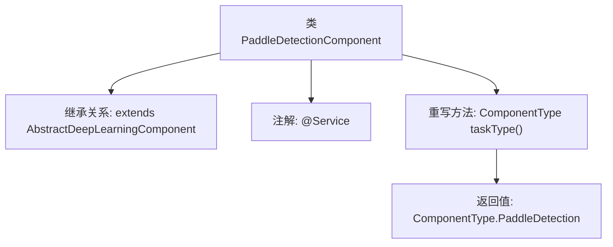

# 基础信息

|      |      |
|------|------|
| 名称 | PaddleDetectionComponent |
| 编码语言 | .java |
| 代码路径 | WeFe/board/board-service/src/main/java/com/welab/wefe/board/service/component/deep_learning/PaddleDetectionComponent.java |
| 包名 | com.welab.wefe.board.service.component.deep_learning |
| 依赖项 | ['com.welab.wefe.common.wefe.enums.ComponentType', 'org.springframework.stereotype.Service'] |
| 概述说明 | 这是一个基于PaddleDetection的深度学习组件类，继承自抽象类AbstractDeepLearningComponent，并指定了组件类型为PaddleDetection。 |

# 说明

该代码片段定义了一个名为PaddleDetectionComponent的Spring服务类，继承自AbstractDeepLearningComponent抽象类。该类通过重写taskType方法明确指定其组件类型为PaddleDetection，表明这是一个基于PaddlePaddle框架的目标检测功能组件。整个实现简洁地完成了组件类型标识的核心功能。

# 类列表 Class Summary

| 名称   | 类型  | 说明 |
|-------|------|-------------|
| PaddleDetectionComponent | class | 这是一个名为PaddleDetectionComponent的Java服务类，继承自AbstractDeepLearningComponent，重写了taskType方法并返回PaddleDetection类型。 |


## 类 PaddleDetectionComponent

|      |      |
|------|------|
| 访问范围 | @Service;public |
| 类型 | class |
| 名称 | PaddleDetectionComponent |
| 说明 | 这是一个名为PaddleDetectionComponent的Java服务类，继承自AbstractDeepLearningComponent，重写了taskType方法并返回PaddleDetection类型。 |


### UML类图

```mermaid
classDiagram
    class AbstractDeepLearningComponent {
        <<Abstract>>
        +ComponentType taskType()*
    }
    // AbstractDeepLearningComponent 是所有深度学习组件的基类
    class PaddleDetectionComponent {
        +ComponentType taskType()
    }
    class ComponentType {
        <<Enumeration>>
        PaddleDetection
        // 其他枚举值...
    }
    AbstractDeepLearningComponent <|-- PaddleDetectionComponent : 继承
    PaddleDetectionComponent --> ComponentType : 使用
```

该类图展示了PaddleDetectionComponent继承自抽象基类AbstractDeepLearningComponent，并实现了taskType()方法返回特定的ComponentType枚举值。其中AbstractDeepLearningComponent定义了抽象方法taskType()，PaddleDetectionComponent作为具体实现类将其特化为PaddleDetection类型。ComponentType是包含PaddleDetection等值的枚举类型，用于标识组件类别。整体结构体现了模板方法模式的应用。


### 内部方法调用关系图



这段流程图展示了PaddleDetectionComponent类的结构，它是一个继承自AbstractDeepLearningComponent的服务类，通过@Service注解标识为Spring组件。核心功能是重写taskType()方法，返回特定的PaddleDetection组件类型枚举值。该设计实现了组件类型的多态识别，符合深度学习组件的扩展架构要求，总节点数控制在合理范围内。

### 字段列表 Field List

| 名称  | 类型  | 说明 |
|-------|-------|------|

### 方法列表

| 名称  | 类型  | 说明 |
|-------|-------|------|
| taskType | ComponentType | 该方法重写父类方法，返回组件类型为PaddleDetection。 |


