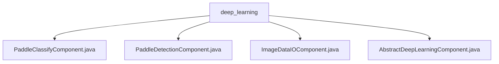

# 基础信息

|      |      |
|------|------|
| 名称 | deep_learning |
| 编码语言 | .java |
| 代码路径 | WeFe/board/board-service/src/main/java/com/welab/wefe/board/service/component/deep_learning |
| 包名 | docs.board.board-service.src.main.java.com.welab.wefe.board.service.component.deep_learning |
| 概述说明 | PaddleClassifyComponent是Paddle分类组件，PaddleDetectionComponent是Paddle检测组件，均继承AbstractDeepLearningComponent。ImageDataIOComponent处理图像数据集输入输出，确保数据有效性。AbstractDeepLearningComponent是深度学习组件基类，提供任务构建和参数处理功能。 |

# 说明

## 概述  
该模块是联邦学习平台中基于PaddlePaddle框架的深度学习组件集合，核心职责是实现图像分类(PaddleClassify)、目标检测(PaddleDetection)等任务的标准化处理流程。接口规范统一继承AbstractDeepLearningComponent抽象类，通过重写taskType方法声明具体功能类型（例如PaddleClassify/PaddleDetection）。关键数据结构包括Params（算法参数）、DataSetItem（数据集元信息）等，通过ImageDataIOComponent确保数据集有效性。外部依赖包括Spring框架、PaddlePaddle深度学习框架及内部数据集服务（如imageDataSetService）。

## 主要业务场景  
模块采用类似工厂模式的设计，通过抽象类实现通用流程（例如数据集校验、参数构建），子类专注特定算法实现。典型流程为：初始化时校验数据集有效性（需2+成员且标签一致）→配置算法参数（如学习率/迭代次数）→生成可追溯的数据集版本。例如PaddleClassifyComponent处理图像分类时，会继承基础参数校验逻辑并补充分类专用配置。所有组件通过统一接口与联邦学习任务调度系统交互，确保算法可插拔。

### 包内部结构视图

该流程图展示了深度学习组件目录下的文件结构关系。根节点为deep_learning文件夹，包含四个Java组件类文件：Paddle分类组件、Paddle检测组件、图像数据IO组件和抽象深度学习组件。所有组件文件都直接隶属于deep_learning目录，没有更深层级的子目录结构。

# 文件列表

| 名称   | 类型  | 说明 |
|-------|------|-------------|
| [PaddleClassifyComponent.java](PaddleClassifyComponent.md) | file | 这是一个名为PaddleClassifyComponent的Java服务类，继承自AbstractDeepLearningComponent，重写taskType方法返回PaddleClassify类型。 |
| [PaddleDetectionComponent.java](PaddleDetectionComponent.md) | file | 这是一个基于PaddleDetection的深度学习组件类，继承自抽象类AbstractDeepLearningComponent，并指定了组件类型为PaddleDetection。 |
| [ImageDataIOComponent.java](ImageDataIOComponent.md) | file | ImageDataIOComponent是处理图像数据集的组件，用于联邦学习任务。主要功能包括：检查数据集有效性（成员数、数据集数、标签一致性）、生成数据集文件、管理任务结果。参数验证包括数据集切割比例（1-99）。适用于多成员协作场景，确保数据合规性。 |
| [AbstractDeepLearningComponent.java](AbstractDeepLearningComponent.md) | file | 抽象深度学习组件类，继承自AbstractComponent，包含数据集检查、任务参数创建、结果获取等方法。Params类定义算法类型、迭代次数等必填参数。核心功能包括验证数据集存在性、构建任务参数JSON、生成数据集下载URL等。 |

