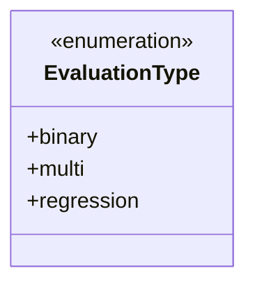
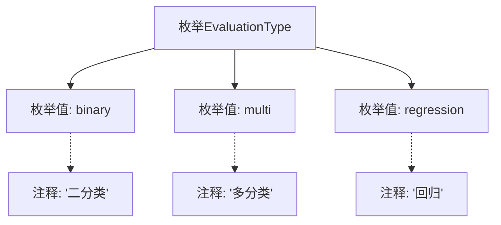

# 基础信息

|      |      |
|------|------|
| 名称 | EvaluationType |
| 编码语言 | .java |
| 代码路径 | WeFe/board/board-service/src/main/java/com/welab/wefe/board/service/component/enums/EvaluationType.java |
| 包名 | com.welab.wefe.board.service.component.enums |
| 依赖项 | [] |
| 概述说明 | 枚举EvaluationType定义三种评估类型：二分类、多分类和回归。 |

# 说明

该内容定义了一个名为EvaluationType的枚举类型，包含三个枚举值：binary表示二分类任务，multi表示多分类任务，regression表示回归任务。每个枚举值都有对应的中文注释说明其用途。

# 类列表 Class Summary

| 名称   | 类型  | 说明 |
|-------|------|-------------|
| EvaluationType | enum | 枚举EvaluationType定义三种评估类型：二分类、多分类和回归。 |

## 类 EvaluationType

|      |      |
|------|------|
| 访问范围 | public |
| 类型 | enum |
| 名称 | EvaluationType |
| 说明 | 枚举EvaluationType定义三种评估类型：二分类、多分类和回归。 |

### UML类图

该枚举类定义了三种评估类型：binary(二分类)、multi(多分类)和regression(回归)。这是一个简单的枚举类型，用于表示机器学习或统计分析中不同类型的评估方法。枚举常量均为公有成员，可直接通过类名访问。这种设计模式常用于需要限定取值范围、提高代码可读性的场景，特别适合表示固定不变的分类标准或配置选项。

### 内部方法调用关系图

该流程图展示了EvaluationType枚举的结构，包含三个枚举值(binary/multi/regression)及其对应的中文注释。binary对应"二分类"注释，multi对应"多分类"注释，regression对应"回归"注释。图形清晰地呈现了枚举定义与各值之间的关联关系，以及每个枚举值的语义说明，便于理解这个用于机器学习评估类型的枚举设计。

### 字段列表 Field List

| 名称  | 类型  | 说明 |
|-------|-------|------|

### 方法列表

| 名称  | 类型  | 说明 |
|-------|-------|------|

