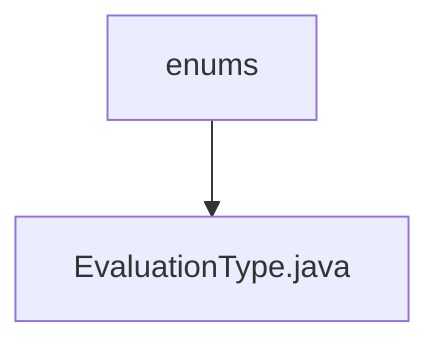

# 基础信息

|      |      |
|------|------|
| 名称 | enums |
| 编码语言 | .java |
| 代码路径 | WeFe/board/board-service/src/main/java/com/welab/wefe/board/service/component/enums |
| 包名 | docs.board.board-service.src.main.java.com.welab.wefe.board.service.component.enums |
| 概述说明 | 枚举EvaluationType定义三种评估类型：二分类、多分类和回归。 |

# 说明

该内容定义了一个名为EvaluationType的枚举类型，包含三个枚举值：binary表示二分类任务，multi表示多分类任务，regression表示回归任务。每个枚举值都有对应的中文注释说明其用途。

### 包内部结构视图

该流程图展示了WeFe项目中board-service模块的枚举类型文件结构。根节点为"enums"目录，其下包含具体的枚举类型实现文件"EvaluationType.java"。这种结构体现了Java项目中常见的枚举类型组织方式，将相关枚举集中存放在特定包路径下，便于维护和使用。

# 文件列表

| 名称   | 类型  | 说明 |
|-------|------|-------------|
| [EvaluationType.java](EvaluationType.md) | file | 枚举EvaluationType定义三种评估类型：二分类、多分类和回归。 |

