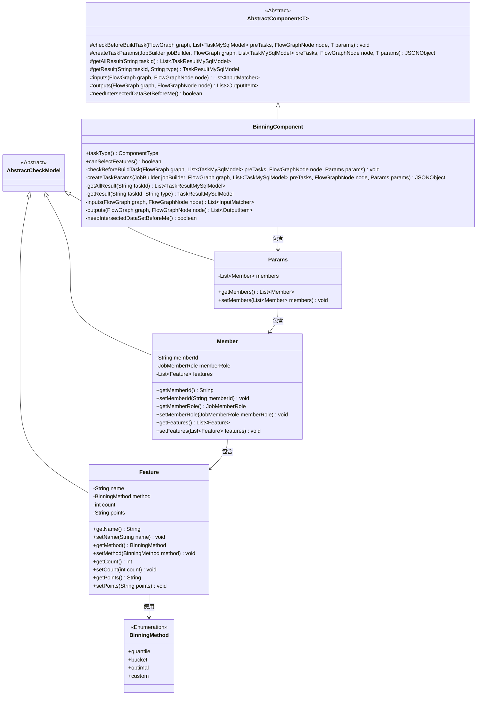
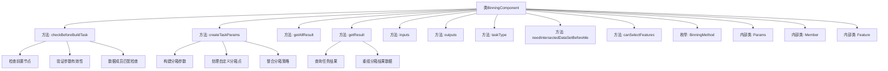

# 基础信息

|      |      |
|------|------|
| 名称 | BinningComponent |
| 编码语言 | .java |
| 代码路径 | WeFe/board/board-service/src/main/java/com/welab/wefe/board/service/component/feature/BinningComponent.java |
| 包名 | com.welab.wefe.board.service.component.feature |
| 依赖项 | ['com.alibaba.fastjson.JSONArray', 'com.alibaba.fastjson.JSONObject', 'com.welab.wefe.board.service.component.DataIOComponent', 'com.welab.wefe.board.service.component.base.AbstractComponent', 'com.welab.wefe.board.service.component.base.io.IODataType', 'com.welab.wefe.board.service.component.base.io.InputMatcher', 'com.welab.wefe.board.service.component.base.io.Names', 'com.welab.wefe.board.service.component.base.io.OutputItem', 'com.welab.wefe.board.service.database.entity.job.TaskMySqlModel', 'com.welab.wefe.board.service.database.entity.job.TaskResultMySqlModel', 'com.welab.wefe.board.service.exception.FlowNodeException', 'com.welab.wefe.board.service.model.FlowGraph', 'com.welab.wefe.board.service.model.FlowGraphNode', 'com.welab.wefe.board.service.model.JobBuilder', 'com.welab.wefe.board.service.service.CacheObjects', 'com.welab.wefe.common.fieldvalidate.AbstractCheckModel', 'com.welab.wefe.common.fieldvalidate.annotation.Check', 'com.welab.wefe.common.util.JObject', 'com.welab.wefe.common.wefe.enums.ComponentType', 'com.welab.wefe.common.wefe.enums.JobMemberRole', 'com.welab.wefe.common.wefe.enums.TaskResultType', 'org.apache.commons.collections4.CollectionUtils', 'org.apache.commons.lang3.StringUtils', 'org.springframework.beans.BeanUtils', 'org.springframework.stereotype.Service', 'java.util', 'java.util.concurrent.atomic.AtomicInteger', 'java.util.stream.Collectors'] |
| 概述说明 | BinningComponent是分箱处理组件，继承AbstractComponent，包含参数校验、任务参数构建和结果处理功能。支持多种分箱方法如等频、等宽、最优分箱和自定义分箱，确保所有成员参与并生成分箱模型和数据集。 |

# 说明

BinningComponent是一个实现分箱功能的组件，继承自AbstractComponent。它包含参数检查、任务参数创建、结果处理等方法。组件要求前置样本对齐节点，并验证分箱策略和成员参与情况。支持多种分箱方法（等频、等宽、最优分箱、自定义），通过参数配置分箱细节。输出分箱模型和数据集，支持特征选择功能。

# 类列表 Class Summary

| 名称   | 类型  | 说明 |
|-------|------|-------------|
| BinningComponent | class | BinningComponent是处理分箱逻辑的组件，检查样本对齐和分箱策略，生成分箱参数，支持多种分箱方法如等频、等宽、最优分箱和自定义分箱，输出分箱模型和数据集。 |

## 类 BinningComponent

|      |      |
|------|------|
| 访问范围 | @Service;public |
| 类型 | class |
| 名称 | BinningComponent |
| 说明 | BinningComponent是处理分箱逻辑的组件，检查样本对齐和分箱策略，生成分箱参数，支持多种分箱方法如等频、等宽、最优分箱和自定义分箱，输出分箱模型和数据集。 |

### UML类图

类图描述：该图展示了BinningComponent及其相关类的结构关系。BinningComponent继承自AbstractComponent，包含Params内部类，Params又包含Member类，Member类进一步包含Feature类。Feature类使用BinningMethod枚举。所有模型类都继承自AbstractCheckModel基类。该结构主要用于实现数据分箱功能，包含参数校验、任务创建和结果处理等核心逻辑。

### 内部方法调用关系图

该流程图展示了BinningComponent类的核心结构和主要方法调用关系。类包含参数校验(checkBeforeBuildTask)、任务参数构建(createTaskParams)、结果处理(getAllResult/getResult)等核心方法，以及Params、Member、Feature三个内部类和BinningMethod枚举。关键流程包括：前置条件验证、分箱策略整合、自定义分箱点处理、结果数据重组等，体现了分箱组件从参数校验到结果生成的全流程处理逻辑。

### 字段列表 Field List

| 名称  | 类型  | 说明 |
|-------|-------|------|

### 方法列表

| 名称  | 类型  | 说明 |
|-------|-------|------|
| canSelectFeatures | boolean | 方法canSelectFeatures返回true，表示支持选择功能。 |
| needIntersectedDataSetBeforeMe | boolean | 方法重写，返回false表示无需前置交集数据集。 |
| inputs | List<InputMatcher> | 重写方法inputs，返回包含数据集实例的输入匹配器列表。 |
| outputs | List<OutputItem> | 方法outputs返回包含两个OutputItem的列表：一个BINNING_MODEL类型模型和一个NORMAL_DATA_SET类型数据集。 |
| getResult | TaskResultMySqlModel | 该方法根据任务ID和类型获取任务结果，处理模型分箱数据，合并提供者结果，并返回包含成员信息的任务结果模型。 |
| checkBeforeBuildTask | void | 检查构建任务前条件：确保存在样本对齐组件、分箱策略非空，且所有成员参与。否则抛出异常。 |
| getAllResult | List<TaskResultMySqlModel> | 方法getAllResult根据taskId获取所有类型为model_binning的TaskResultMySqlModel结果，并添加重组数据后返回列表。 |
| taskType | ComponentType | 方法taskType返回组件类型为Binning。 |
| createTaskParams | JSONObject | 方法创建任务参数，整合特征分箱策略，包括自定义分箱点，生成包含转换参数、最优分箱参数及成员模式的JSON对象。 |

