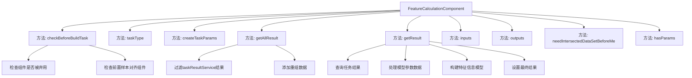
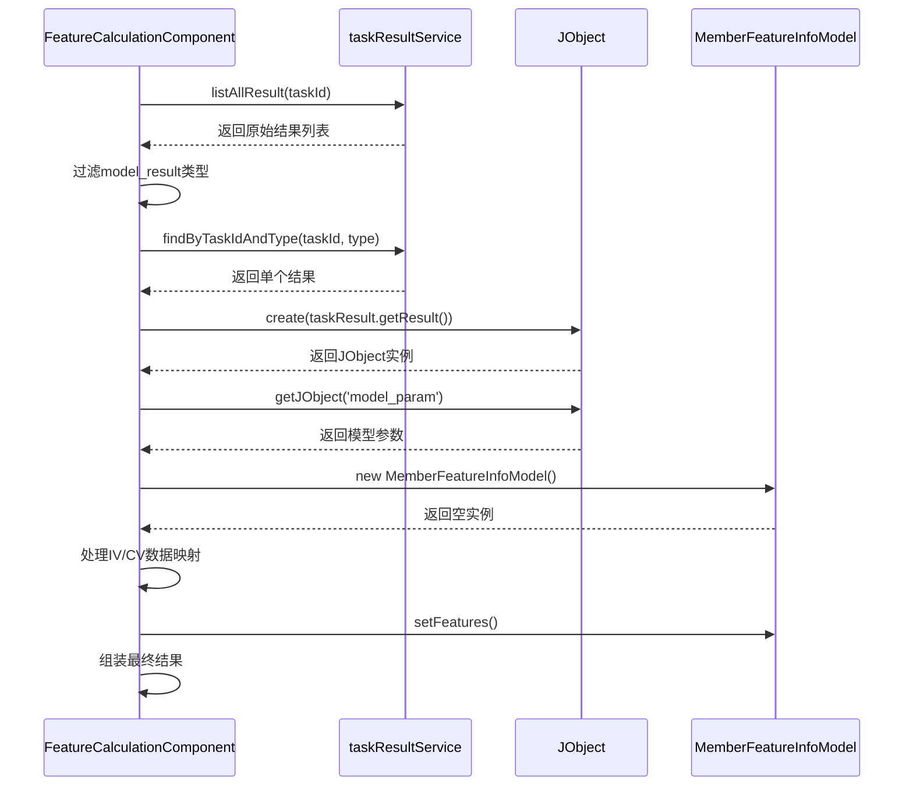

# 基础信息

|      |      |
|------|------|
| 名称 | FeatureCalculationComponent |
| 编码语言 | .java |
| 代码路径 | WeFe/board/board-service/src/main/java/com/welab/wefe/board/service/component/feature/FeatureCalculationComponent.java |
| 包名 | com.welab.wefe.board.service.component.feature |
| 依赖项 | ['com.alibaba.fastjson.JSONArray', 'com.alibaba.fastjson.JSONObject', 'com.welab.wefe.board.service.component.base.AbstractComponent', 'com.welab.wefe.board.service.component.base.filter.IntersectedOutputFilter', 'com.welab.wefe.board.service.component.base.io.IODataType', 'com.welab.wefe.board.service.component.base.io.InputMatcher', 'com.welab.wefe.board.service.component.base.io.Names', 'com.welab.wefe.board.service.component.base.io.OutputItem', 'com.welab.wefe.board.service.database.entity.job.TaskMySqlModel', 'com.welab.wefe.board.service.database.entity.job.TaskResultMySqlModel', 'com.welab.wefe.board.service.dto.entity.MemberFeatureInfoModel', 'com.welab.wefe.board.service.exception.FlowNodeException', 'com.welab.wefe.board.service.model.FlowGraph', 'com.welab.wefe.board.service.model.FlowGraphNode', 'com.welab.wefe.board.service.model.JobBuilder', 'com.welab.wefe.board.service.service.CacheObjects', 'com.welab.wefe.common.fieldvalidate.AbstractCheckModel', 'com.welab.wefe.common.util.JObject', 'com.welab.wefe.common.wefe.enums.ComponentType', 'com.welab.wefe.common.wefe.enums.JobMemberRole', 'com.welab.wefe.common.wefe.enums.TaskResultType', 'org.springframework.beans.BeanUtils', 'org.springframework.stereotype.Service', 'java.util', 'java.util.stream.Collectors'] |
| 概述说明 | FeatureCalculationComponent组件已弃用，建议使用特征统计组件替代。需前置样本对齐组件，处理特征数据并生成包含IV和CV值的模型结果。 |

# 说明

该代码实现了一个已弃用的特征计算组件，强制要求使用"特征统计"组件替代。主要功能包括：检查前置条件（需样本对齐组件）、创建空任务参数、获取任务结果并重组数据。结果处理部分会解析模型参数，提取IV（信息价值）和CV（变异系数）值，构建特征信息列表，包含成员ID、角色及特征名称与对应指标值。组件输入需标准化数据集和分箱模型，输出JSON格式结果。明确声明无需参数且依赖前置交集数据集。

# 类列表 Class Summary

| 名称   | 类型  | 说明 |
|-------|------|-------------|
| FeatureCalculationComponent | class | FeatureCalculationComponent组件已弃用，建议使用特征统计组件替代。需前置样本对齐组件，处理特征IV和CV值，输出JSON格式结果。 |


## 类 FeatureCalculationComponent

|      |      |
|------|------|
| 访问范围 | @Service;public |
| 类型 | class |
| 名称 | FeatureCalculationComponent |
| 说明 | FeatureCalculationComponent组件已弃用，建议使用特征统计组件替代。需前置样本对齐组件，处理特征IV和CV值，输出JSON格式结果。 |


### UML类图

```mermaid
classDiagram
    class AbstractComponent~T~ {
        <<Abstract>>
        #checkBeforeBuildTask(FlowGraph graph, List~TaskMySqlModel~ preTasks, FlowGraphNode node, T params) void
        #createTaskParams(JobBuilder jobBuilder, FlowGraph graph, List~TaskMySqlModel~ preTasks, FlowGraphNode node, T params) JSONObject
        #getAllResult(String taskId) List~TaskResultMySqlModel~
        #getResult(String taskId, String type) TaskResultMySqlModel
        #inputs(FlowGraph graph, FlowGraphNode node) List~InputMatcher~
        #outputs(FlowGraph graph, FlowGraphNode node) List~OutputItem~
        #needIntersectedDataSetBeforeMe() boolean
        #hasParams() boolean
    }

    class FeatureCalculationComponent {
        +FeatureCalculationComponent$Params
        +checkBeforeBuildTask(FlowGraph graph, List~TaskMySqlModel~ preTasks, FlowGraphNode node, Params params) void
        +taskType() ComponentType
        +createTaskParams(JobBuilder jobBuilder, FlowGraph graph, List~TaskMySqlModel~ preTasks, FlowGraphNode node, Params params) JSONObject
        +getAllResult(String taskId) List~TaskResultMySqlModel~
        +getResult(String taskId, String type) TaskResultMySqlModel
        +inputs(FlowGraph graph, FlowGraphNode node) List~InputMatcher~
        +outputs(FlowGraph graph, FlowGraphNode node) List~OutputItem~
        +needIntersectedDataSetBeforeMe() boolean
        +hasParams() boolean
    }

    class FeatureCalculationComponent$Params {
        <<Model>>
    }

    class MemberFeatureInfoModel {
        -String memberId
        -String memberName
        -JobMemberRole memberRole
        -List~Feature~ features
        +setMemberId(String memberId) void
        +setMemberName(String memberName) void
        +setMemberRole(JobMemberRole memberRole) void
        +setFeatures(List~Feature~ features) void
    }

    class MemberFeatureInfoModel$Feature {
        -String name
        -Double iv
        -Double cv
        +setName(String name) void
        +setIv(Double iv) void
        +setCv(Double cv) void
    }

    AbstractComponent~T~ <|-- FeatureCalculationComponent
    FeatureCalculationComponent *-- FeatureCalculationComponent$Params
    MemberFeatureInfoModel *-- MemberFeatureInfoModel$Feature

    FeatureCalculationComponent --> MemberFeatureInfoModel : "聚合结果"
    FeatureCalculationComponent --> TaskResultMySqlModel : "操作结果"
    FeatureCalculationComponent --> FlowGraphNode : "校验依赖"
    FeatureCalculationComponent --> JObject : "解析JSON"
```

该类图展示了特征计算组件的核心结构，继承自泛型抽象组件AbstractComponent，包含参数类Params和嵌套模型类。主要功能包括：前置校验（检查样本对齐组件）、任务参数生成、结果处理（聚合特征IV/CV值）和输入输出定义。通过MemberFeatureInfoModel及其内部Feature类组织计算结果，与任务结果服务交互实现数据持久化。组件强制要求前置样本对齐，并标记为已弃用状态。


### 内部方法调用关系图





流程图描述了FeatureCalculationComponent类的核心方法调用关系，重点展示了参数检查、结果获取和处理流程。时序图详细呈现了getResult方法中与taskResultService的交互、数据转换和特征模型构建过程，突出了从原始数据到结构化特征的转换逻辑。该组件主要负责特征计算任务的结果处理，包含严格的预处理检查和多步骤数据重组能力。

### 字段列表 Field List

| 名称  | 类型  | 说明 |
|-------|-------|------|

### 方法列表

| 名称  | 类型  | 说明 |
|-------|-------|------|
| hasParams | boolean | 方法hasParams重写父类，固定返回false，表示无参数。 |
| needIntersectedDataSetBeforeMe | boolean | 方法重写，返回固定值true，表示需要前置交集数据集。 |
| outputs | List<OutputItem> | 方法重写，返回包含JSON结果的输出项列表。 |
| getAllResult | List<TaskResultMySqlModel> | 该方法获取指定任务ID的所有模型结果，先筛选出类型为model_result的数据，再补充重组后的数据，最后返回合并列表。 |
| getResult | TaskResultMySqlModel | 方法根据任务ID和类型获取结果，处理模型参数中的计算数据，提取成员特征信息（包括IV和CV值），最终返回包含处理结果的TaskResultMySqlModel对象。 |
| taskType | ComponentType | 方法重写，返回任务类型为特征计算。 |
| checkBeforeBuildTask | void | 代码检查流程：若条件为真，抛出异常提示弃用组件并推荐替代方案；若无样本对齐组件节点，抛出异常提示需添加。 |
| createTaskParams | JSONObject | 方法重写，返回空JSON对象，用于创建任务参数。 |
| inputs | List<InputMatcher> | 该方法返回两个输入匹配器：一个匹配正常数据集并使用交叉输出过滤器，另一个匹配分箱模型并指定数据类型为分箱模型。 |


