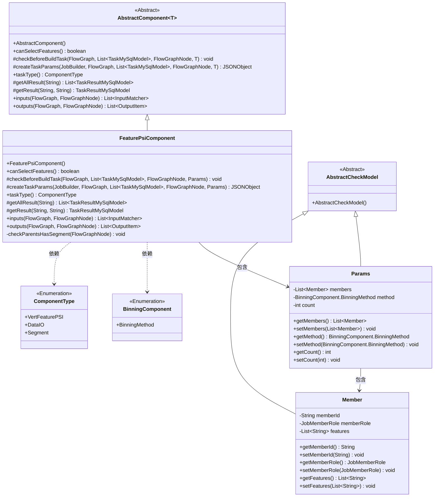
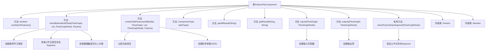
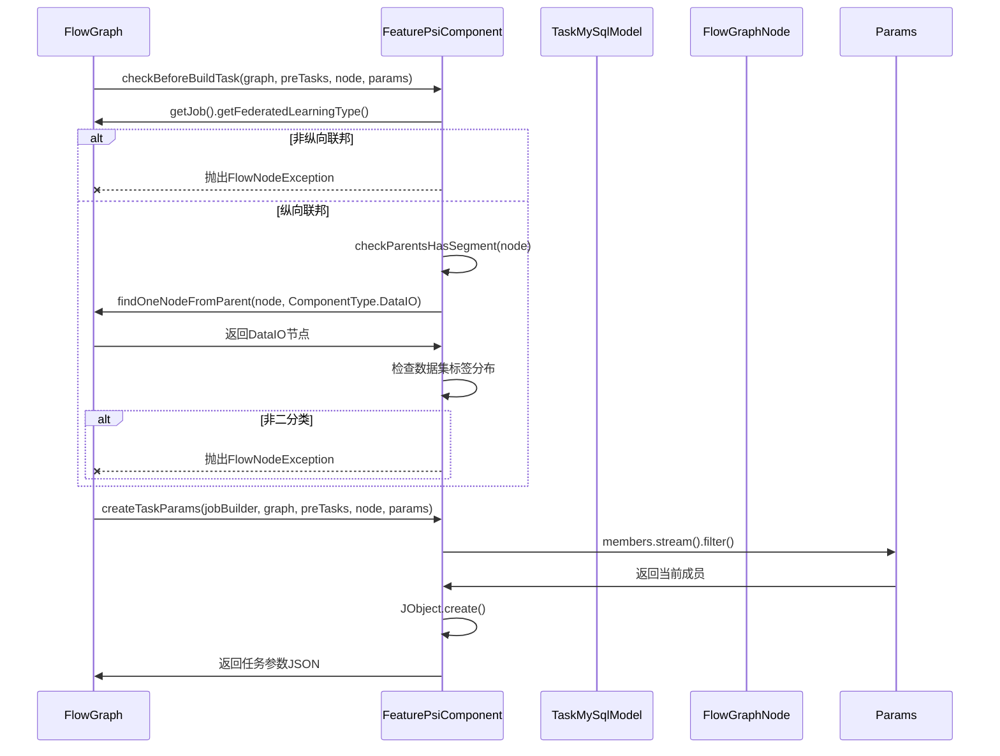

# 基础信息

|      |      |
|------|------|
| 名称 | FeaturePsiComponent |
| 编码语言 | .java |
| 代码路径 | WeFe/board/board-service/src/main/java/com/welab/wefe/board/service/component/feature/FeaturePsiComponent.java |
| 包名 | com.welab.wefe.board.service.component.feature |
| 依赖项 | ['com.alibaba.fastjson.JSONObject', 'com.welab.wefe.board.service.component.DataIOComponent', 'com.welab.wefe.board.service.component.base.AbstractComponent', 'com.welab.wefe.board.service.component.base.filter.OutputDataTypeAndNameOutputFilter', 'com.welab.wefe.board.service.component.base.io.IODataType', 'com.welab.wefe.board.service.component.base.io.InputMatcher', 'com.welab.wefe.board.service.component.base.io.Names', 'com.welab.wefe.board.service.component.base.io.OutputItem', 'com.welab.wefe.board.service.database.entity.data_resource.TableDataSetMysqlModel', 'com.welab.wefe.board.service.database.entity.job.TaskMySqlModel', 'com.welab.wefe.board.service.database.entity.job.TaskResultMySqlModel', 'com.welab.wefe.board.service.dto.vo.data_set.table_data_set.LabelDistribution', 'com.welab.wefe.board.service.exception.FlowNodeException', 'com.welab.wefe.board.service.model.FlowGraph', 'com.welab.wefe.board.service.model.FlowGraphNode', 'com.welab.wefe.board.service.model.JobBuilder', 'com.welab.wefe.board.service.service.CacheObjects', 'com.welab.wefe.common.exception.StatusCodeWithException', 'com.welab.wefe.common.fieldvalidate.AbstractCheckModel', 'com.welab.wefe.common.fieldvalidate.annotation.Check', 'com.welab.wefe.common.util.JObject', 'com.welab.wefe.common.wefe.enums.ComponentType', 'com.welab.wefe.common.wefe.enums.FederatedLearningType', 'com.welab.wefe.common.wefe.enums.JobMemberRole', 'org.springframework.stereotype.Service', 'java.util.Arrays', 'java.util.List'] |
| 概述说明 | FeaturePsiComponent是纵向联邦学习组件，支持二分类场景，需紧跟Segment组件执行。检查输入数据集类型和标签分布，生成任务参数并处理结果。 |

# 说明

FeaturePsiComponent是一个继承自AbstractComponent的服务类，用于处理纵向联邦任务中的特征PSI操作。它支持特征选择，并在构建任务前进行多项检查：仅允许纵向联邦任务类型，要求前置节点包含Segment组件，且发起方数据集必须是二分类类型。组件通过Params类接收成员列表、分箱方法和分箱数量等参数，并生成包含特征名、方法和分箱数的任务参数。输入要求为训练和评估数据集，输出为JSON格式结果。内部Member类定义了成员ID、角色和特征列表等属性。

# 类列表 Class Summary

| 名称   | 类型  | 说明 |
|-------|------|-------------|
| FeaturePsiComponent | class | FeaturePsiComponent是纵向联邦学习组件，仅支持二分类数据集，需紧跟Segment组件执行。检查输入输出，生成任务参数，处理结果查询。 |

## 类 FeaturePsiComponent

|      |      |
|------|------|
| 访问范围 | @Service;public |
| 类型 | class |
| 名称 | FeaturePsiComponent |
| 说明 | FeaturePsiComponent是纵向联邦学习组件，仅支持二分类数据集，需紧跟Segment组件执行。检查输入输出，生成任务参数，处理结果查询。 |

### UML类图

这段代码描述了一个名为`FeaturePsiComponent`的联邦学习组件，继承自`AbstractComponent`，主要用于纵向联邦任务中的特征PSI（隐私保护集合交集）处理。该组件包含参数类`Params`和成员类`Member`，通过严格的输入验证（如检查联邦学习类型、数据分类类型和前置节点）确保流程正确性，并生成任务参数JSON。类图展示了组件继承关系、参数结构和关键依赖，体现了对纵向联邦学习场景的特定约束和数据处理逻辑。

### 内部方法调用关系图

这段代码实现了一个联邦学习特征PSI组件，主要功能包括：1) 验证任务类型必须为纵向联邦；2) 检查流程节点必须位于数据分割(Segment)之后；3) 对发起方(promoter)强制要求二分类数据集；4) 生成包含特征分箱参数的JSON配置。流程图展示了类结构和核心方法调用关系，时序图则重点描述了构建任务前的验证过程和任务参数生成流程。该组件通过严格的输入输出控制和参数校验，确保特征PSI操作在合规的联邦学习环境下执行。

### 字段列表 Field List

| 名称  | 类型  | 说明 |
|-------|-------|------|

### 方法列表

| 名称  | 类型  | 说明 |
|-------|-------|------|
| taskType | ComponentType | 该方法重写并返回组件类型为VertFeaturePSI。 |
| inputs | List<InputMatcher> | 该方法重写父类方法，返回两个输入匹配器，分别对应训练数据集和评估数据集，需通过名称和数据类型筛选确保准确性。 |
| getResult | TaskResultMySqlModel | 重写方法，通过任务ID和类型查询结果，可能抛出异常。 |
| createTaskParams | JSONObject | 方法重写，生成任务参数JSON：筛选当前成员，添加特征、方法和数量字段。 |
| canSelectFeatures | boolean | 方法canSelectFeatures返回true，表示支持选择功能。 |
| checkParentsHasSegment | void | 检查节点父级是否包含Segment类型，若无则抛出异常提示VertFeaturePSI必须紧跟Segment后执行。 |
| checkBeforeBuildTask | void | 检查纵向联邦任务和二分类数据集：若非纵向联邦或数据集非二分类，抛出异常；验证父节点并确保存在DataIO组件。 |
| outputs | List<OutputItem> | 该方法返回一个包含单个OutputItem的列表，OutputItem名为JSON_RESULT，数据类型为Json。 |
| getAllResult | List<TaskResultMySqlModel> | 这是一个Java方法，重写了父类的getAllResult方法，通过调用taskResultService的listAllResult方法获取指定taskId的所有任务结果列表。 |

