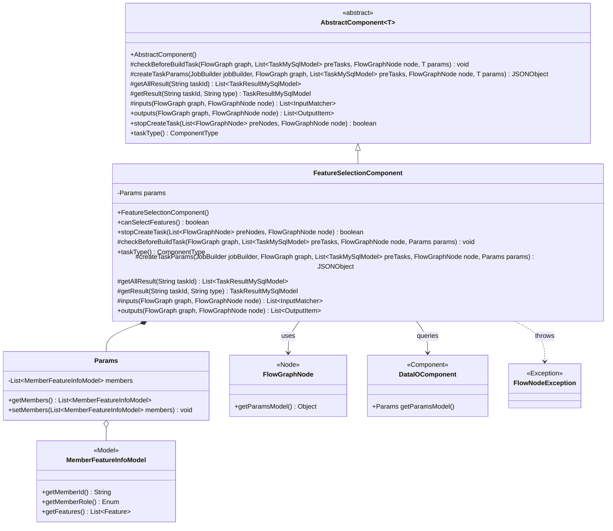
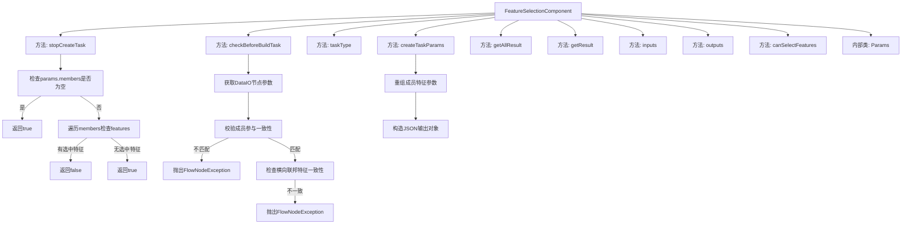
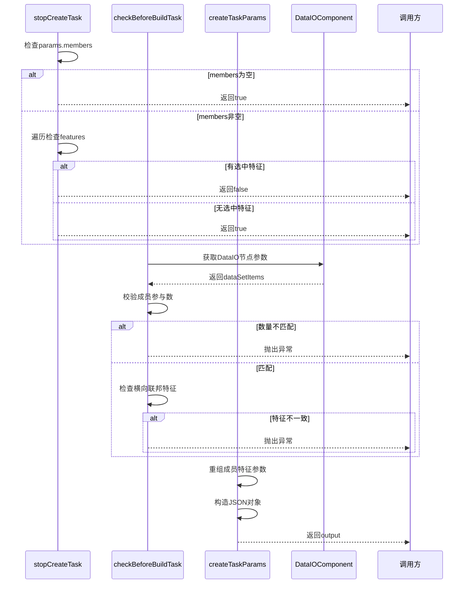

# 基础信息

|      |      |
|------|------|
| 名称 | FeatureSelectionComponent |
| 编码语言 | .java |
| 代码路径 | WeFe/board/board-service/src/main/java/com/welab/wefe/board/service/component/feature/FeatureSelectionComponent.java |
| 包名 | com.welab.wefe.board.service.component.feature |
| 依赖项 | ['com.alibaba.fastjson.JSONObject', 'com.welab.wefe.board.service.component.DataIOComponent', 'com.welab.wefe.board.service.component.base.AbstractComponent', 'com.welab.wefe.board.service.component.base.io.IODataType', 'com.welab.wefe.board.service.component.base.io.InputMatcher', 'com.welab.wefe.board.service.component.base.io.Names', 'com.welab.wefe.board.service.component.base.io.OutputItem', 'com.welab.wefe.board.service.database.entity.job.TaskMySqlModel', 'com.welab.wefe.board.service.database.entity.job.TaskResultMySqlModel', 'com.welab.wefe.board.service.dto.entity.MemberFeatureInfoModel', 'com.welab.wefe.board.service.exception.FlowNodeException', 'com.welab.wefe.board.service.model.FlowGraph', 'com.welab.wefe.board.service.model.FlowGraphNode', 'com.welab.wefe.board.service.model.JobBuilder', 'com.welab.wefe.common.exception.StatusCodeWithException', 'com.welab.wefe.common.fieldvalidate.AbstractCheckModel', 'com.welab.wefe.common.util.JObject', 'com.welab.wefe.common.wefe.enums.ComponentType', 'com.welab.wefe.common.wefe.enums.FederatedLearningType', 'org.apache.commons.collections4.CollectionUtils', 'org.springframework.stereotype.Service', 'java.util.ArrayList', 'java.util.Arrays', 'java.util.List', 'java.util.concurrent.atomic.AtomicInteger', 'java.util.stream.Collectors'] |
| 概述说明 | FeatureSelectionComponent是特征选择组件，检查成员特征是否一致，确保横向建模特征列表相同，无特征时停止任务创建。 |

# 说明

FeatureSelectionComponent是一个用于特征选择的组件，继承自AbstractComponent。主要功能包括：在未选择特征时停止创建任务；检查前置节点数据确保所有成员参与；横向建模时验证特征列表一致性；重组前端参数生成任务参数；定义输入输出数据类型。该组件支持特征选择，并包含成员和特征列表的参数类Params。

# 类列表 Class Summary

| 名称   | 类型  | 说明 |
|-------|------|-------------|
| FeatureSelectionComponent | class | FeatureSelectionComponent用于特征选择，检查成员和特征是否有效，横向建模需特征一致，生成任务参数并处理输入输出。若无特征或成员不匹配则停止任务。 |

## 类 FeatureSelectionComponent

|      |      |
|------|------|
| 访问范围 | @Service;public |
| 类型 | class |
| 名称 | FeatureSelectionComponent |
| 说明 | FeatureSelectionComponent用于特征选择，检查成员和特征是否有效，横向建模需特征一致，生成任务参数并处理输入输出。若无特征或成员不匹配则停止任务。 |

### UML类图

类图描述：该图展示了一个特征选择组件(FeatureSelectionComponent)的类结构，继承自泛型抽象类AbstractComponent，包含Params内部类用于存储成员特征信息。组件通过FlowGraphNode获取参数，与DataIOComponent交互验证数据，并在校验失败时抛出FlowNodeException。核心功能包括任务创建控制、参数校验和结果处理，支持横向联邦学习的特征一致性检查。

### 内部方法调用关系图

这段代码实现了一个特征选择组件，主要包含三个核心方法：stopCreateTask用于校验是否选中特征来决定是否停止任务创建；checkBeforeBuildTask在任务构建前进行数据一致性校验；createTaskParams负责重组特征参数生成任务JSON。流程图展示了类结构和方法调用关系，时序图详细描述了关键方法的执行逻辑和数据流转过程。该组件特别注重联邦学习场景下的数据一致性验证，确保横向建模时所有参与方的特征列表完全一致。

### 字段列表 Field List

| 名称  | 类型  | 说明 |
|-------|-------|------|

### 方法列表

| 名称  | 类型  | 说明 |
|-------|-------|------|
| createTaskParams | JSONObject | 该方法将前端参数重组为JSON对象，遍历成员列表，提取每个成员的ID、角色和特征名称，最终返回包含所有成员信息的JSON结构。 |
| inputs | List<InputMatcher> | 方法重写，返回包含数据集实例的输入匹配器列表。 |
| checkBeforeBuildTask | void | 检查构建任务前条件：确保所有成员参与且横向建模特征列表一致，否则抛出异常。 |
| canSelectFeatures | boolean | 方法canSelectFeatures返回true，表示支持选择功能。 |
| getResult | TaskResultMySqlModel | 这是一个Java方法，重写父类方法，根据任务ID和类型获取结果，目前返回null。 |
| getAllResult | List<TaskResultMySqlModel> | 这是一个Java方法，重写了父类方法，通过调用taskResultService的listAllResult方法获取指定taskId的所有任务结果列表。 |
| stopCreateTask | boolean | 方法检查节点参数中是否选择了特征，若未选择或成员为空则停止创建任务。 |
| outputs | List<OutputItem> | 该方法重写父类方法，返回包含一个OutputItem的列表，OutputItem由NORMAL_DATA_SET和DataSetInstance类型组成。 |
| taskType | ComponentType | 该方法返回组件类型为特征选择。 |

