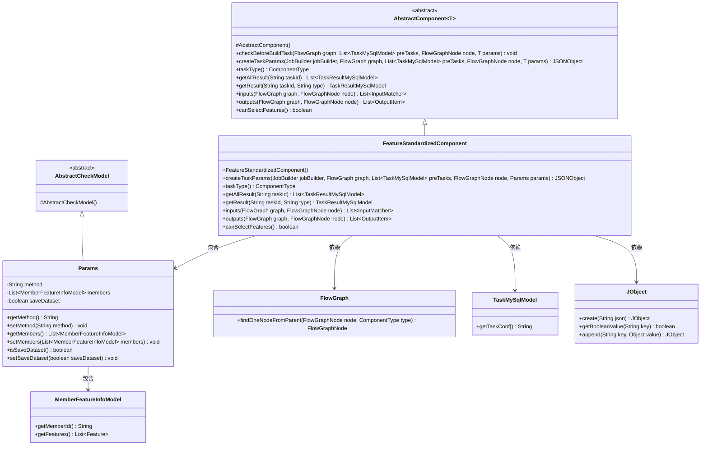
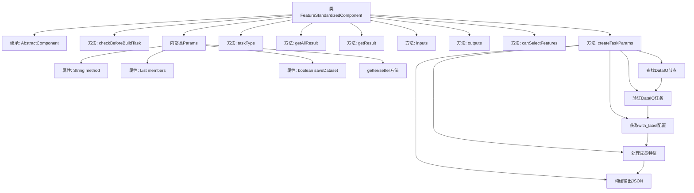
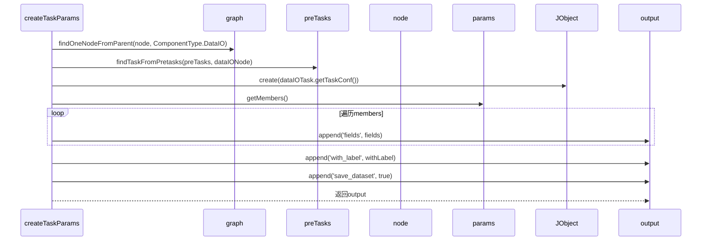

# 基础信息

|      |      |
|------|------|
| 名称 | FeatureStandardizedComponent |
| 编码语言 | .java |
| 代码路径 | WeFe/board/board-service/src/main/java/com/welab/wefe/board/service/component/feature/FeatureStandardizedComponent.java |
| 包名 | com.welab.wefe.board.service.component.feature |
| 依赖项 | ['com.alibaba.fastjson.JSONObject', 'com.welab.wefe.board.service.component.base.AbstractComponent', 'com.welab.wefe.board.service.component.base.io.IODataType', 'com.welab.wefe.board.service.component.base.io.InputMatcher', 'com.welab.wefe.board.service.component.base.io.Names', 'com.welab.wefe.board.service.component.base.io.OutputItem', 'com.welab.wefe.board.service.database.entity.job.TaskMySqlModel', 'com.welab.wefe.board.service.database.entity.job.TaskResultMySqlModel', 'com.welab.wefe.board.service.dto.entity.MemberFeatureInfoModel', 'com.welab.wefe.board.service.exception.FlowNodeException', 'com.welab.wefe.board.service.model.FlowGraph', 'com.welab.wefe.board.service.model.FlowGraphNode', 'com.welab.wefe.board.service.model.JobBuilder', 'com.welab.wefe.board.service.service.CacheObjects', 'com.welab.wefe.common.fieldvalidate.AbstractCheckModel', 'com.welab.wefe.common.fieldvalidate.annotation.Check', 'com.welab.wefe.common.util.JObject', 'com.welab.wefe.common.util.StringUtil', 'com.welab.wefe.common.wefe.enums.ComponentType', 'org.springframework.stereotype.Service', 'java.util.ArrayList', 'java.util.Arrays', 'java.util.List'] |
| 概述说明 | FeatureStandardizedComponent是特征标准化组件，继承AbstractComponent，检查DataIO组件并提取with_label字段，处理成员特征信息，支持z-score或min-max标准化方法，输出标准化数据集。 |

# 说明

FeatureStandardizedComponent是一个继承自AbstractComponent的服务类，用于特征标准化处理。它通过检查前置DataIO组件获取标签信息，并处理成员特征数据生成任务参数。主要功能包括验证前置任务、提取DataIO组件的with_label字段、遍历成员特征信息生成包含字段列表和标签状态的JSON输出。该类定义了标准化方法、成员信息和保存选项等参数，支持特征选择，并指定了数据输入输出类型为DataSetInstance。

# 类列表 Class Summary

| 名称   | 类型  | 说明 |
|-------|------|-------------|
| FeatureStandardizedComponent | class | FeatureStandardizedComponent是处理特征标准化的服务组件，继承AbstractComponent。主要功能包括检查前置DataIO组件、生成任务参数（含字段和标签信息）、定义输入输出数据类型。支持z-score和min-max标准化方法，可配置成员特征和保存选项。 |

## 类 FeatureStandardizedComponent

|      |      |
|------|------|
| 访问范围 | @Service;public |
| 类型 | class |
| 名称 | FeatureStandardizedComponent |
| 说明 | FeatureStandardizedComponent是处理特征标准化的服务组件，继承AbstractComponent。主要功能包括检查前置DataIO组件、生成任务参数（含字段和标签信息）、定义输入输出数据类型。支持z-score和min-max标准化方法，可配置成员特征和保存选项。 |

### UML类图

这段代码描述了一个特征标准化组件`FeatureStandardizedComponent`，它继承自泛型抽象类`AbstractComponent`，主要用于处理特征标准化任务。该组件通过`createTaskParams`方法创建任务参数，需要依赖DataIO组件提供的数据集，并处理成员特征信息。内部类`Params`继承自`AbstractCheckModel`，包含标准化方法、成员信息和保存标志等配置参数。组件实现了输入输出数据匹配、任务类型定义等接口方法，整体设计体现了对特征标准化流程的封装和扩展性。

### 内部方法调用关系图

这段代码实现了一个特征标准化组件，主要功能是处理数据特征标准化流程。流程图展示了类结构和主要方法调用关系，时序图详细描述了createTaskParams方法的执行过程。该组件会检查前置DataIO节点，获取标签配置，处理成员特征信息，最终生成包含标准化字段、标签标识和保存标志的任务参数JSON对象。内部类Params封装了标准化方法、成员信息和保存标志等配置参数。

### 字段列表 Field List

| 名称  | 类型  | 说明 |
|-------|-------|------|

### 方法列表

| 名称  | 类型  | 说明 |
|-------|-------|------|
| checkBeforeBuildTask | void | 方法检查构建任务前条件，参数包括流程图、前置任务列表、节点和参数，可能抛出流程节点异常。 |
| createTaskParams | JSONObject | 方法创建任务参数，检查DataIO组件和with_label字段，处理成员特征并生成包含字段、标签和保存数据集的JSON输出。 |
| getResult | TaskResultMySqlModel | 这是一个Java方法，重写父类方法，根据任务ID和类型获取结果，目前返回null。 |
| getAllResult | List<TaskResultMySqlModel> | 方法getAllResult重写父类，接收taskId参数，返回TaskResultMySqlModel列表，当前实现返回null。 |
| inputs | List<InputMatcher> | 方法重写，返回包含数据集实例的输入匹配器列表。 |
| outputs | List<OutputItem> | 方法outputs返回包含数据集实例的输出项列表，键为NORMAL_DATA_SET。 |
| canSelectFeatures | boolean | 方法canSelectFeatures返回true，表示支持选择功能。 |
| taskType | ComponentType | 方法重写，返回任务类型为FeatureStandardized。 |

