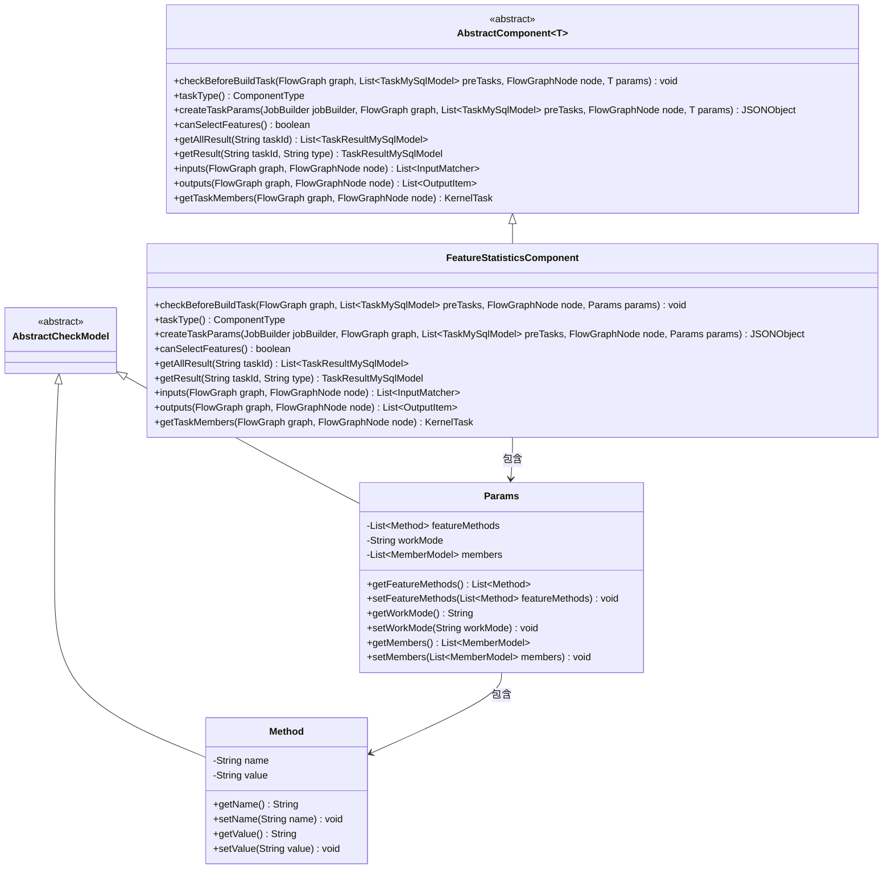
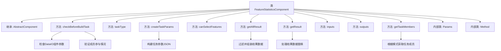
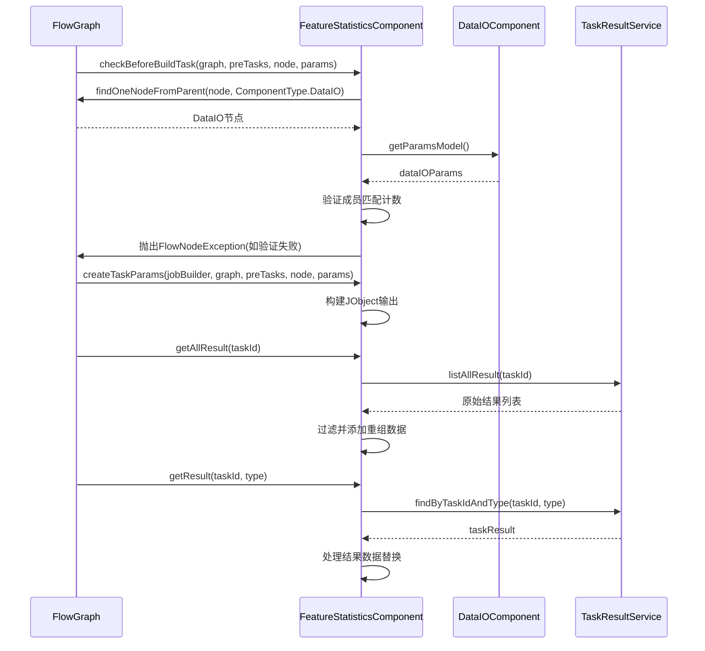

# 基础信息

|      |      |
|------|------|
| 名称 | FeatureStatisticsComponent |
| 编码语言 | .java |
| 代码路径 | WeFe/board/board-service/src/main/java/com/welab/wefe/board/service/component/feature/FeatureStatisticsComponent.java |
| 包名 | com.welab.wefe.board.service.component.feature |
| 依赖项 | ['com.alibaba.fastjson.JSONObject', 'com.welab.wefe.board.service.component.DataIOComponent', 'com.welab.wefe.board.service.component.base.AbstractComponent', 'com.welab.wefe.board.service.component.base.filter.OutputDataTypesOutputFilter', 'com.welab.wefe.board.service.component.base.io.IODataType', 'com.welab.wefe.board.service.component.base.io.InputMatcher', 'com.welab.wefe.board.service.component.base.io.Names', 'com.welab.wefe.board.service.component.base.io.OutputItem', 'com.welab.wefe.board.service.database.entity.job.TaskMySqlModel', 'com.welab.wefe.board.service.database.entity.job.TaskResultMySqlModel', 'com.welab.wefe.board.service.dto.entity.MemberModel', 'com.welab.wefe.board.service.dto.kernel.Member', 'com.welab.wefe.board.service.dto.kernel.machine_learning.KernelTask', 'com.welab.wefe.board.service.exception.FlowNodeException', 'com.welab.wefe.board.service.model.FlowGraph', 'com.welab.wefe.board.service.model.FlowGraphNode', 'com.welab.wefe.board.service.model.JobBuilder', 'com.welab.wefe.board.service.service.CacheObjects', 'com.welab.wefe.common.fieldvalidate.AbstractCheckModel', 'com.welab.wefe.common.fieldvalidate.annotation.Check', 'com.welab.wefe.common.util.JObject', 'com.welab.wefe.common.wefe.enums.ComponentType', 'com.welab.wefe.common.wefe.enums.TaskResultType', 'org.apache.commons.collections4.CollectionUtils', 'org.springframework.beans.BeanUtils', 'org.springframework.stereotype.Service', 'java.util.ArrayList', 'java.util.Arrays', 'java.util.List', 'java.util.concurrent.atomic.AtomicInteger', 'java.util.stream.Collectors'] |
| 概述说明 | FeatureStatisticsComponent是用于特征统计的组件，检查数据IO成员参与情况，支持本地和分布式模式，输出JSON结果。 |

# 说明

FeatureStatisticsComponent是一个继承自AbstractComponent的服务类，用于处理特征统计任务。它包含参数检查、任务创建、结果处理和成员管理等功能。组件在执行前会验证DataIO组件是否存在，并确保所有成员参与非本地模式的任务。任务参数包含工作模式，输出结果为JSON格式。组件支持特征选择，并能获取和重组任务结果，包括成员信息的补充。Params类定义了特征方法、工作模式和成员列表等参数，Method类用于描述具体方法及其值。组件还处理输入输出数据类型的匹配。

# 类列表 Class Summary

| 名称   | 类型  | 说明 |
|-------|------|-------------|
| FeatureStatisticsComponent | class | FeatureStatisticsComponent是处理特征统计的组件，继承AbstractComponent。主要功能包括检查数据IO组件成员参与情况，生成任务参数，获取统计结果，支持本地和分布式模式，输出JSON格式结果。 |

## 类 FeatureStatisticsComponent

|      |      |
|------|------|
| 访问范围 | @Service;public |
| 类型 | class |
| 名称 | FeatureStatisticsComponent |
| 说明 | FeatureStatisticsComponent是处理特征统计的组件，继承AbstractComponent。主要功能包括检查数据IO组件成员参与情况，生成任务参数，获取统计结果，支持本地和分布式模式，输出JSON格式结果。 |

### UML类图

这段代码展示了一个特征统计组件`FeatureStatisticsComponent`，它继承自泛型抽象类`AbstractComponent`，主要用于处理特征统计任务。该组件包含参数类`Params`和方法类`Method`，其中`Params`用于存储工作模式、成员列表和特征方法等配置信息。组件实现了任务构建前的检查、任务参数创建、结果获取等功能，支持本地和分布式两种工作模式，并能验证参与成员的一致性。通过继承关系，代码实现了良好的扩展性和类型安全性。

### 内部方法调用关系图

流程图描述：该流程图展示了FeatureStatisticsComponent类的完整结构，包括其继承关系、核心方法及两个内部类Params和Method。关键方法包括参数检查(checkBeforeBuildTask)、任务参数创建(createTaskParams)、结果处理(getAllResult/getResult)等，突出了组件对DataIO参数的依赖验证、工作模式判断以及结果数据重组等核心逻辑。时序图则具体呈现了组件与流程图、数据IO组件及任务结果服务之间的交互过程。

### 字段列表 Field List

| 名称  | 类型  | 说明 |
|-------|-------|------|

### 方法列表

| 名称  | 类型  | 说明 |
|-------|-------|------|
| inputs | List<InputMatcher> | 方法重写，返回包含InputMatcher的列表，匹配NORMAL_DATA_SET和指定输出过滤器。 |
| getTaskMembers | KernelTask | 方法根据工作模式获取任务成员：本地模式时筛选当前成员并返回；否则调用父类方法。 |
| outputs | List<OutputItem> | 方法outputs返回包含JSON结果的OutputItem列表。 |
| getAllResult | List<TaskResultMySqlModel> | 该方法获取指定任务ID的所有结果，筛选类型为data_feature_statistic的数据，并添加重组后的结果，最后返回合并列表。 |
| createTaskParams | JSONObject | 方法重写创建任务参数，生成包含工作模式的JSON对象，忽略原注释的百分比处理代码。 |
| getResult | TaskResultMySqlModel | 根据任务ID和类型获取结果，处理数据特征统计结果，替换Infinity值，补充成员名称后返回。 |
| checkBeforeBuildTask | void | 检查流程图中DataIO组件的成员是否与当前节点参数中的成员匹配，若工作模式非本地且不匹配则抛出异常。 |
| taskType | ComponentType | 方法重写，返回组件类型为FeatureStatistic。 |
| canSelectFeatures | boolean | 方法canSelectFeatures返回true，表示支持选择功能。 |

