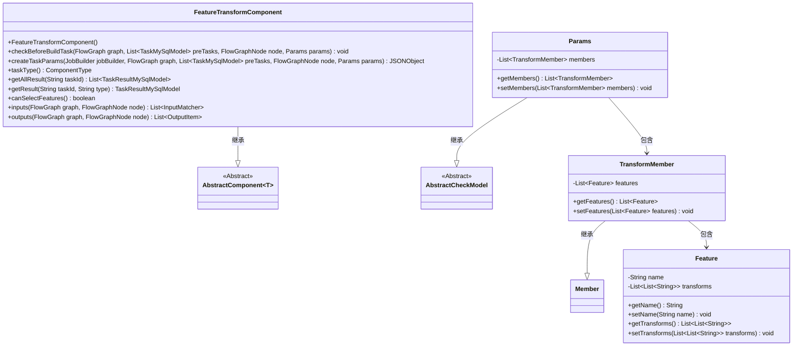
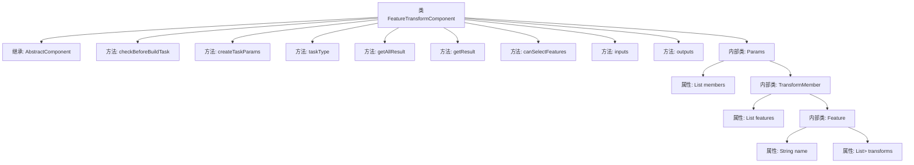
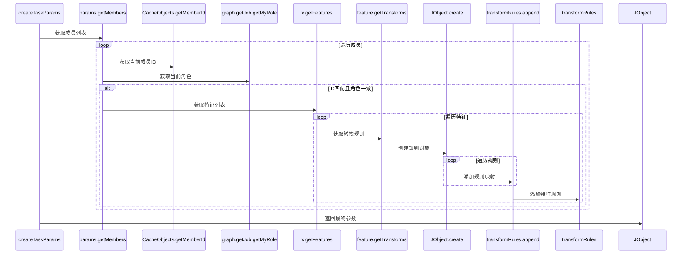

# 基础信息

|      |      |
|------|------|
| 名称 | FeatureTransformComponent |
| 编码语言 | .java |
| 代码路径 | WeFe/board/board-service/src/main/java/com/welab/wefe/board/service/component/feature/FeatureTransformComponent.java |
| 包名 | com.welab.wefe.board.service.component.feature |
| 依赖项 | ['com.alibaba.fastjson.JSONObject', 'com.welab.wefe.board.service.component.base.AbstractComponent', 'com.welab.wefe.board.service.component.base.io.IODataType', 'com.welab.wefe.board.service.component.base.io.InputMatcher', 'com.welab.wefe.board.service.component.base.io.Names', 'com.welab.wefe.board.service.component.base.io.OutputItem', 'com.welab.wefe.board.service.database.entity.job.TaskMySqlModel', 'com.welab.wefe.board.service.database.entity.job.TaskResultMySqlModel', 'com.welab.wefe.board.service.dto.kernel.Member', 'com.welab.wefe.board.service.exception.FlowNodeException', 'com.welab.wefe.board.service.model.FlowGraph', 'com.welab.wefe.board.service.model.FlowGraphNode', 'com.welab.wefe.board.service.model.JobBuilder', 'com.welab.wefe.board.service.service.CacheObjects', 'com.welab.wefe.common.fieldvalidate.AbstractCheckModel', 'com.welab.wefe.common.fieldvalidate.annotation.Check', 'com.welab.wefe.common.util.JObject', 'com.welab.wefe.common.wefe.enums.ComponentType', 'org.springframework.stereotype.Service', 'java.util.Arrays', 'java.util.List'] |
| 概述说明 | 特征转换组件，继承抽象类，处理特征转换任务。包含参数校验、任务参数生成、输入输出定义。支持特征选择和转换规则配置，返回转换后的数据集。 |

# 说明

FeatureTransformComponent是一个服务类，继承自AbstractComponent，用于处理特征转换任务。它包含参数检查、任务参数创建、输入输出定义等功能。主要逻辑在createTaskParams方法中，通过遍历成员和特征，构建转换规则JSON对象。Params内部类定义了成员信息和特征转换规则的结构，包含必要的校验注解。组件类型为FeatureTransform，支持特征选择，输入输出数据类型为DataSetInstance。

# 类列表 Class Summary

| 名称   | 类型  | 说明 |
|-------|------|-------------|
| FeatureTransformComponent | class | FeatureTransformComponent是处理特征转换的组件，继承AbstractComponent，包含参数校验、任务参数生成及输入输出定义。支持特征选择和转换规则配置，输出转换后的数据集。 |

## 类 FeatureTransformComponent

|      |      |
|------|------|
| 访问范围 | @Service;public |
| 类型 | class |
| 名称 | FeatureTransformComponent |
| 说明 | FeatureTransformComponent是处理特征转换的组件，继承AbstractComponent，包含参数校验、任务参数生成及输入输出定义。支持特征选择和转换规则配置，输出转换后的数据集。 |

### UML类图

这段代码描述了一个特征转换组件（FeatureTransformComponent），它继承自泛型抽象类AbstractComponent，主要用于处理特征数据的转换规则。核心类Params包含TransformMember列表，每个成员又包含多个Feature对象，特征对象中存储了名称和转换规则（字符串二维列表）。组件通过createTaskParams方法将转换规则序列化为JSON格式，并实现了任务类型定义、输入输出匹配等接口方法。整体设计采用分层结构，通过嵌套类组织参数模型，支持特征级别的转换规则配置。

### 内部方法调用关系图

流程图展示了FeatureTransformComponent类的结构，包括其继承关系、主要方法和内部类Params的层级结构。时序图详细描述了createTaskParams方法的执行流程，展示了如何从参数中提取成员信息，验证身份后处理特征转换规则，最终构建任务参数JSON对象的过程。该组件主要用于特征转换任务的处理，包含完整的参数校验和转换规则构建能力。

### 字段列表 Field List

| 名称  | 类型  | 说明 |
|-------|-------|------|

### 方法列表

| 名称  | 类型  | 说明 |
|-------|-------|------|
| getAllResult | List<TaskResultMySqlModel> | 重写方法getAllResult，接收taskId参数，返回TaskResultMySqlModel列表，当前返回null。 |
| checkBeforeBuildTask | void | 覆盖方法检查构建任务前条件，参数包括流程图、前置任务列表、节点和参数，可能抛出流程节点异常。 |
| getResult | TaskResultMySqlModel | 方法getResult根据taskId和type查询结果，当前返回null。 |
| taskType | ComponentType | 代码重写父类方法，返回组件类型为特征转换。 |
| createTaskParams | JSONObject | 该方法根据任务参数创建JSON对象，处理特征转换规则。遍历成员列表，匹配当前角色和成员ID，提取特征及其转换映射，生成转换规则JSON。最终返回包含转换规则的JSON对象。 |
| canSelectFeatures | boolean | 方法canSelectFeatures返回true，表示支持选择功能。 |
| inputs | List<InputMatcher> | 方法重写，返回包含数据集输入匹配器的列表。 |
| outputs | List<OutputItem> | 方法outputs返回包含数据集实例的输出项列表，参数为流程图和节点，可能抛出节点异常。 |

