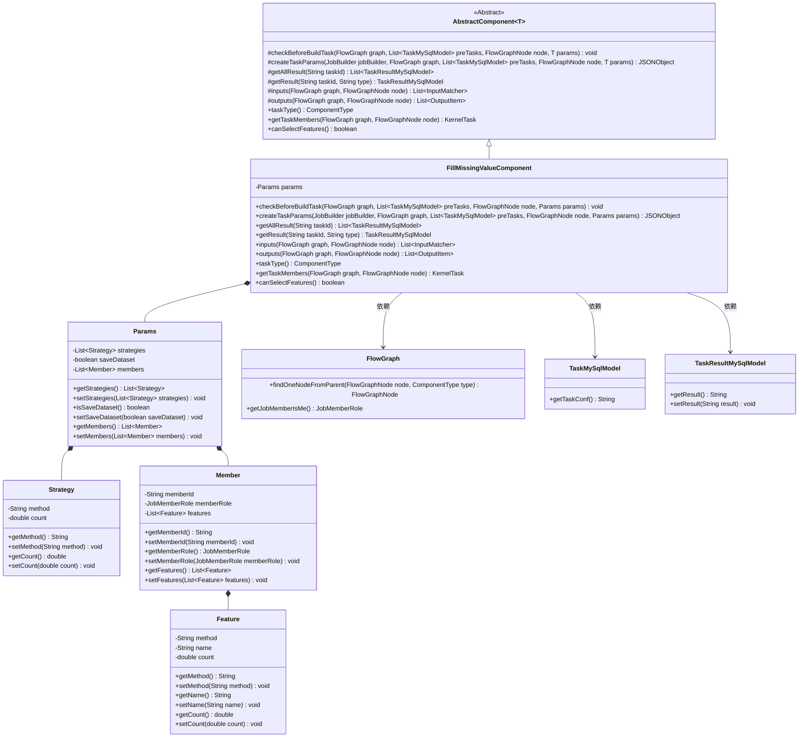
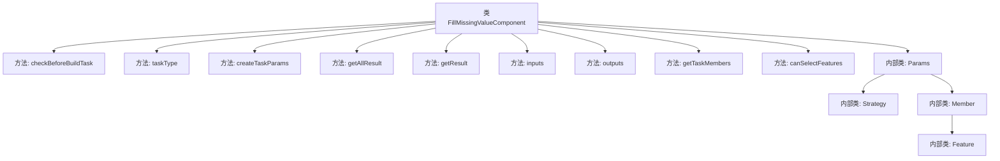
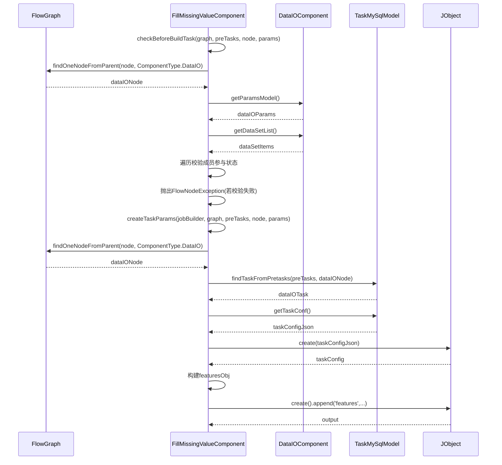

# 基础信息

|      |      |
|------|------|
| 名称 | FillMissingValueComponent |
| 编码语言 | .java |
| 代码路径 | WeFe/board/board-service/src/main/java/com/welab/wefe/board/service/component/feature/FillMissingValueComponent.java |
| 包名 | com.welab.wefe.board.service.component.feature |
| 依赖项 | ['com.alibaba.fastjson.JSONObject', 'com.welab.wefe.board.service.component.DataIOComponent', 'com.welab.wefe.board.service.component.base.AbstractComponent', 'com.welab.wefe.board.service.component.base.io.IODataType', 'com.welab.wefe.board.service.component.base.io.InputMatcher', 'com.welab.wefe.board.service.component.base.io.Names', 'com.welab.wefe.board.service.component.base.io.OutputItem', 'com.welab.wefe.board.service.database.entity.job.TaskMySqlModel', 'com.welab.wefe.board.service.database.entity.job.TaskResultMySqlModel', 'com.welab.wefe.board.service.dto.kernel.Member', 'com.welab.wefe.board.service.dto.kernel.machine_learning.KernelTask', 'com.welab.wefe.board.service.exception.FlowNodeException', 'com.welab.wefe.board.service.model.FlowGraph', 'com.welab.wefe.board.service.model.FlowGraphNode', 'com.welab.wefe.board.service.model.JobBuilder', 'com.welab.wefe.board.service.service.CacheObjects', 'com.welab.wefe.common.fieldvalidate.AbstractCheckModel', 'com.welab.wefe.common.fieldvalidate.annotation.Check', 'com.welab.wefe.common.util.JObject', 'com.welab.wefe.common.web.util.ModelMapper', 'com.welab.wefe.common.wefe.enums.ComponentType', 'com.welab.wefe.common.wefe.enums.JobMemberRole', 'com.welab.wefe.common.wefe.enums.TaskResultType', 'org.apache.commons.collections4.CollectionUtils', 'org.springframework.beans.BeanUtils', 'org.springframework.stereotype.Service', 'java.util.ArrayList', 'java.util.Arrays', 'java.util.List', 'java.util.concurrent.atomic.AtomicInteger'] |
| 概述说明 | FillMissingValueComponent是处理缺失值填充的组件，检查成员参与情况并生成任务参数，支持特征选择和数据集保存。 |

# 说明

FillMissingValueComponent是一个继承自AbstractComponent的服务类，用于处理数据缺失值填充任务。它包含多个关键方法：checkBeforeBuildTask验证所有成员是否参与任务，createTaskParams生成任务参数JSON对象，getAllResult和getResult获取任务结果，inputs和outputs定义输入输出数据类型，getTaskMembers获取任务成员信息。Params内部类定义了策略、成员和特征的参数结构，包含方法、名称、数值等字段，并进行了必要的校验。该类支持特征选择，确保数据填充操作的完整性和正确性。

# 类列表 Class Summary

| 名称   | 类型  | 说明 |
|-------|------|-------------|
| FillMissingValueComponent | class | FillMissingValueComponent是处理缺失值的组件，检查成员参与情况，生成任务参数，支持特征选择和结果处理。 |

## 类 FillMissingValueComponent

|      |      |
|------|------|
| 访问范围 | @Service;public |
| 类型 | class |
| 名称 | FillMissingValueComponent |
| 说明 | FillMissingValueComponent是处理缺失值的组件，检查成员参与情况，生成任务参数，支持特征选择和结果处理。 |

### UML类图

这段代码描述了一个用于填充缺失值的组件FillMissingValueComponent，它继承自AbstractComponent并实现了多个核心方法。该组件通过Params类管理填充策略(Strategy)、成员信息(Member)和特征配置(Feature)，包含数据验证、任务参数生成和结果处理等功能。类图展示了组件与参数类的组合关系，以及与流程图中其他核心类的依赖关系，整体结构清晰体现了数据处理流程中的职责划分。

### 内部方法调用关系图

该流程图展示了FillMissingValueComponent类的核心结构和调用关系。主类包含9个主要方法和4个嵌套类，其中Params作为核心配置类包含Strategy/Member/Feature三个子类。时序图重点描述了checkBeforeBuildTask和createTaskParams两个关键方法的执行流程，涉及与FlowGraph、DataIOComponent的交互，以及参数校验和任务配置构建过程。整体设计用于缺失值填充功能，强调数据校验和任务参数生成的完整性。

### 字段列表 Field List

| 名称  | 类型  | 说明 |
|-------|-------|------|

### 方法列表

| 名称  | 类型  | 说明 |
|-------|-------|------|
| inputs | List<InputMatcher> | 该方法重写父类方法，返回一个包含单个InputMatcher的列表，匹配名为NORMAL_DATA_SET的数据集实例输入。 |
| getTaskMembers | KernelTask | 方法getTaskMembers接收FlowGraph和FlowGraphNode参数，提取节点成员列表并转换为Member对象，设置成员名称后返回KernelTask。 |
| getResult | TaskResultMySqlModel | 该方法根据任务ID和类型查询任务结果，若不存在返回null。存在则复制属性，处理结果中的成员信息，添加成员名称后更新结果并返回。 |
| checkBeforeBuildTask | void | 检查构建任务前确保所有成员参与。遍历数据集和成员列表，匹配成员ID和角色，统计匹配数。若匹配数不等于数据集大小，抛出异常提示所有成员需参与。 |
| outputs | List<OutputItem> | Java方法重写，返回包含数据集实例的输出项列表。 |
| getAllResult | List<TaskResultMySqlModel> | 获取指定任务ID的所有结果列表。 |
| taskType | ComponentType | Java方法重写，返回填充缺失值任务类型。 |
| canSelectFeatures | boolean | 方法canSelectFeatures返回true，表示支持选择功能。 |
| createTaskParams | JSONObject | 该方法创建任务参数JSON对象，检查DataIO组件是否存在并获取with_label字段，遍历成员特征生成features对象，最终返回包含features、with_label和save_dataset的JSON。 |

