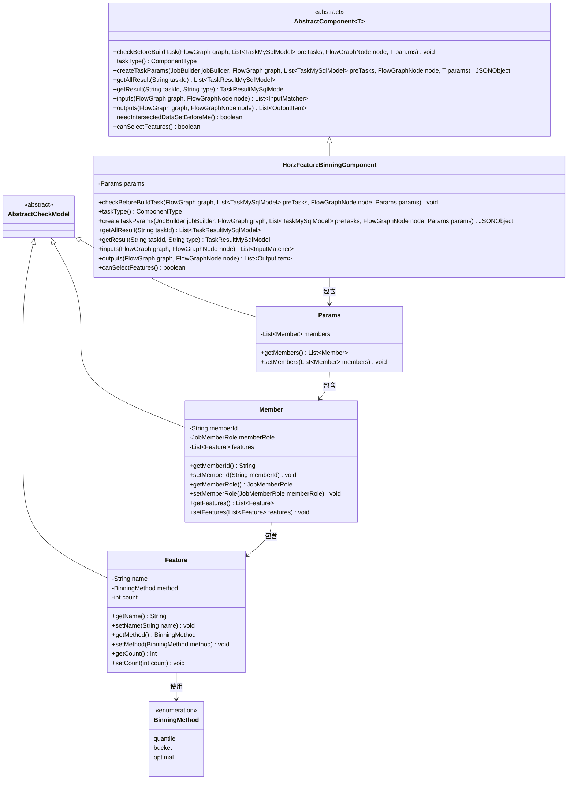
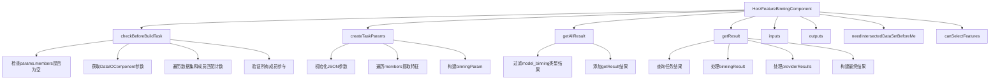
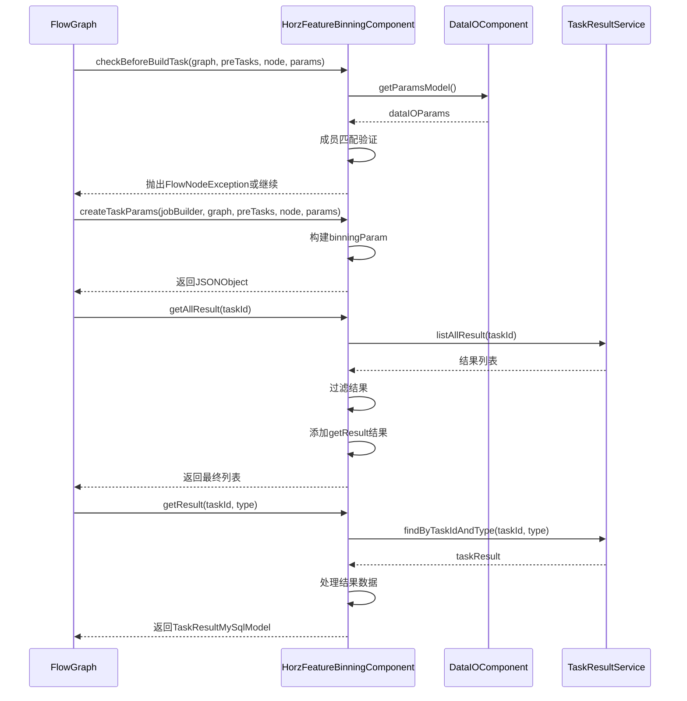

# 基础信息

|      |      |
|------|------|
| 名称 | HorzFeatureBinningComponent |
| 编码语言 | .java |
| 代码路径 | WeFe/board/board-service/src/main/java/com/welab/wefe/board/service/component/feature/HorzFeatureBinningComponent.java |
| 包名 | com.welab.wefe.board.service.component.feature |
| 依赖项 | ['com.alibaba.fastjson.JSONObject', 'com.welab.wefe.board.service.component.DataIOComponent', 'com.welab.wefe.board.service.component.base.AbstractComponent', 'com.welab.wefe.board.service.component.base.io.IODataType', 'com.welab.wefe.board.service.component.base.io.InputMatcher', 'com.welab.wefe.board.service.component.base.io.Names', 'com.welab.wefe.board.service.component.base.io.OutputItem', 'com.welab.wefe.board.service.database.entity.job.TaskMySqlModel', 'com.welab.wefe.board.service.database.entity.job.TaskResultMySqlModel', 'com.welab.wefe.board.service.exception.FlowNodeException', 'com.welab.wefe.board.service.model.FlowGraph', 'com.welab.wefe.board.service.model.FlowGraphNode', 'com.welab.wefe.board.service.model.JobBuilder', 'com.welab.wefe.board.service.service.CacheObjects', 'com.welab.wefe.common.fieldvalidate.AbstractCheckModel', 'com.welab.wefe.common.fieldvalidate.annotation.Check', 'com.welab.wefe.common.util.JObject', 'com.welab.wefe.common.wefe.enums.ComponentType', 'com.welab.wefe.common.wefe.enums.JobMemberRole', 'com.welab.wefe.common.wefe.enums.TaskResultType', 'org.apache.commons.collections4.CollectionUtils', 'org.springframework.beans.BeanUtils', 'org.springframework.stereotype.Service', 'java.util.ArrayList', 'java.util.Arrays', 'java.util.List', 'java.util.concurrent.atomic.AtomicInteger', 'java.util.stream.Collectors'] |
| 概述说明 | HorzFeatureBinningComponent实现特征分箱功能，检查成员参与情况，生成分箱参数，支持等频、等宽、卡方分箱方法，输出分箱模型和数据集。 |

# 说明

HorzFeatureBinningComponent是一个实现横向特征分箱功能的Spring服务组件，继承自AbstractComponent。主要功能包括：构建任务前校验参数有效性（确保所有成员参与分箱）、生成分箱任务参数（设置分箱数量与特征名）、获取分箱结果（处理模型参数与提供者结果）。组件定义了Params、Member和Feature三个嵌套类来管理分箱配置，支持等频、等宽和卡方三种分箱方法。输入输出类型明确指定为数据集实例和分箱模型，并声明不要求前置数据集交集。该组件允许特征选择，核心逻辑围绕成员ID、角色及特征属性的校验与数据处理展开。

# 类列表 Class Summary

| 名称   | 类型  | 说明 |
|-------|------|-------------|
| HorzFeatureBinningComponent | class | HorzFeatureBinningComponent实现特征分箱功能，检查成员参与情况，生成分箱参数，支持等频、等宽、卡方分箱方法，输出分箱模型和数据集。 |

## 类 HorzFeatureBinningComponent

|      |      |
|------|------|
| 访问范围 | @Service;public |
| 类型 | class |
| 名称 | HorzFeatureBinningComponent |
| 说明 | HorzFeatureBinningComponent实现特征分箱功能，检查成员参与情况，生成分箱参数，支持等频、等宽、卡方分箱方法，输出分箱模型和数据集。 |

### UML类图

这段代码实现了一个水平特征分箱组件，主要用于特征工程中的分箱处理。类图展示了核心类结构：HorzFeatureBinningComponent继承自泛型抽象类AbstractComponent，包含Params参数类、Member成员类和Feature特征类。其中Feature使用BinningMethod枚举定义分箱方法，Params通过Member聚合Feature形成层级结构。该组件实现了任务参数构建、结果处理、输入输出定义等功能，支持等频/等宽/卡方等多种分箱方法，并包含严格的参数校验逻辑。

### 内部方法调用关系图

该流程图展示了HorzFeatureBinningComponent的核心方法调用关系，包括参数检查、任务参数创建、结果获取等关键流程。时序图则详细描述了组件与外部系统的交互过程，特别是与FlowGraph和TaskResultService的数据流转。该组件主要负责特征分箱处理，包含成员验证、分箱参数生成和结果处理等功能，确保特征分箱过程的完整性和正确性。

### 字段列表 Field List

| 名称  | 类型  | 说明 |
|-------|-------|------|

### 方法列表

| 名称  | 类型  | 说明 |
|-------|-------|------|
| getAllResult | List<TaskResultMySqlModel> | 该方法获取指定任务ID的所有结果，筛选类型为model_binning的数据，并合并另一方法的结果后返回列表。 |
| needIntersectedDataSetBeforeMe | boolean | 该方法重写父类逻辑，明确返回false，表示当前操作不需要预先获取交集数据集。 |
| outputs | List<OutputItem> | 方法outputs返回包含两个OutputItem的列表：一个名为BINNING_MODEL的模型和一个名为NORMAL_DATA_SET的数据集。 |
| inputs | List<InputMatcher> | 该方法返回一个包含单个InputMatcher的列表，匹配名为NORMAL_DATA_SET的数据集实例输入。 |
| checkBeforeBuildTask | void | 检查构建任务前条件：确保分箱策略存在且所有数据集成员参与，否则抛出异常。 |
| taskType | ComponentType | 该方法重写父类方法，返回组件类型为水平特征分箱。 |
| canSelectFeatures | boolean | 该方法返回true，表示支持选择特性。 |
| getResult | TaskResultMySqlModel | 该方法根据任务ID和类型查询结果，处理并返回包含成员信息的模型分箱结果。若结果不存在则返回null。 |
| createTaskParams | JSONObject | 方法创建任务参数，遍历成员特征生成分箱参数，包含分箱数量和名称列表。 |

