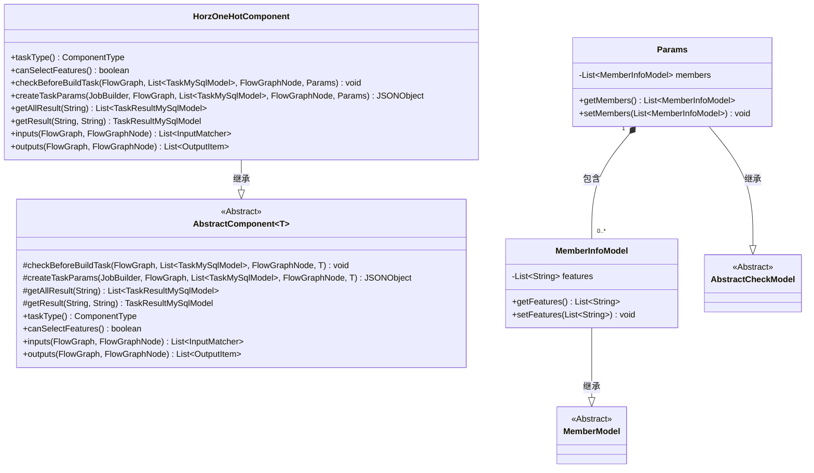
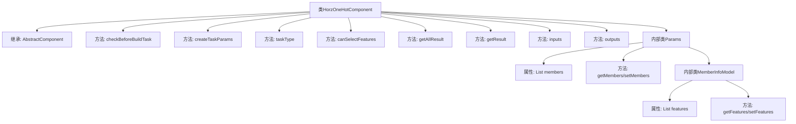

# 基础信息

|      |      |
|------|------|
| 名称 | HorzOneHotComponent |
| 编码语言 | .java |
| 代码路径 | WeFe/board/board-service/src/main/java/com/welab/wefe/board/service/component/feature/HorzOneHotComponent.java |
| 包名 | com.welab.wefe.board.service.component.feature |
| 依赖项 | ['java.util.ArrayList', 'java.util.Arrays', 'java.util.List', 'org.springframework.stereotype.Service', 'com.alibaba.fastjson.JSONObject', 'com.welab.wefe.board.service.component.base.AbstractComponent', 'com.welab.wefe.board.service.component.base.io.IODataType', 'com.welab.wefe.board.service.component.base.io.InputMatcher', 'com.welab.wefe.board.service.component.base.io.Names', 'com.welab.wefe.board.service.component.base.io.OutputItem', 'com.welab.wefe.board.service.database.entity.job.TaskMySqlModel', 'com.welab.wefe.board.service.database.entity.job.TaskResultMySqlModel', 'com.welab.wefe.board.service.dto.entity.MemberModel', 'com.welab.wefe.board.service.exception.FlowNodeException', 'com.welab.wefe.board.service.model.FlowGraph', 'com.welab.wefe.board.service.model.FlowGraphNode', 'com.welab.wefe.board.service.model.JobBuilder', 'com.welab.wefe.board.service.service.CacheObjects', 'com.welab.wefe.common.fieldvalidate.AbstractCheckModel', 'com.welab.wefe.common.fieldvalidate.annotation.Check', 'com.welab.wefe.common.util.JObject', 'com.welab.wefe.common.wefe.enums.ComponentType'] |
| 概述说明 | HorzOneHotComponent实现水平方向OneHot编码，检查成员特征并生成任务参数，支持特征选择，输入输出为数据集实例。 |

# 说明

HorzOneHotComponent是一个继承自AbstractComponent的服务类，用于处理水平方向的特征独热编码任务。该类包含多个关键方法：checkBeforeBuildTask用于构建前的参数检查，createTaskParams生成任务参数并提取当前成员的特征列名，taskType返回组件类型为HorzOneHot。inputs和outputs方法分别定义输入输出数据类型为NORMAL_DATA_SET的DataSetInstance。Params内部类包含成员信息及特征列配置，支持必填校验。组件支持特征选择功能，但结果获取方法返回空值。

# 类列表 Class Summary

| 名称   | 类型  | 说明 |
|-------|------|-------------|
| HorzOneHotComponent | class | HorzOneHotComponent是处理水平OneHot编码的组件，继承AbstractComponent，支持特征选择，输入为数据集，输出为转换后的数据集。Params包含成员信息和特征列配置。 |

## 类 HorzOneHotComponent

|      |      |
|------|------|
| 访问范围 | @Service;public |
| 类型 | class |
| 名称 | HorzOneHotComponent |
| 说明 | HorzOneHotComponent是处理水平OneHot编码的组件，继承AbstractComponent，支持特征选择，输入为数据集，输出为转换后的数据集。Params包含成员信息和特征列配置。 |

### UML类图

该类图展示了HorzOneHotComponent及其相关类的结构。HorzOneHotComponent继承自泛型类AbstractComponent<Params>，实现了数据处理流程中的核心方法。Params作为参数类包含多个MemberInfoModel实例，后者继承自MemberModel并扩展了特征列表功能。整体设计采用分层抽象，通过继承和组合实现代码复用，主要功能包括参数校验、任务参数生成和输入输出匹配。

### 内部方法调用关系图

这段代码展示了一个名为HorzOneHotComponent的服务类，继承自AbstractComponent并实现了多个核心方法。主要功能包括参数校验(checkBeforeBuildTask)、任务参数生成(createTaskParams)、输入输出定义(inputs/outputs)等。内部类Params用于封装成员信息和特征列配置，包含嵌套的MemberInfoModel类来管理特征列表。该组件支持特征选择(canSelectFeatures)，并定义了水平方向独热编码的任务类型(ComponentType.HorzOneHot)。整体结构体现了组件化设计思想，通过继承和组合实现特定数据处理功能。

### 字段列表 Field List

| 名称  | 类型  | 说明 |
|-------|-------|------|

### 方法列表

| 名称  | 类型  | 说明 |
|-------|-------|------|
| checkBeforeBuildTask | void | 检查构建任务前的参数和依赖关系，确保流程节点正常执行。 |
| getResult | TaskResultMySqlModel | 重写方法getResult，根据taskId和type查询结果，当前返回null。 |
| inputs | List<InputMatcher> | 方法重写，返回包含数据集实例的输入匹配器列表。 |
| outputs | List<OutputItem> | 方法outputs返回包含数据集实例的输出项列表，参数为graph和node，可能抛出FlowNodeException。 |
| createTaskParams | JSONObject | 方法创建任务参数，处理成员特征并生成包含转换列名和保存数据集的JSON对象。 |
| taskType | ComponentType | 方法重写，返回水平方向独热编码组件类型。 |
| getAllResult | List<TaskResultMySqlModel> | Java方法：根据taskId获取任务结果列表，当前返回空。 |
| canSelectFeatures | boolean | 方法canSelectFeatures返回true，表示支持选择功能。 |

