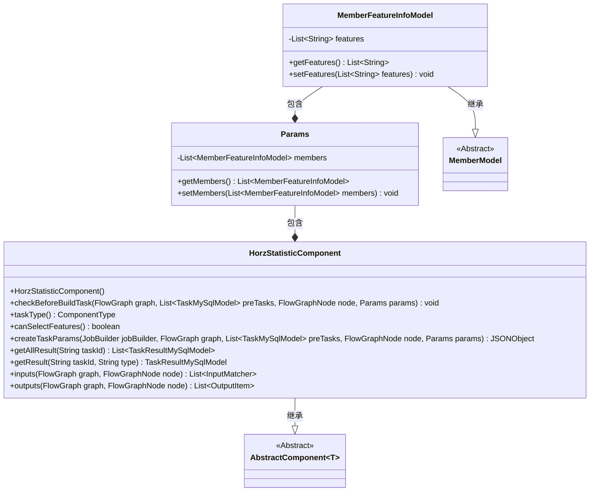
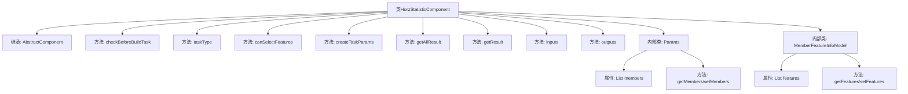

# 基础信息

|      |      |
|------|------|
| 名称 | HorzStatisticComponent |
| 编码语言 | .java |
| 代码路径 | WeFe/board/board-service/src/main/java/com/welab/wefe/board/service/component/feature/HorzStatisticComponent.java |
| 包名 | com.welab.wefe.board.service.component.feature |
| 依赖项 | ['com.alibaba.fastjson.JSONObject', 'com.welab.wefe.board.service.component.base.AbstractComponent', 'com.welab.wefe.board.service.component.base.filter.OutputDataTypesOutputFilter', 'com.welab.wefe.board.service.component.base.io.IODataType', 'com.welab.wefe.board.service.component.base.io.InputMatcher', 'com.welab.wefe.board.service.component.base.io.Names', 'com.welab.wefe.board.service.component.base.io.OutputItem', 'com.welab.wefe.board.service.database.entity.job.TaskMySqlModel', 'com.welab.wefe.board.service.database.entity.job.TaskResultMySqlModel', 'com.welab.wefe.board.service.dto.entity.MemberModel', 'com.welab.wefe.board.service.exception.FlowNodeException', 'com.welab.wefe.board.service.model.FlowGraph', 'com.welab.wefe.board.service.model.FlowGraphNode', 'com.welab.wefe.board.service.model.JobBuilder', 'com.welab.wefe.board.service.service.CacheObjects', 'com.welab.wefe.common.fieldvalidate.AbstractCheckModel', 'com.welab.wefe.common.util.JObject', 'com.welab.wefe.common.wefe.enums.ComponentType', 'com.welab.wefe.common.wefe.enums.TaskResultType', 'org.apache.commons.collections4.CollectionUtils', 'org.springframework.beans.BeanUtils', 'org.springframework.stereotype.Service', 'java.util.Arrays', 'java.util.List', 'java.util.stream.Collectors'] |
| 概述说明 | HorzStatisticComponent是处理横向统计任务的组件，支持特征选择，生成JSON结果，包含成员特征处理和结果格式化功能。 |

# 说明

HorzStatisticComponent是一个继承自AbstractComponent的服务类，用于处理横向统计任务。它包含参数检查、任务类型定义、特征选择支持、任务参数创建、结果获取和处理等功能。主要方法包括检查前置任务、返回组件类型、支持特征选择、创建任务参数、获取所有结果和单个结果、定义输入输出匹配器等。内部类Params和MemberFeatureInfoModel用于封装成员特征信息。结果处理涉及数据转换和成员信息补充。输入要求NORMAL_DATA_SET类型数据集，输出JSON格式结果。

# 类列表 Class Summary

| 名称   | 类型  | 说明 |
|-------|------|-------------|
| HorzStatisticComponent | class | HorzStatisticComponent是处理横向统计的组件，支持特征选择，生成JSON结果，包含成员特征处理和结果格式化功能。 |

## 类 HorzStatisticComponent

|      |      |
|------|------|
| 访问范围 | @Service;public |
| 类型 | class |
| 名称 | HorzStatisticComponent |
| 说明 | HorzStatisticComponent是处理横向统计的组件，支持特征选择，生成JSON结果，包含成员特征处理和结果格式化功能。 |

### UML类图

类图描述：
该图展示了HorzStatisticComponent及其相关类的结构关系。HorzStatisticComponent继承自泛型类AbstractComponent<Params>，包含Params内部类作为参数模型，而Params又聚合了MemberFeatureInfoModel对象列表。MemberFeatureInfoModel继承自抽象类MemberModel，扩展了features字段。组件实现了任务参数创建、结果获取、输入输出匹配等核心方法，主要用于处理水平统计任务的数据处理和结果转换。各层级间通过继承和组合形成清晰的职责划分。

### 内部方法调用关系图

这段代码定义了一个名为HorzStatisticComponent的服务类，继承自AbstractComponent泛型类，主要用于处理水平统计相关的任务。类包含多个核心方法：创建任务参数、获取任务结果、定义输入输出匹配器等，并有两个内部类Params和MemberFeatureInfoModel用于封装成员特征数据。其中createTaskParams方法会遍历成员特征信息并生成JSON参数，getResult方法会对统计结果进行数据清洗和成员信息补充。整个类设计用于在数据流处理中完成特征统计任务，支持特征选择和结果格式化输出。

### 字段列表 Field List

| 名称  | 类型  | 说明 |
|-------|-------|------|

### 方法列表

| 名称  | 类型  | 说明 |
|-------|-------|------|
| getAllResult | List<TaskResultMySqlModel> | Java方法：根据任务ID获取特定类型的结果列表，合并后返回。 |
| getResult | TaskResultMySqlModel | 根据任务ID和类型获取任务结果，处理结果中的无限值替换，更新成员名称后返回结果模型。 |
| inputs | List<InputMatcher> | 该方法重写父类方法，返回一个包含InputMatcher的列表，匹配NORMAL_DATA_SET和指定输出类型的过滤器。 |
| outputs | List<OutputItem> | 方法outputs返回包含JSON结果的OutputItem列表，输入为FlowGraph和节点。 |
| taskType | ComponentType | 该方法重写taskType()，返回水平统计组件类型HorzStatistic。 |
| createTaskParams | JSONObject | 方法根据成员ID匹配特征列表，返回包含特征名的JSON对象；若无匹配返回空对象。 |
| canSelectFeatures | boolean | 方法canSelectFeatures返回true，表示支持选择功能。 |
| checkBeforeBuildTask | void | 方法检查构建任务前的条件，参数包括流程图、前置任务列表、节点和参数，可能抛出流程节点异常。 |

