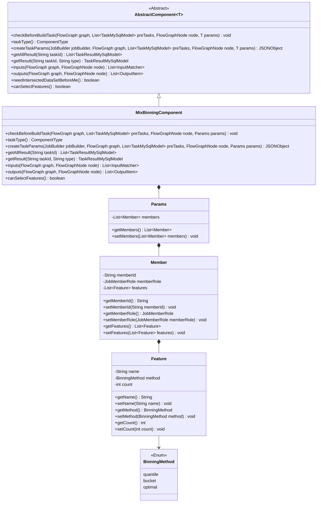
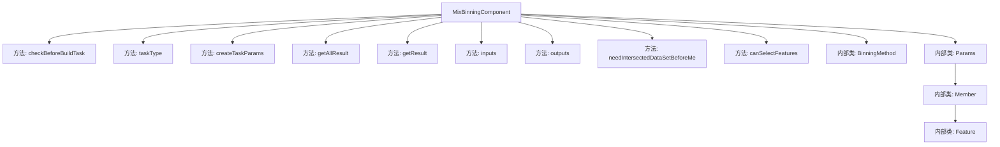
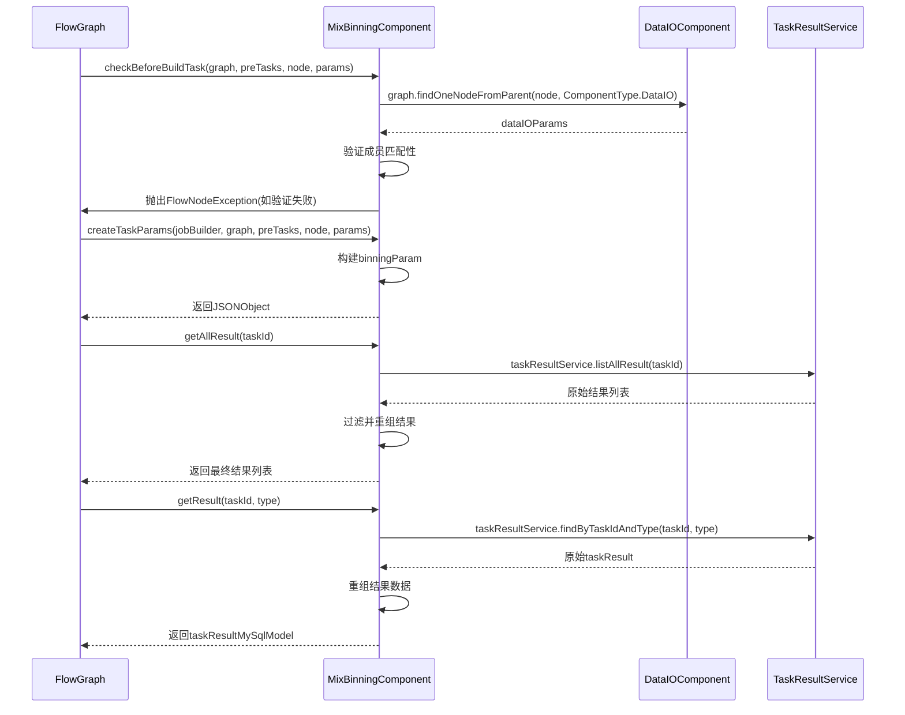

# 基础信息

|      |      |
|------|------|
| 名称 | MixBinningComponent |
| 编码语言 | .java |
| 代码路径 | WeFe/board/board-service/src/main/java/com/welab/wefe/board/service/component/feature/MixBinningComponent.java |
| 包名 | com.welab.wefe.board.service.component.feature |
| 依赖项 | ['com.alibaba.fastjson.JSONObject', 'com.welab.wefe.board.service.component.DataIOComponent', 'com.welab.wefe.board.service.component.base.AbstractComponent', 'com.welab.wefe.board.service.component.base.io.IODataType', 'com.welab.wefe.board.service.component.base.io.InputMatcher', 'com.welab.wefe.board.service.component.base.io.Names', 'com.welab.wefe.board.service.component.base.io.OutputItem', 'com.welab.wefe.board.service.database.entity.job.TaskMySqlModel', 'com.welab.wefe.board.service.database.entity.job.TaskResultMySqlModel', 'com.welab.wefe.board.service.exception.FlowNodeException', 'com.welab.wefe.board.service.model.FlowGraph', 'com.welab.wefe.board.service.model.FlowGraphNode', 'com.welab.wefe.board.service.model.JobBuilder', 'com.welab.wefe.board.service.service.CacheObjects', 'com.welab.wefe.common.fieldvalidate.AbstractCheckModel', 'com.welab.wefe.common.fieldvalidate.annotation.Check', 'com.welab.wefe.common.util.JObject', 'com.welab.wefe.common.wefe.enums.ComponentType', 'com.welab.wefe.common.wefe.enums.JobMemberRole', 'com.welab.wefe.common.wefe.enums.TaskResultType', 'org.apache.commons.collections4.CollectionUtils', 'org.springframework.beans.BeanUtils', 'org.springframework.stereotype.Service', 'java.util.ArrayList', 'java.util.Arrays', 'java.util.List', 'java.util.concurrent.atomic.AtomicInteger', 'java.util.stream.Collectors'] |
| 概述说明 | MixBinningComponent是处理分箱策略的组件，检查成员参与情况并生成分箱参数，支持多种分箱方法如等频、等宽和卡方。 |

# 说明

MixBinningComponent是一个服务类，继承自AbstractComponent，用于处理混合分箱任务。它包含多个关键方法：checkBeforeBuildTask验证分箱策略和成员参与情况；createTaskParams生成分箱参数；getAllResult和getResult处理任务结果；inputs和outputs定义输入输出。内部类Params、Member和Feature分别封装分箱参数、成员信息和特征属性，支持等频、等宽和卡方分箱方法。该类还提供特征选择功能。

# 类列表 Class Summary

| 名称   | 类型  | 说明 |
|-------|------|-------------|
| MixBinningComponent | class | MixBinningComponent是处理分箱策略的组件，检查成员参与情况并生成分箱参数，支持多种分箱方法如等频、等宽和卡方。 |

## 类 MixBinningComponent

|      |      |
|------|------|
| 访问范围 | @Service;public |
| 类型 | class |
| 名称 | MixBinningComponent |
| 说明 | MixBinningComponent是处理分箱策略的组件，检查成员参与情况并生成分箱参数，支持多种分箱方法如等频、等宽和卡方。 |

### UML类图

这段类图展示了MixBinningComponent及其相关类的结构。MixBinningComponent继承自AbstractComponent，实现了数据分箱功能的核心逻辑。它包含Params内部类作为参数容器，Params又由Member和Feature类组成，形成多层嵌套结构。BinningMethod枚举定义了三种分箱方法。类之间的关系包括继承、组合和关联，清晰地展现了组件的数据流动和依赖关系。该组件主要负责验证成员参与情况、创建分箱任务参数、处理任务结果以及定义输入输出数据格式。

### 内部方法调用关系图

该流程图展示了MixBinningComponent类的完整结构，包括9个主要方法和4个内部类。时序图重点描述了三个核心交互流程：1)构建前的参数检查流程，涉及与DataIOComponent的交互；2)任务参数创建流程；3)结果获取流程，展示与TaskResultService的交互。类结构清晰展现了分箱功能的核心组件，包括参数验证、任务创建和结果处理三个主要功能模块，同时包含了必要的枚举和参数模型定义。

### 字段列表 Field List

| 名称  | 类型  | 说明 |
|-------|-------|------|

### 方法列表

| 名称  | 类型  | 说明 |
|-------|-------|------|
| getResult | TaskResultMySqlModel | 该方法根据任务ID和类型查询结果，处理模型分箱数据，补充成员信息后返回。若结果为空则返回null。 |
| canSelectFeatures | boolean | 方法canSelectFeatures返回true，表示支持选择功能。 |
| needIntersectedDataSetBeforeMe | boolean | 方法needIntersectedDataSetBeforeMe返回false，表示无需前置交集数据集。 |
| outputs | List<OutputItem> | 方法返回两个输出项：BINNING_MODEL类型为ModelFromBinning，NORMAL_DATA_SET类型为DataSetInstance。 |
| inputs | List<InputMatcher> | 该方法重写父类方法，返回一个包含单个InputMatcher的列表，匹配名为NORMAL_DATA_SET的数据集实例。 |
| getAllResult | List<TaskResultMySqlModel> | 该方法获取指定任务ID的模型分箱结果，先筛选现有结果再添加新组装数据，最后返回合并后的列表。 |
| createTaskParams | JSONObject | 方法根据输入参数生成JSON对象，包含bin_num和bin_names。bin_num默认10，若成员ID匹配则更新为特征数量，bin_names来自成员特征名列表。 |
| checkBeforeBuildTask | void | 检查构建任务前条件：确保分箱策略成员与数据集成员完全匹配，否则抛出异常。 |
| taskType | ComponentType | 该方法返回任务类型为MixBinning的枚举值。 |

