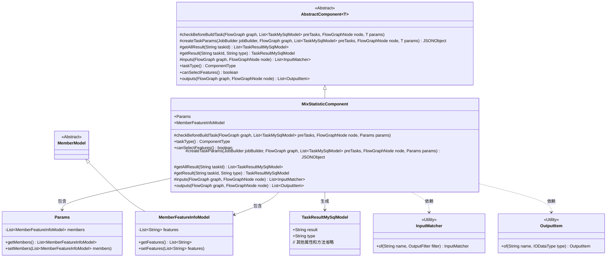

# 基础信息

|      |      |
|------|------|
| 名称 | MixStatisticComponent |
| 编码语言 | .java |
| 代码路径 | WeFe/board/board-service/src/main/java/com/welab/wefe/board/service/component/feature/MixStatisticComponent.java |
| 包名 | com.welab.wefe.board.service.component.feature |
| 依赖项 | ['com.alibaba.fastjson.JSONObject', 'com.welab.wefe.board.service.component.base.AbstractComponent', 'com.welab.wefe.board.service.component.base.filter.OutputDataTypesOutputFilter', 'com.welab.wefe.board.service.component.base.io.IODataType', 'com.welab.wefe.board.service.component.base.io.InputMatcher', 'com.welab.wefe.board.service.component.base.io.Names', 'com.welab.wefe.board.service.component.base.io.OutputItem', 'com.welab.wefe.board.service.database.entity.job.TaskMySqlModel', 'com.welab.wefe.board.service.database.entity.job.TaskResultMySqlModel', 'com.welab.wefe.board.service.dto.entity.MemberModel', 'com.welab.wefe.board.service.model.FlowGraph', 'com.welab.wefe.board.service.model.FlowGraphNode', 'com.welab.wefe.board.service.model.JobBuilder', 'com.welab.wefe.board.service.service.CacheObjects', 'com.welab.wefe.common.fieldvalidate.AbstractCheckModel', 'com.welab.wefe.common.util.JObject', 'com.welab.wefe.common.wefe.enums.ComponentType', 'com.welab.wefe.common.wefe.enums.TaskResultType', 'org.apache.commons.collections4.CollectionUtils', 'org.springframework.beans.BeanUtils', 'org.springframework.stereotype.Service', 'java.util.Arrays', 'java.util.List', 'java.util.stream.Collectors'] |
| 概述说明 | MixStatisticComponent是处理混合统计的组件，继承AbstractComponent，支持特征选择，生成JSON结果，包含成员特征处理和结果重组逻辑。 |

# 说明

MixStatisticComponent是一个继承自AbstractComponent的服务类，用于处理混合统计任务。它重写了多个方法，包括任务类型定义、特征选择支持、任务参数创建、结果获取与处理等。该类包含Params和MemberFeatureInfoModel两个内部类，用于封装成员特征信息。主要功能包括根据成员ID筛选特征、处理任务结果数据（如替换特殊值、添加成员名称）、定义输入输出数据类型等。该组件支持数据特征统计，并能将处理后的结果以JSON格式输出。

# 类列表 Class Summary

| 名称   | 类型  | 说明 |
|-------|------|-------------|
| MixStatisticComponent | class | MixStatisticComponent是处理混合统计任务的组件，支持特征选择，生成JSON结果，包含成员特征处理和结果重组功能。 |

## 类 MixStatisticComponent

|      |      |
|------|------|
| 访问范围 | @Service;public |
| 类型 | class |
| 名称 | MixStatisticComponent |
| 说明 | MixStatisticComponent是处理混合统计任务的组件，支持特征选择，生成JSON结果，包含成员特征处理和结果重组功能。 |

### UML类图

该代码实现了一个混合统计组件`MixStatisticComponent`，继承自泛型抽象类`AbstractComponent`，主要用于处理特征统计任务。类图中展示了核心类结构：`MixStatisticComponent`通过内部类`Params`和`MemberFeatureInfoModel`封装参数，继承`AbstractComponent`的模板方法，并与`TaskResultMySqlModel`、`InputMatcher`等辅助类交互。组件支持特征选择，能生成JSON格式的统计结果，并处理特殊数值转换和成员信息补充。

### 内部方法调用关系图

```mermaid
graph TD
    A["类MixStatisticComponent"]
    B["继承: AbstractComponent<Params>"]
    C["方法: checkBeforeBuildTask"]
    D["方法: taskType --> 返回ComponentType.MixStatistic"]
    E["方法: canSelectFeatures --> 返回true"]
    F["方法: createTaskParams"]
    G["方法: getAllResult"]
    H["方法: getResult"]
    I["方法: inputs"]
    J["方法: outputs"]
    K["内部类: Params"]
    L["内部类: MemberFeatureInfoModel"]

    A --> B
    A --> C
    A --> D
    A --> E
    A --> F
    A --> G
    A --> H
    A --> I
    A --> J
    A --> K
    A --> L

    F --> F1["过滤params.members获取当前成员"]
    F --> F2["创建JObject包含成员特征"]
    G --> G1["过滤taskResultService.listAllResult"]
    G --> G2["添加重组数据到结果列表"]
    H --> H1["查询taskResult"]
    H --> H2["处理Infinity值"]
    H --> H3["添加member_name到结果"]
    I --> I1["返回InputMatcher列表"]
    J --> J1["返回OutputItem列表"]
    K --> K1["属性: List<MemberFeatureInfoModel> members"]
    L --> L1["扩展MemberModel"]
    L --> L2["属性: List<String> features"]
```

这段代码实现了一个混合统计组件，主要功能包括：任务参数创建、结果数据处理和输入输出类型定义。流程图展示了类继承关系、核心方法调用链和两个内部类的结构。组件通过createTaskParams方法构建任务参数，通过getResult方法处理包含Infinity值的统计结果，并补充成员名称信息。输入输出方法定义了数据流规范，Params和MemberFeatureInfoModel内部类用于封装成员特征数据。整体设计体现了数据处理和类型安全的结合。

### 字段列表 Field List

| 名称  | 类型  | 说明 |
|-------|-------|------|

### 方法列表

| 名称  | 类型  | 说明 |
|-------|-------|------|
| canSelectFeatures | boolean | 方法canSelectFeatures返回true，表示支持选择功能。 |
| getAllResult | List<TaskResultMySqlModel> | 该方法获取指定任务ID的数据特征统计结果，先筛选已有结果再添加重组数据，最后返回合并后的列表。 |
| checkBeforeBuildTask | void | 方法checkBeforeBuildTask用于在构建任务前检查，参数包括流程图、前置任务列表、节点和参数。 |
| taskType | ComponentType | 该方法重写taskType()，返回MixStatistic类型的ComponentType枚举值。 |
| createTaskParams | JSONObject | 方法重写，根据成员ID筛选特征信息并返回包含特征列表的JSON对象。 |
| getResult | TaskResultMySqlModel | 方法根据任务ID和类型查询结果，处理结果中的无限值替换，更新成员名称后返回。 |
| inputs | List<InputMatcher> | 方法重写，返回包含输入匹配器的列表，匹配正常数据集和指定输出数据类型过滤器。 |
| outputs | List<OutputItem> | 方法outputs返回包含JSON结果的OutputItem列表。 |

