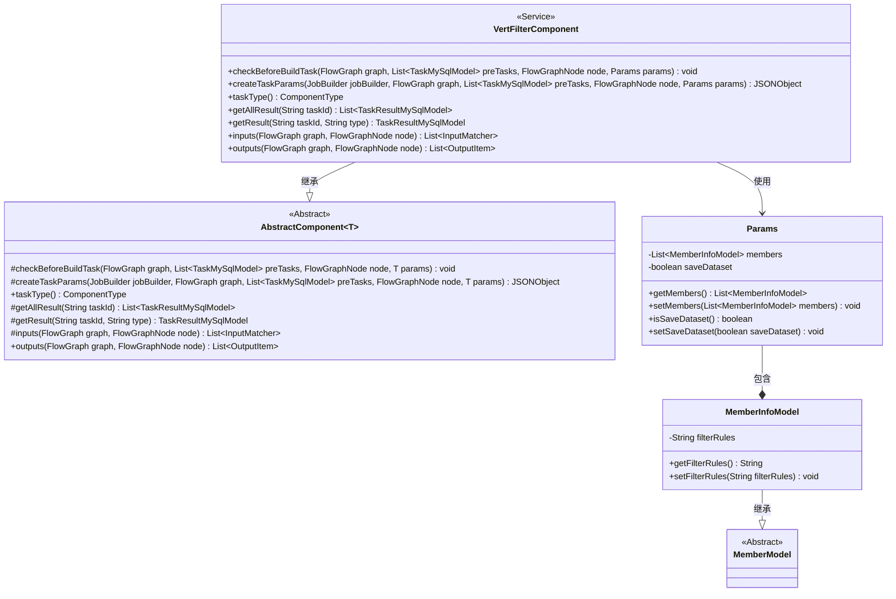
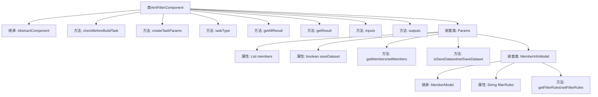

# 基础信息

|      |      |
|------|------|
| 名称 | VertFilterComponent |
| 编码语言 | .java |
| 代码路径 | WeFe/board/board-service/src/main/java/com/welab/wefe/board/service/component/feature/VertFilterComponent.java |
| 包名 | com.welab.wefe.board.service.component.feature |
| 依赖项 | ['com.alibaba.fastjson.JSONObject', 'com.welab.wefe.board.service.component.base.AbstractComponent', 'com.welab.wefe.board.service.component.base.io.IODataType', 'com.welab.wefe.board.service.component.base.io.InputMatcher', 'com.welab.wefe.board.service.component.base.io.Names', 'com.welab.wefe.board.service.component.base.io.OutputItem', 'com.welab.wefe.board.service.database.entity.job.TaskMySqlModel', 'com.welab.wefe.board.service.database.entity.job.TaskResultMySqlModel', 'com.welab.wefe.board.service.dto.entity.MemberModel', 'com.welab.wefe.board.service.exception.FlowNodeException', 'com.welab.wefe.board.service.model.FlowGraph', 'com.welab.wefe.board.service.model.FlowGraphNode', 'com.welab.wefe.board.service.model.JobBuilder', 'com.welab.wefe.board.service.service.CacheObjects', 'com.welab.wefe.common.fieldvalidate.annotation.Check', 'com.welab.wefe.common.util.JObject', 'com.welab.wefe.common.web.dto.AbstractApiInput', 'com.welab.wefe.common.wefe.enums.ComponentType', 'com.welab.wefe.common.wefe.enums.TaskResultType', 'org.apache.commons.lang3.StringUtils', 'org.springframework.stereotype.Service', 'java.util.Arrays', 'java.util.List'] |
| 概述说明 | VertFilterComponent是一个服务组件，用于处理垂直过滤任务。它继承AbstractComponent，包含参数检查、任务参数创建、输入输出定义等功能。Params类定义了成员信息和过滤规则等参数。 |

# 说明

VertFilterComponent是一个继承自AbstractComponent的服务类，用于处理垂直过滤任务。它包含参数检查、任务参数创建、任务类型定义、结果获取、输入输出匹配等功能。Params内部类定义了成员信息和是否保存衍生数据集的参数，其中MemberInfoModel扩展了MemberModel，包含过滤规则字段。组件通过createTaskParams方法构建任务参数，根据成员角色和过滤规则生成JSON对象。输入要求为NORMAL_DATA_SET类型的数据集实例，输出同样类型的数据集实例。

# 类列表 Class Summary

| 名称   | 类型  | 说明 |
|-------|------|-------------|
| VertFilterComponent | class | VertFilterComponent是处理垂直过滤的组件，继承AbstractComponent，包含参数检查、任务参数创建、输入输出定义等功能。Params类包含成员信息和过滤规则，支持保存衍生数据集。 |

## 类 VertFilterComponent

|      |      |
|------|------|
| 访问范围 | @Service;public |
| 类型 | class |
| 名称 | VertFilterComponent |
| 说明 | VertFilterComponent是处理垂直过滤的组件，继承AbstractComponent，包含参数检查、任务参数创建、输入输出定义等功能。Params类包含成员信息和过滤规则，支持保存衍生数据集。 |

### UML类图

类图描述：
VertFilterComponent是一个服务类，继承自泛型抽象类AbstractComponent<Params>，实现了数据过滤相关的核心逻辑。包含Params内部类用于封装成员信息和过滤规则参数，其中Params又嵌套了MemberInfoModel类（继承自MemberModel）用于存储成员特定的过滤规则。该类通过重写父类方法实现任务参数构建、输入输出定义等功能，主要处理数据集过滤操作，支持规则配置和结果保存。

### 内部方法调用关系图

这段代码展示了一个VertFilterComponent类，它继承自AbstractComponent并实现了多个核心方法。该类主要用于处理垂直过滤任务，包含参数校验、任务参数创建、结果获取等功能。内部Params类定义了成员信息和数据集保存标志，而MemberInfoModel则扩展了过滤规则功能。流程图清晰展示了类继承关系、方法调用链和嵌套类的层级结构，体现了组件化设计思想。

### 字段列表 Field List

| 名称  | 类型  | 说明 |
|-------|-------|------|

### 方法列表

| 名称  | 类型  | 说明 |
|-------|-------|------|
| createTaskParams | JSONObject | 该方法根据任务参数创建JSON对象，包含保存数据集标志和当前成员的过滤规则。 |
| getAllResult | List<TaskResultMySqlModel> | 覆盖方法getAllResult，接收taskId参数，返回空列表。 |
| checkBeforeBuildTask | void | 检查构建任务前的条件，确保流程图中节点和前置任务符合要求。 |
| inputs | List<InputMatcher> | Java方法重写，返回包含数据集实例的输入匹配器列表。 |
| outputs | List<OutputItem> | 方法outputs返回包含OutputItem的列表，OutputItem由Names.Data.NORMAL_DATA_SET和IODataType.DataSetInstance组成。 |
| taskType | ComponentType | 方法重写，返回组件类型为垂直过滤器。 |
| getResult | TaskResultMySqlModel | 方法根据任务ID和类型查询结果，若类型为空则默认为metric_train，返回查询结果。 |

