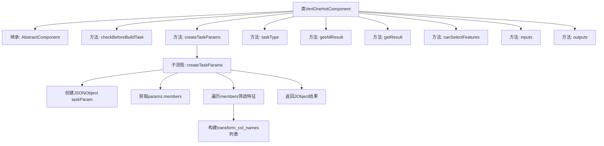

# 基础信息

|      |      |
|------|------|
| 名称 | VertOneHotComponent |
| 编码语言 | .java |
| 代码路径 | WeFe/board/board-service/src/main/java/com/welab/wefe/board/service/component/feature/VertOneHotComponent.java |
| 包名 | com.welab.wefe.board.service.component.feature |
| 依赖项 | ['java.util.ArrayList', 'java.util.Arrays', 'java.util.List', 'org.springframework.stereotype.Service', 'com.alibaba.fastjson.JSONObject', 'com.welab.wefe.board.service.component.base.AbstractComponent', 'com.welab.wefe.board.service.component.base.io.IODataType', 'com.welab.wefe.board.service.component.base.io.InputMatcher', 'com.welab.wefe.board.service.component.base.io.Names', 'com.welab.wefe.board.service.component.base.io.OutputItem', 'com.welab.wefe.board.service.database.entity.job.TaskMySqlModel', 'com.welab.wefe.board.service.database.entity.job.TaskResultMySqlModel', 'com.welab.wefe.board.service.exception.FlowNodeException', 'com.welab.wefe.board.service.model.FlowGraph', 'com.welab.wefe.board.service.model.FlowGraphNode', 'com.welab.wefe.board.service.model.JobBuilder', 'com.welab.wefe.board.service.service.CacheObjects', 'com.welab.wefe.common.util.JObject', 'com.welab.wefe.common.wefe.enums.ComponentType'] |
| 概述说明 | VertOneHotComponent继承AbstractComponent，实现特征转换逻辑，支持特征选择，输入输出为数据集实例。 |

# 说明

VertOneHotComponent是一个继承自AbstractComponent的服务类，用于处理垂直独热编码任务。它重写了多个方法，包括参数检查、任务参数创建、输入输出定义等。在createTaskParams方法中，根据成员信息和角色筛选特征列，生成包含转换列名和保存数据集的JSON参数。该类支持特征选择，定义了数据集的输入输出类型，并返回特定的组件类型VertOneHot。结果获取方法返回空值，需进一步实现。

# 类列表 Class Summary

| 名称   | 类型  | 说明 |
|-------|------|-------------|
| VertOneHotComponent | class | VertOneHotComponent继承AbstractComponent，实现特征列名转换任务参数生成，支持特征选择，输入输出为数据集实例。 |


## 类 VertOneHotComponent

|      |      |
|------|------|
| 访问范围 | @Service;public |
| 类型 | class |
| 名称 | VertOneHotComponent |
| 说明 | VertOneHotComponent继承AbstractComponent，实现特征列名转换任务参数生成，支持特征选择，输入输出为数据集实例。 |


### UML类图

```mermaid
classDiagram
    class AbstractComponent~T~ {
        <<Abstract>>
        #checkBeforeBuildTask(FlowGraph graph, List~TaskMySqlModel~ preTasks, FlowGraphNode node, T params) void
        #createTaskParams(JobBuilder jobBuilder, FlowGraph graph, List~TaskMySqlModel~ preTasks, FlowGraphNode node, T params) JSONObject
        #getAllResult(String taskId) List~TaskResultMySqlModel~
        #getResult(String taskId, String type) TaskResultMySqlModel
        #inputs(FlowGraph graph, FlowGraphNode node) List~InputMatcher~
        #outputs(FlowGraph graph, FlowGraphNode node) List~OutputItem~
        +taskType() ComponentType
        +canSelectFeatures() boolean
    }

    class VertOneHotComponent {
        +taskType() ComponentType
        +canSelectFeatures() boolean
    }

    class HorzOneHotComponent {
        <<InnerClass>>
        class Params {
            +getMembers() List~MemberInfoModel~
        }
        <<InnerClass>>
        class MemberInfoModel {
            +getMemberId() String
            +getMemberRole() RoleType
            +getFeatures() List~String~
        }
    }

    class FlowGraph {
        +getJob() Job
    }

    class Job {
        +getMyRole() RoleType
    }

    class InputMatcher {
        <<Static>>
        +of(String name, IODataType type) InputMatcher
    }

    class OutputItem {
        <<Static>>
        +of(String name, IODataType type) OutputItem
    }

    AbstractComponent~HorzOneHotComponent.Params~ <|-- VertOneHotComponent
    VertOneHotComponent --> HorzOneHotComponent.Params : 使用
    VertOneHotComponent --> FlowGraph : 依赖
    VertOneHotComponent --> InputMatcher : 创建
    VertOneHotComponent --> OutputItem : 创建
    FlowGraph --> Job : 包含
```

这段类图展示了VertOneHotComponent继承自AbstractComponent的泛型类，并实现了多个抽象方法。该类主要处理垂直One-Hot编码任务，通过FlowGraph获取任务信息，使用HorzOneHotComponent.Params中的成员数据进行特征转换。关键功能包括参数校验、任务参数生成、输入输出匹配等，体现了联邦学习场景下数据预处理组件的典型设计模式。


### 内部方法调用关系图



该流程图展示了VertOneHotComponent类的完整结构，重点描述了createTaskParams方法的内部处理逻辑。该类继承自AbstractComponent，实现了8个核心方法，其中createTaskParams包含详细的数据处理流程：先创建JSON对象，然后获取成员信息，通过条件筛选特征列，最终构建包含转换列名和保存标志的结果对象。其他方法如输入输出匹配、任务类型定义等也通过独立节点展示，完整呈现了该组件的功能架构。

### 字段列表 Field List

| 名称  | 类型  | 说明 |
|-------|-------|------|

### 方法列表

| 名称  | 类型  | 说明 |
|-------|-------|------|
| canSelectFeatures | boolean | 该方法返回true，表示支持选择特性功能。 |
| inputs | List<InputMatcher> | 方法重写，返回包含数据集实例的输入匹配器列表。 |
| checkBeforeBuildTask | void | 检查构建任务前的参数和依赖关系，确保流程节点正确执行。 |
| getAllResult | List<TaskResultMySqlModel> | 这是一个Java方法，重写了父类方法，返回指定taskId的所有任务结果列表，当前返回null。 |
| createTaskParams | JSONObject | 该方法为任务创建参数，提取成员特征列名并生成包含转换列名和保存数据集的JSON对象。 |
| getResult | TaskResultMySqlModel | 方法getResult根据taskId和type查询结果，返回TaskResultMySqlModel，当前实现返回null。 |
| taskType | ComponentType | 该方法重写父类方法，返回组件类型为VertOneHot。 |
| outputs | List<OutputItem> | 方法重写，返回包含数据集实例的输出项列表。 |


