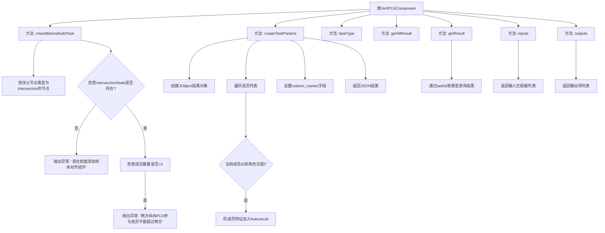

# 基础信息

|      |      |
|------|------|
| 名称 | VertPCAComponent |
| 编码语言 | .java |
| 代码路径 | WeFe/board/board-service/src/main/java/com/welab/wefe/board/service/component/feature/VertPCAComponent.java |
| 包名 | com.welab.wefe.board.service.component.feature |
| 依赖项 | ['com.alibaba.fastjson.JSONObject', 'com.welab.wefe.board.service.component.base.AbstractComponent', 'com.welab.wefe.board.service.component.base.io.IODataType', 'com.welab.wefe.board.service.component.base.io.InputMatcher', 'com.welab.wefe.board.service.component.base.io.Names', 'com.welab.wefe.board.service.component.base.io.OutputItem', 'com.welab.wefe.board.service.database.entity.job.TaskMySqlModel', 'com.welab.wefe.board.service.database.entity.job.TaskResultMySqlModel', 'com.welab.wefe.board.service.exception.FlowNodeException', 'com.welab.wefe.board.service.model.FlowGraph', 'com.welab.wefe.board.service.model.FlowGraphNode', 'com.welab.wefe.board.service.model.JobBuilder', 'com.welab.wefe.board.service.service.CacheObjects', 'com.welab.wefe.common.util.JObject', 'com.welab.wefe.common.wefe.enums.ComponentType', 'com.welab.wefe.common.wefe.enums.TaskResultType', 'org.springframework.stereotype.Service', 'java.util.ArrayList', 'java.util.Arrays', 'java.util.List'] |
| 概述说明 | VertPCAComponent是纵向PCA组件，检查前置样本对齐和成员数不超过两方，生成特征列表任务参数，输入为数据集，输出JSON结果。 |

# 说明

VertPCAComponent是一个继承自AbstractComponent的服务类，用于实现纵向PCA（主成分分析）功能。该类在构建任务前会进行两项检查：确保前置流程中存在样本对齐组件，且参与成员不超过两方。创建任务参数时，会收集当前成员的特征列表并封装为JSON对象。该组件定义的任务类型为VertPCA，输入要求为正常数据集，输出为JSON格式结果。结果查询支持按任务ID获取特定类型的统计指标结果。

# 类列表 Class Summary

| 名称   | 类型  | 说明 |
|-------|------|-------------|
| VertPCAComponent | class | VertPCAComponent是纵向PCA组件，检查样本对齐和成员数量，生成特征列表任务参数，输入为数据集，输出JSON结果。 |


## 类 VertPCAComponent

|      |      |
|------|------|
| 访问范围 | @Service;public |
| 类型 | class |
| 名称 | VertPCAComponent |
| 说明 | VertPCAComponent是纵向PCA组件，检查样本对齐和成员数量，生成特征列表任务参数，输入为数据集，输出JSON结果。 |


### UML类图

```mermaid
classDiagram
    class AbstractComponent~T~ {
        <<Abstract>>
        #checkBeforeBuildTask(FlowGraph graph, List~TaskMySqlModel~ preTasks, FlowGraphNode node, T params) void
        #createTaskParams(JobBuilder jobBuilder, FlowGraph graph, List~TaskMySqlModel~ preTasks, FlowGraphNode node, T params) JSONObject
        +taskType() ComponentType
        #getAllResult(String taskId) List~TaskResultMySqlModel~
        #getResult(String taskId, String type) TaskResultMySqlModel
        #inputs(FlowGraph graph, FlowGraphNode node) List~InputMatcher~
        +outputs(FlowGraph graph, FlowGraphNode node) List~OutputItem~
    }

    class VertPCAComponent {
        +checkBeforeBuildTask(FlowGraph graph, List~TaskMySqlModel~ preTasks, FlowGraphNode node, HorzOneHotComponent.Params params) void
        +createTaskParams(JobBuilder jobBuilder, FlowGraph graph, List~TaskMySqlModel~ preTasks, FlowGraphNode node, HorzOneHotComponent.Params params) JSONObject
        +taskType() ComponentType
        +getAllResult(String taskId) List~TaskResultMySqlModel~
        +getResult(String taskId, String type) TaskResultMySqlModel
        +inputs(FlowGraph graph, FlowGraphNode node) List~InputMatcher~
        +outputs(FlowGraph graph, FlowGraphNode node) List~OutputItem~
    }

    class HorzOneHotComponent {
        class Params {
            +List~MemberInfoModel~ members
            +getMembers() List~MemberInfoModel~
        }
        class MemberInfoModel {
            +String memberId
            +MemberRole memberRole
            +List~String~ features
            +getMemberId() String
            +getMemberRole() MemberRole
            +getFeatures() List~String~
        }
    }

    class FlowGraph {
        +findOneNodeFromParent(FlowGraphNode node, ComponentType type) FlowGraphNode
        +getJob() Job
    }

    class TaskResultMySqlModel {
        // ORM模型类
    }

    AbstractComponent <|-- VertPCAComponent
    VertPCAComponent --> HorzOneHotComponent.Params : 使用
    VertPCAComponent --> FlowGraph : 依赖
    VertPCAComponent --> TaskResultMySqlModel : 返回
```

类图描述：VertPCAComponent是继承自AbstractComponent的纵向PCA处理组件，通过泛型参数使用HorzOneHotComponent.Params配置。主要功能包括构建前校验(checkBeforeBuildTask)、创建任务参数(createTaskParams)和结果处理(getResult)。它与FlowGraph交互获取节点信息，并依赖HorzOneHotComponent的内部类Params和MemberInfoModel来管理成员特征数据。组件输出JSON格式结果，输入要求标准数据集。


### 内部方法调用关系图



流程图描述：
该流程图展示了VertPCAComponent类的核心方法调用关系。主要包含8个方法，其中checkBeforeBuildTask负责前置校验，包括检查样本对齐组件是否存在和成员数量限制；createTaskParams处理任务参数创建，包含成员特征收集和JSON构建；其他方法如taskType返回组件类型，getResult实现结果查询，inputs/outputs定义数据接口。流程清晰展现了纵向PCA组件的关键逻辑链和异常处理路径。

### 字段列表 Field List

| 名称  | 类型  | 说明 |
|-------|-------|------|

### 方法列表

| 名称  | 类型  | 说明 |
|-------|-------|------|
| taskType | ComponentType | 该方法重写父类方法，返回组件类型为VertPCA。 |
| getAllResult | List<TaskResultMySqlModel> | 方法getAllResult根据taskId获取任务结果列表，当前返回null。 |
| checkBeforeBuildTask | void | 检查构建任务前条件：需存在样本对齐组件，且纵向PCA成员不超过两方。 |
| createTaskParams | JSONObject | 方法创建任务参数，检查成员ID和角色匹配后，将特征列表加入结果对象并返回。 |
| getResult | TaskResultMySqlModel | 重写方法getResult，通过taskId和type查询taskResultService，返回TaskResultMySqlModel。 |
| inputs | List<InputMatcher> | 方法重写，返回包含数据集输入匹配器的列表，参数为流程图和节点，可能抛出节点异常。 |
| outputs | List<OutputItem> | 方法outputs返回包含JSON结果的OutputItem列表，参数为graph和node，可能抛出FlowNodeException。 |


