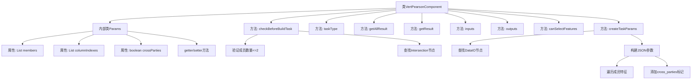
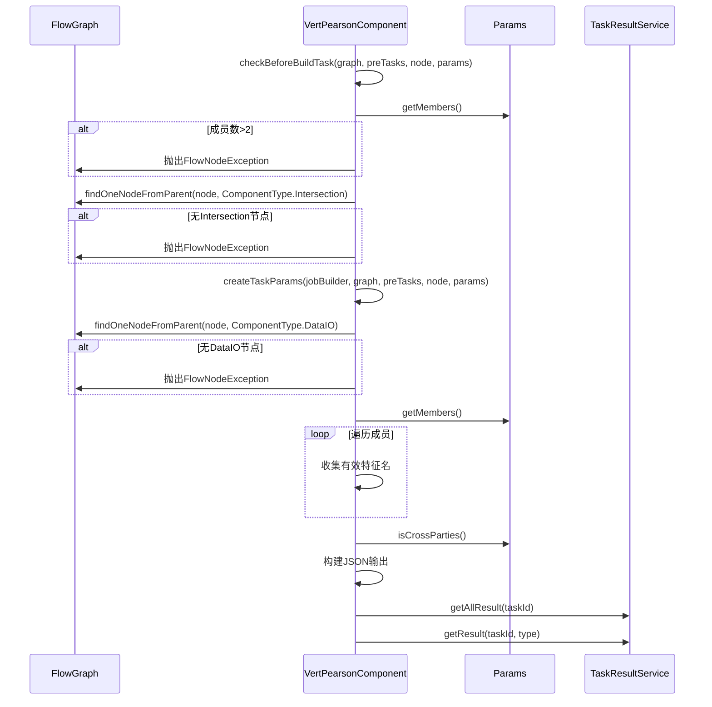

# 基础信息

|      |      |
|------|------|
| 名称 | VertPearsonComponent |
| 编码语言 | .java |
| 代码路径 | WeFe/board/board-service/src/main/java/com/welab/wefe/board/service/component/feature/VertPearsonComponent.java |
| 包名 | com.welab.wefe.board.service.component.feature |
| 依赖项 | ['com.alibaba.fastjson.JSONObject', 'com.welab.wefe.board.service.component.base.AbstractComponent', 'com.welab.wefe.board.service.component.base.io.IODataType', 'com.welab.wefe.board.service.component.base.io.InputMatcher', 'com.welab.wefe.board.service.component.base.io.Names', 'com.welab.wefe.board.service.component.base.io.OutputItem', 'com.welab.wefe.board.service.database.entity.job.TaskMySqlModel', 'com.welab.wefe.board.service.database.entity.job.TaskResultMySqlModel', 'com.welab.wefe.board.service.dto.entity.MemberFeatureInfoModel', 'com.welab.wefe.board.service.exception.FlowNodeException', 'com.welab.wefe.board.service.model.FlowGraph', 'com.welab.wefe.board.service.model.FlowGraphNode', 'com.welab.wefe.board.service.model.JobBuilder', 'com.welab.wefe.board.service.service.CacheObjects', 'com.welab.wefe.common.fieldvalidate.AbstractCheckModel', 'com.welab.wefe.common.fieldvalidate.annotation.Check', 'com.welab.wefe.common.util.JObject', 'com.welab.wefe.common.util.StringUtil', 'com.welab.wefe.common.wefe.enums.ComponentType', 'com.welab.wefe.common.wefe.enums.TaskResultType', 'org.springframework.stereotype.Service', 'java.util.ArrayList', 'java.util.Arrays', 'java.util.List'] |
| 概述说明 | VertPearsonComponent是用于计算皮尔逊相关性的组件，要求成员不超过两方且需前置样本对齐和DataIO组件。支持特征选择和跨方计算，输出JSON格式结果。 |

# 说明

VertPearsonComponent是一个继承自AbstractComponent的服务类，用于计算皮尔逊相关性。主要功能包括：检查输入参数，确保成员不超过两方且存在样本对齐组件；创建任务参数，要求必须包含DataIO组件并处理特征列名；定义输入输出数据类型为数据集和JSON；提供任务结果查询方法。Params内部类包含成员特征信息、列索引和跨方计算标志等参数，并支持特征选择功能。

# 类列表 Class Summary

| 名称   | 类型  | 说明 |
|-------|------|-------------|
| VertPearsonComponent | class | VertPearsonComponent是计算皮尔逊相关性的组件，要求成员不超过两方且需前置样本对齐和DataIO组件，输出JSON结果。支持特征选择和跨方计算。 |


## 类 VertPearsonComponent

|      |      |
|------|------|
| 访问范围 | @Service;public |
| 类型 | class |
| 名称 | VertPearsonComponent |
| 说明 | VertPearsonComponent是计算皮尔逊相关性的组件，要求成员不超过两方且需前置样本对齐和DataIO组件，输出JSON结果。支持特征选择和跨方计算。 |


### UML类图

```mermaid
classDiagram
    class VertPearsonComponent {
        +VertPearsonComponent$Params~Params~
        +checkBeforeBuildTask(FlowGraph graph, List~TaskMySqlModel~ preTasks, FlowGraphNode node, Params params) void
        +createTaskParams(JobBuilder jobBuilder, FlowGraph graph, List~TaskMySqlModel~ preTasks, FlowGraphNode node, Params params) JSONObject
        +taskType() ComponentType
        +getAllResult(String taskId) List~TaskResultMySqlModel~
        +getResult(String taskId, String type) TaskResultMySqlModel
        +inputs(FlowGraph graph, FlowGraphNode node) List~InputMatcher~
        +outputs(FlowGraph graph, FlowGraphNode node) List~OutputItem~
        +canSelectFeatures() boolean
    }

    class AbstractComponent~T~ {
        <<Abstract>>
        #checkBeforeBuildTask(FlowGraph graph, List~TaskMySqlModel~ preTasks, FlowGraphNode node, T params) void
        #createTaskParams(JobBuilder jobBuilder, FlowGraph graph, List~TaskMySqlModel~ preTasks, FlowGraphNode node, T params) JSONObject
        +taskType() ComponentType
        #getAllResult(String taskId) List~TaskResultMySqlModel~
        #getResult(String taskId, String type) TaskResultMySqlModel
        +inputs(FlowGraph graph, FlowGraphNode node) List~InputMatcher~
        +outputs(FlowGraph graph, FlowGraphNode node) List~OutputItem~
    }

    class VertPearsonComponent$Params {
        -List~MemberFeatureInfoModel~ members
        -List~String~ columnIndexes
        -boolean crossParties
        +getMembers() List~MemberFeatureInfoModel~
        +setMembers(List~MemberFeatureInfoModel~ members) void
        +getColumnIndexes() List~String~
        +setColumnIndexes(List~String~ columnIndexes) void
        +isCrossParties() boolean
        +setCrossParties(boolean crossParties) void
    }

    class AbstractCheckModel {
        <<Abstract>>
    }

    VertPearsonComponent --|> AbstractComponent~VertPearsonComponent$Params~ : 继承
    VertPearsonComponent$Params --|> AbstractCheckModel : 继承
    VertPearsonComponent --> VertPearsonComponent$Params : 包含
```

类图描述：
该图展示了VertPearsonComponent及其相关类的结构。VertPearsonComponent继承自泛型类AbstractComponent<Params>，实现了流程检查、任务参数创建等功能。内部类Params继承自AbstractCheckModel，包含成员特征、列索引等属性。类图清晰地反映了继承关系和组件间的依赖，体现了纵向皮尔逊相关性计算组件的核心设计。


### 内部方法调用关系图





这段代码实现了一个垂直皮尔逊相关性计算组件，主要包含参数验证、任务参数构建和结果查询功能。流程图展示了类结构和方法调用关系，时序图详细描述了参数检查、节点查找和任务参数构建的过程。组件严格限制参与方不超过2个，要求前置样本对齐，并支持特征选择和跨方计算。内部类Params封装了成员特征、列索引和跨方计算标志等配置参数。

### 字段列表 Field List

| 名称  | 类型  | 说明 |
|-------|-------|------|

### 方法列表

| 名称  | 类型  | 说明 |
|-------|-------|------|
| getAllResult | List<TaskResultMySqlModel> | 这是一个Java方法，重写父类方法，通过taskResultService获取指定taskId的所有任务结果列表。 |
| createTaskParams | JSONObject | 方法创建任务参数，检查DataIO组件是否存在，遍历参数成员提取特征名，设置跨参与方标志，返回JSON对象。 |
| checkBeforeBuildTask | void | 检查构建任务前条件：成员数不超过2，需存在样本对齐组件。 |
| taskType | ComponentType | 方法重写，返回组件类型为VertPearson。 |
| getResult | TaskResultMySqlModel | 重写方法，通过任务ID和类型查询任务结果，返回MySQL模型对象。 |
| inputs | List<InputMatcher> | 该方法重写父类逻辑，返回一个包含单个输入匹配器的列表，匹配器指定数据名称为NORMAL_DATA_SET且数据类型为DataSetInstance。 |
| outputs | List<OutputItem> | 该方法返回一个包含JSON结果的输出项列表。 |
| canSelectFeatures | boolean | 该方法返回true，表示允许选择特征。 |


