# 基础信息

|      |      |
|------|------|
| 名称 | feature |
| 编码语言 | .java |
| 代码路径 | WeFe/board/board-service/src/main/java/com/welab/wefe/board/service/component/feature |
| 包名 | docs.board.board-service.src.main.java.com.welab.wefe.board.service.component.feature |
| 概述说明 | HorzFeatureBinningComponent实现横向特征分箱，支持等频等宽卡方方法。FeatureTransformComponent处理特征转换任务。VertFilterComponent处理垂直过滤任务。MixBinningComponent处理混合分箱。FeatureStandardizedComponent标准化特征。MixStatisticComponent处理混合统计。BinningComponent实现分箱功能。HorzOneHotComponent处理水平独热编码。FillMissingValueComponent填充缺失值。FeatureStatisticsComponent处理特征统计。HorzStatisticComponent处理横向统计。VertOneHotComponent处理垂直独热编码。VertPCAComponent实现纵向PCA。VertPearsonComponent计算皮尔逊相关性。FeaturePsiComponent处理特征PSI操作。FeatureSelectionComponent用于特征选择。 |

# 说明

## 概述  
该模块是一组Spring服务组件，专注于联邦学习中的特征工程处理，类似数据预处理流水线。核心职责包括特征分箱（等频/等宽/卡方）、标准化、独热编码、缺失值填充、统计分析和PSI计算等。所有组件继承AbstractComponent，遵循统一接口规范：参数校验（例如成员参与检查）、任务参数生成（JSON格式）、结果处理（模型/数据集输出）。  

关键数据结构包括Params（任务配置）、Member（成员信息）和Feature（特征属性）三类嵌套类，支持特征选择功能。外部依赖集中于DataSetInstance输入输出类型，部分组件要求前置DataIO或样本对齐节点。例如HorzFeatureBinningComponent依赖分箱模型，VertPCAComponent需要样本对齐组件。  

## 主要业务场景  
模块支持横向/纵向/混合联邦场景下的特征处理。典型流程为：先校验成员参与和前置条件（例如FeaturePsiComponent要求二分类数据集），再生成含特征规则的任务参数（如MixBinningComponent配置分箱方法），最终输出处理后的数据集或统计结果（JSON格式）。  

交互模式统一采用"校验-参数化-执行"链，例如FillMissingValueComponent先验证全成员参与，再生成填充策略参数。API类型涵盖特征转换（FeatureTransformComponent）、过滤（VertFilterComponent）和统计分析（HorzStatisticComponent）。集成案例包括：特征分箱后接独热编码（HorzOneHotComponent），或PSI计算前需样本对齐（FeaturePsiComponent）。

### 包内部结构视图

```mermaid
graph TD
    feature --> HorzFeatureBinningComponent.java
    feature --> FeatureTransformComponent.java
    feature --> VertFilterComponent.java
    feature --> MixBinningComponent.java
    feature --> FeatureStandardizedComponent.java
    feature --> MixStatisticComponent.java
    feature --> BinningComponent.java
    feature --> HorzOneHotComponent.java
    feature --> FillMissingValueComponent.java
    feature --> FeatureStatisticsComponent.java
    feature --> HorzStatisticComponent.java
    feature --> VertOneHotComponent.java
    feature --> VertPCAComponent.java
    feature --> VertPearsonComponent.java
    feature --> FeatureCalculationComponent.java
    feature --> FeaturePsiComponent.java
    feature --> FeatureSelectionComponent.java
```

该流程图展示了feature目录下的17个Java组件文件，这些文件都是直接位于feature目录下的实现类，没有更深层级的子目录结构。所有组件文件均以特征处理相关功能命名，涉及特征分箱、转换、标准化、统计计算等多种数据处理功能。

# 文件列表

| 名称   | 类型  | 说明 |
|-------|------|-------------|
| [HorzFeatureBinningComponent.java](HorzFeatureBinningComponent.md) | file | HorzFeatureBinningComponent实现特征分箱功能，检查成员参与情况，生成分箱参数，支持等频、等宽、卡方分箱方法，输出分箱模型和数据集。 |
| [FeatureTransformComponent.java](FeatureTransformComponent.md) | file | 特征转换组件，继承抽象类，处理特征转换任务。包含参数校验、任务参数生成、输入输出定义。支持特征选择和转换规则配置，返回转换后的数据集。 |
| [VertFilterComponent.java](VertFilterComponent.md) | file | VertFilterComponent是一个服务组件，用于处理垂直过滤任务。它继承AbstractComponent，包含参数检查、任务参数创建、输入输出定义等功能。Params类定义了成员信息和过滤规则等参数。 |
| [MixBinningComponent.java](MixBinningComponent.md) | file | MixBinningComponent是处理分箱策略的组件，检查成员参与情况并生成分箱参数，支持多种分箱方法如等频、等宽和卡方。 |
| [FeatureStandardizedComponent.java](FeatureStandardizedComponent.md) | file | FeatureStandardizedComponent是特征标准化组件，继承AbstractComponent，检查DataIO组件并提取with_label字段，处理成员特征信息，支持z-score或min-max标准化方法，输出标准化数据集。 |
| [MixStatisticComponent.java](MixStatisticComponent.md) | file | MixStatisticComponent是处理混合统计的组件，继承AbstractComponent，支持特征选择，生成JSON结果，包含成员特征处理和结果重组逻辑。 |
| [BinningComponent.java](BinningComponent.md) | file | BinningComponent是分箱处理组件，继承AbstractComponent，包含参数校验、任务参数构建和结果处理功能。支持多种分箱方法如等频、等宽、最优分箱和自定义分箱，确保所有成员参与并生成分箱模型和数据集。 |
| [HorzOneHotComponent.java](HorzOneHotComponent.md) | file | HorzOneHotComponent实现水平方向OneHot编码，检查成员特征并生成任务参数，支持特征选择，输入输出为数据集实例。 |
| [FillMissingValueComponent.java](FillMissingValueComponent.md) | file | FillMissingValueComponent是处理缺失值填充的组件，检查成员参与情况并生成任务参数，支持特征选择和数据集保存。 |
| [FeatureStatisticsComponent.java](FeatureStatisticsComponent.md) | file | FeatureStatisticsComponent是用于特征统计的组件，检查数据IO成员参与情况，支持本地和分布式模式，输出JSON结果。 |
| [HorzStatisticComponent.java](HorzStatisticComponent.md) | file | HorzStatisticComponent是处理横向统计任务的组件，支持特征选择，生成JSON结果，包含成员特征处理和结果格式化功能。 |
| [VertOneHotComponent.java](VertOneHotComponent.md) | file | VertOneHotComponent继承AbstractComponent，实现特征转换逻辑，支持特征选择，输入输出为数据集实例。 |
| [VertPCAComponent.java](VertPCAComponent.md) | file | VertPCAComponent是纵向PCA组件，检查前置样本对齐和成员数不超过两方，生成特征列表任务参数，输入为数据集，输出JSON结果。 |
| [VertPearsonComponent.java](VertPearsonComponent.md) | file | VertPearsonComponent是用于计算皮尔逊相关性的组件，要求成员不超过两方且需前置样本对齐和DataIO组件。支持特征选择和跨方计算，输出JSON格式结果。 |
| [FeatureCalculationComponent.java](FeatureCalculationComponent.md) | file | FeatureCalculationComponent组件已弃用，建议使用特征统计组件替代。需前置样本对齐组件，处理特征数据并生成包含IV和CV值的模型结果。 |
| [FeaturePsiComponent.java](FeaturePsiComponent.md) | file | FeaturePsiComponent是纵向联邦学习组件，支持二分类场景，需紧跟Segment组件执行。检查输入数据集类型和标签分布，生成任务参数并处理结果。 |
| [FeatureSelectionComponent.java](FeatureSelectionComponent.md) | file | FeatureSelectionComponent是特征选择组件，检查成员特征是否一致，确保横向建模特征列表相同，无特征时停止任务创建。 |

