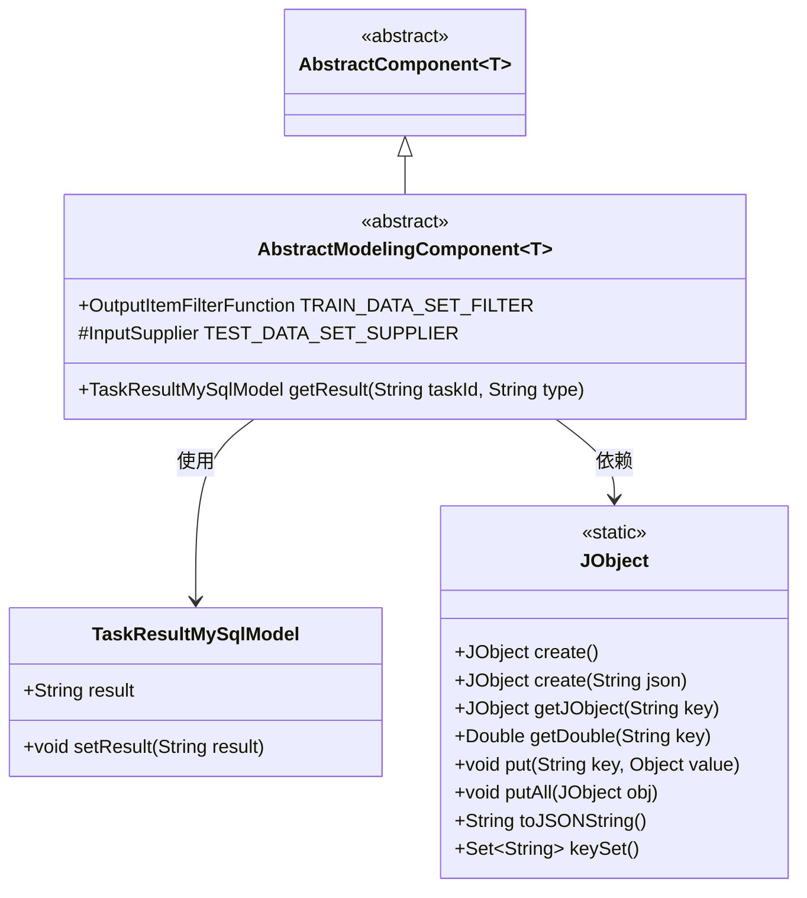
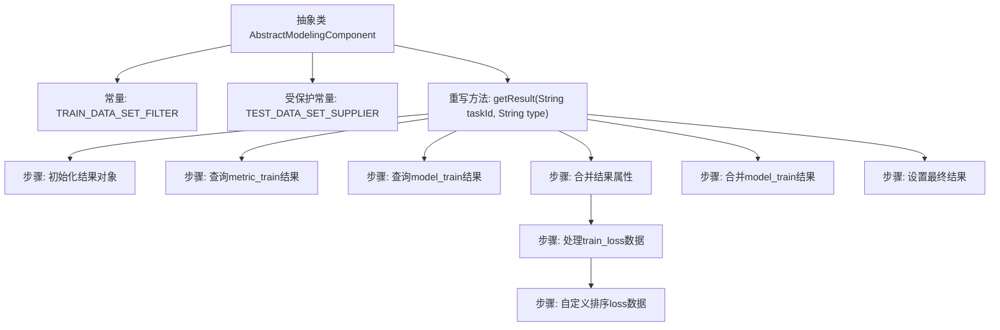

# 基础信息

|      |      |
|------|------|
| 名称 | AbstractModelingComponent |
| 编码语言 | .java |
| 代码路径 | WeFe/board/board-service/src/main/java/com/welab/wefe/board/service/component/modeling/AbstractModelingComponent.java |
| 包名 | com.welab.wefe.board.service.component.modeling |
| 依赖项 | ['com.welab.wefe.board.service.component.base.AbstractComponent', 'com.welab.wefe.board.service.component.base.filter.OutputItemFilterFunction', 'com.welab.wefe.board.service.component.base.io', 'com.welab.wefe.board.service.database.entity.job.TaskResultMySqlModel', 'com.welab.wefe.board.service.model.FlowGraphNode', 'com.welab.wefe.common.fieldvalidate.AbstractCheckModel', 'com.welab.wefe.common.util.JObject', 'com.welab.wefe.common.wefe.enums.ComponentType', 'com.welab.wefe.common.wefe.enums.TaskResultType', 'org.springframework.beans.BeanUtils', 'java.util.ArrayList', 'java.util.Comparator', 'java.util.List', 'java.util.stream.Collectors'] |
| 概述说明 | 抽象类AbstractModelingComponent定义了训练数据集过滤器和测试/验证数据集供应商，包含获取任务结果的方法，处理训练损失数据排序和结果合并。 |

# 说明

这是一个抽象建模组件类，继承自泛型化的AbstractComponent基类。主要功能包括：1) 定义了训练数据集过滤器TRAIN_DATA_SET_FILTER，用于识别Segment类型的组件；2) 提供了测试/验证数据集的输入供应逻辑TEST_DATA_SET_SUPPLIER，会优先查找验证集节点，其次查找Segment节点；3) 重写了getResult方法，该方法会合并metric_train和model_train两种任务结果，并对训练损失数据进行特殊处理，包括数据提取、排序和重组。结果最终会被合并成一个JObject对象并返回。

# 类列表 Class Summary

| 名称   | 类型  | 说明 |
|-------|------|-------------|
| AbstractModelingComponent | class | 抽象类AbstractModelingComponent定义了训练数据集过滤器和测试/验证数据集供应商，包含获取任务结果的方法，处理训练损失数据排序和结果合并逻辑。 |

## 类 AbstractModelingComponent

|      |      |
|------|------|
| 访问范围 | public abstract |
| 类型 | class |
| 名称 | AbstractModelingComponent |
| 说明 | 抽象类AbstractModelingComponent定义了训练数据集过滤器和测试/验证数据集供应商，包含获取任务结果的方法，处理训练损失数据排序和结果合并逻辑。 |

### UML类图

该代码展示了一个抽象建模组件类`AbstractModelingComponent`，它继承自泛型抽象类`AbstractComponent`。主要功能包括：1) 通过`TRAIN_DATA_SET_FILTER`和`TEST_DATA_SET_SUPPLIER`处理数据集；2) 实现`getResult`方法合并训练指标和模型结果。类图中清晰地展示了继承关系、成员变量和方法，以及与`TaskResultMySqlModel`和`JObject`的依赖关系，体现了数据处理和结果合并的核心逻辑。

### 内部方法调用关系图

这段代码定义了一个抽象建模组件类，主要包含两个核心部分：1) 数据集的过滤器和供应商定义，用于处理训练和测试数据集；2) 结果获取方法，通过查询和合并不同类型的结果数据，并对训练损失数据进行特殊处理。流程图展示了从初始化到最终结果生成的全过程，包括数据查询、属性合并、自定义排序等关键步骤。该方法最终返回一个包含合并后所有结果数据的TaskResultMySqlModel对象。

### 字段列表 Field List

| 名称  | 类型  | 说明 |
|-------|-------|------|
| TEST_DATA_SET_SUPPLIER = (graph, node) -> {        // Find validation set        FlowGraphNode validationNode = graph.findValidationDataSetFromParent(node, taskType());        if (validationNode != null) {            return new NodeOutputItem(validationNode, OutputItem.of(Names.Data.EVALUATION_DATA_SET, IODataType.DataSetInstance));        }        // Find data cutting        FlowGraphNode segmentNode = graph.findOneNodeFromParent(node, ComponentType.Segment);        if (segmentNode != null) {            return new NodeOutputItem(segmentNode, OutputItem.of(Names.Data.EVALUATION_DATA_SET, IODataType.DataSetInstance));        }        return null;    } | InputSupplier | 定义了一个输入供应方法，优先从父节点查找验证数据集，若无则查找分段节点数据，均无则返回空。 |
| TRAIN_DATA_SET_FILTER = (n, item) -> ComponentType.Segment == n.getComponentType() | OutputItemFilterFunction | 定义过滤函数TRAIN_DATA_SET_FILTER，检查节点类型是否为Segment。 |

### 方法列表

| 名称  | 类型  | 说明 |
|-------|-------|------|
| getResult | TaskResultMySqlModel | 方法根据任务ID和类型获取训练结果，优先合并指标和模型结果，处理训练损失数据排序后返回。 |

