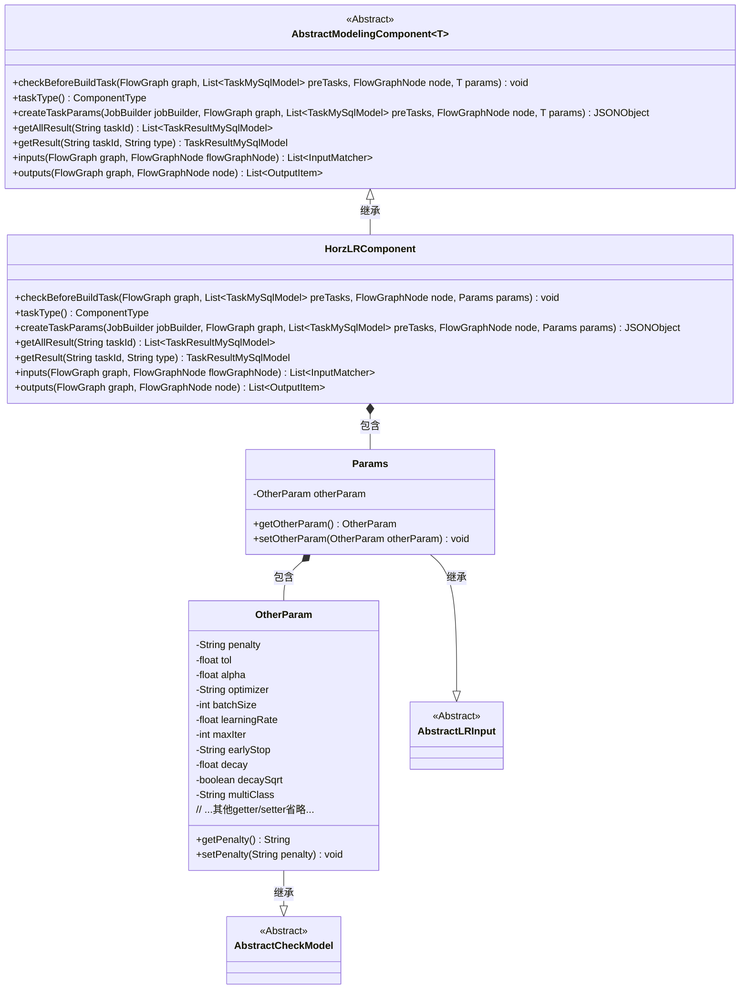
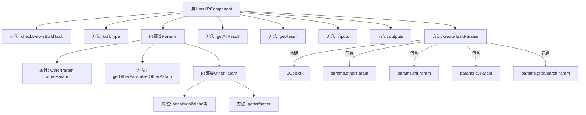

# 基础信息

|      |      |
|------|------|
| 名称 | HorzLRComponent |
| 编码语言 | .java |
| 代码路径 | WeFe/board/board-service/src/main/java/com/welab/wefe/board/service/component/modeling/HorzLRComponent.java |
| 包名 | com.welab.wefe.board.service.component.modeling |
| 依赖项 | ['com.alibaba.fastjson.JSONObject', 'com.welab.wefe.board.service.component.base.io.IODataType', 'com.welab.wefe.board.service.component.base.io.InputMatcher', 'com.welab.wefe.board.service.component.base.io.Names', 'com.welab.wefe.board.service.component.base.io.OutputItem', 'com.welab.wefe.board.service.database.entity.job.TaskMySqlModel', 'com.welab.wefe.board.service.database.entity.job.TaskResultMySqlModel', 'com.welab.wefe.board.service.exception.FlowNodeException', 'com.welab.wefe.board.service.model.FlowGraph', 'com.welab.wefe.board.service.model.FlowGraphNode', 'com.welab.wefe.board.service.model.JobBuilder', 'com.welab.wefe.common.fieldvalidate.AbstractCheckModel', 'com.welab.wefe.common.fieldvalidate.annotation.Check', 'com.welab.wefe.common.util.JObject', 'com.welab.wefe.common.web.dto.AbstractLRInput', 'com.welab.wefe.common.wefe.enums.ComponentType', 'org.springframework.stereotype.Service', 'java.util.Arrays', 'java.util.List'] |
| 概述说明 | HorzLRComponent是水平逻辑回归组件，继承AbstractModelingComponent，包含参数校验、任务参数生成、输入输出定义等功能，主要处理训练数据和模型输出。 |

# 说明

HorzLRComponent是一个继承自AbstractModelingComponent的服务类，专用于水平逻辑回归任务。它定义了任务类型为ComponentType.HorzLR，并实现了多个关键方法。该类包含参数校验、任务参数创建、结果获取以及输入输出匹配等功能。Params内部类封装了逻辑回归所需的各项参数，包括惩罚方式、收敛容忍度、惩罚项系数、优化算法、批量大小、学习率、最大迭代次数等，这些参数都通过@Check注解进行了必要性校验。createTaskParams方法将参数转换为JSON格式，包含初始化方法、交叉验证参数和网格搜索参数等。输入要求训练数据集和评估数据集，输出包括普通数据集和训练好的逻辑回归模型。

# 类列表 Class Summary

| 名称   | 类型  | 说明 |
|-------|------|-------------|
| HorzLRComponent | class | HorzLRComponent是一个水平逻辑回归组件，继承AbstractModelingComponent，处理参数校验、任务参数生成及输入输出匹配。包含训练参数如惩罚方式、学习率等，输出数据集和模型。 |

## 类 HorzLRComponent

|      |      |
|------|------|
| 访问范围 | @Service;public |
| 类型 | class |
| 名称 | HorzLRComponent |
| 说明 | HorzLRComponent是一个水平逻辑回归组件，继承AbstractModelingComponent，处理参数校验、任务参数生成及输入输出匹配。包含训练参数如惩罚方式、学习率等，输出数据集和模型。 |

### UML类图

该代码实现了一个水平逻辑回归组件(HorzLRComponent)，继承自泛型抽象建模组件，主要用于机器学习任务参数处理和结果管理。类图展示了四层结构：顶层抽象组件定义基础接口，第二层是具体实现类HorzLRComponent，第三层包含参数类Params及其嵌套类OtherParam，底层是参数校验相关的抽象类。组件通过createTaskParams方法将参数转换为JSON格式，并定义了输入输出数据的匹配规则，支持交叉验证和网格搜索等高级功能。

### 内部方法调用关系图

这段代码展示了一个名为HorzLRComponent的服务类，继承自AbstractModelingComponent，主要用于处理水平逻辑回归任务。核心功能包括参数校验(checkBeforeBuildTask)、任务类型标识(taskType)、任务参数构造(createTaskParams)以及输入输出定义(inputs/outputs)。内部类Params封装了算法参数，包含OtherParam子类定义12个机器学习超参数。流程图清晰呈现了类结构、方法调用关系和参数组成，特别是createTaskParams方法如何聚合不同参数模块构建完整任务参数。

### 字段列表 Field List

| 名称  | 类型  | 说明 |
|-------|-------|------|

### 方法列表

| 名称  | 类型  | 说明 |
|-------|-------|------|
| getAllResult | List<TaskResultMySqlModel> | 该方法重写父类逻辑，通过调用taskResultService的listAllResult方法，根据taskId获取所有任务结果并返回列表。 |
| getResult | TaskResultMySqlModel | 重写getResult方法，调用父类实现并返回TaskResultMySqlModel对象，参数为taskId和type。 |
| taskType | ComponentType | 代码重写taskType方法，返回水平布局类型ComponentType.HorzLR。 |
| createTaskParams | JSONObject | 方法创建任务参数JSON，包含惩罚系数、容差、学习率等模型参数及交叉验证、网格搜索配置。 |
| checkBeforeBuildTask | void | 检查构建任务前的条件，确保流程图中节点和前置任务满足要求。 |
| inputs | List<InputMatcher> | 重写inputs方法，返回包含训练数据集和评估数据集的InputMatcher列表。 |
| outputs | List<OutputItem> | 方法outputs返回两个OutputItem：NORMAL_DATA_SET（数据类型DataSetInstance）和TRAIN_MODEL（数据类型ModelFromLr）。 |

