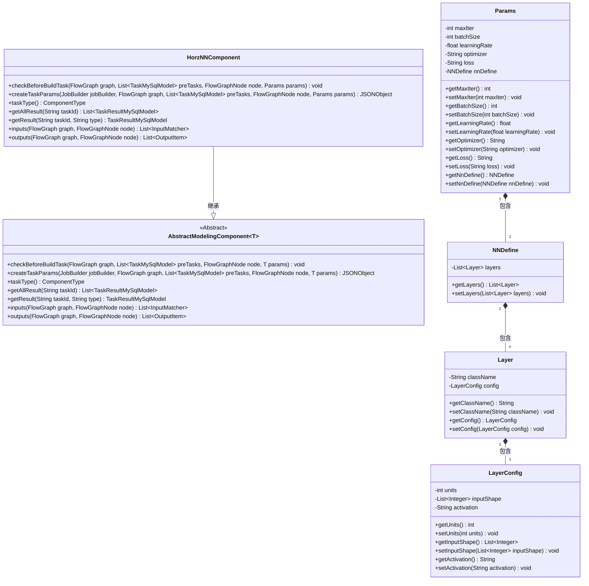
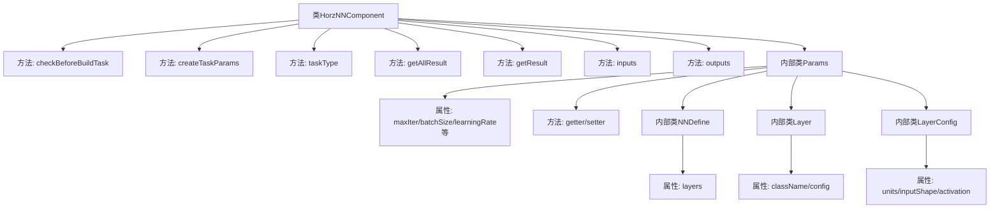
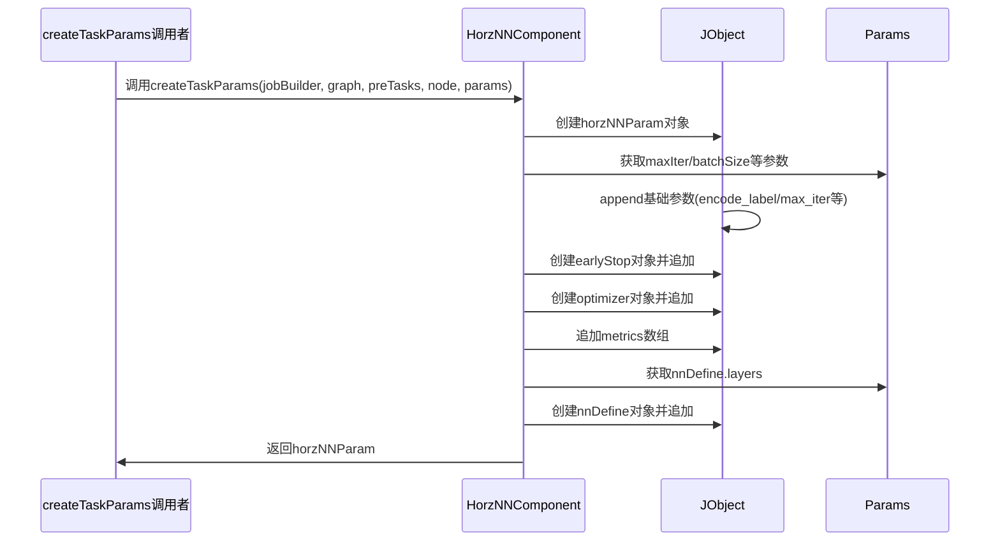

# 基础信息

|      |      |
|------|------|
| 名称 | HorzNNComponent |
| 编码语言 | .java |
| 代码路径 | WeFe/board/board-service/src/main/java/com/welab/wefe/board/service/component/modeling/HorzNNComponent.java |
| 包名 | com.welab.wefe.board.service.component.modeling |
| 依赖项 | ['com.alibaba.fastjson.JSONObject', 'com.welab.wefe.board.service.component.base.io.IODataType', 'com.welab.wefe.board.service.component.base.io.InputMatcher', 'com.welab.wefe.board.service.component.base.io.Names', 'com.welab.wefe.board.service.component.base.io.OutputItem', 'com.welab.wefe.board.service.database.entity.job.TaskMySqlModel', 'com.welab.wefe.board.service.database.entity.job.TaskResultMySqlModel', 'com.welab.wefe.board.service.exception.FlowNodeException', 'com.welab.wefe.board.service.model.FlowGraph', 'com.welab.wefe.board.service.model.FlowGraphNode', 'com.welab.wefe.board.service.model.JobBuilder', 'com.welab.wefe.common.fieldvalidate.AbstractCheckModel', 'com.welab.wefe.common.fieldvalidate.annotation.Check', 'com.welab.wefe.common.util.JObject', 'com.welab.wefe.common.wefe.enums.ComponentType', 'org.springframework.stereotype.Service', 'java.util.ArrayList', 'java.util.Arrays', 'java.util.List'] |
| 概述说明 | HorzNNComponent是水平神经网络组件，继承AbstractModelingComponent，包含参数校验、任务创建、输入输出定义及神经网络层配置。 |

# 说明

HorzNNComponent是一个继承自AbstractModelingComponent的Spring服务类，用于实现横向神经网络建模任务。该类通过Params内部类定义模型参数，包括最大迭代次数、批量大小、学习率、优化器、损失函数和神经网络层定义。createTaskParams方法构建包含训练参数的JSON对象，包括编码标签、迭代配置、优化器设置、评估指标和神经网络结构定义。inputs和outputs方法分别定义了组件所需输入数据（训练集和评估集）和输出结果（数据集和训练模型）。组件类型为HorzNN，支持获取任务结果。神经网络层定义包含类名和配置参数，如维度、输入形状和激活函数。

# 类列表 Class Summary

| 名称   | 类型  | 说明 |
|-------|------|-------------|
| HorzNNComponent | class | HorzNNComponent是水平神经网络组件，继承AbstractModelingComponent，处理任务参数生成、输入输出匹配。包含最大迭代次数、批量大小、学习率等参数，支持Keras配置，输出数据集和模型。 |

## 类 HorzNNComponent

|      |      |
|------|------|
| 访问范围 | @Service;public |
| 类型 | class |
| 名称 | HorzNNComponent |
| 说明 | HorzNNComponent是水平神经网络组件，继承AbstractModelingComponent，处理任务参数生成、输入输出匹配。包含最大迭代次数、批量大小、学习率等参数，支持Keras配置，输出数据集和模型。 |

### UML类图

这段代码描述了一个水平神经网络组件`HorzNNComponent`，它继承自泛型抽象类`AbstractModelingComponent`，并实现了多个关键方法用于任务参数构建、输入输出匹配等。内部类`Params`定义了神经网络训练所需的超参数（如迭代次数、批量大小等），并通过嵌套类`NNDefine`、`Layer`和`LayerConfig`实现了神经网络层的结构化定义。整体采用分层设计模式，参数验证通过`@Check`注解实现，体现了可配置化的深度学习组件实现。

### 内部方法调用关系图

该流程图展示了HorzNNComponent类的完整结构，包含7个主要方法和4层嵌套参数类。时序图重点描述了createTaskParams方法的执行过程，该方法通过JObject构建包含神经网络训练参数的JSON结构，包括基础参数、early_stop配置、优化器设置、评估指标和神经网络层定义等组件，最终返回完整的参数对象。参数通过Params类及其嵌套类NNDefine/Layer/LayerConfig逐层获取配置信息。

### 字段列表 Field List

| 名称  | 类型  | 说明 |
|-------|-------|------|

### 方法列表

| 名称  | 类型  | 说明 |
|-------|-------|------|
| createTaskParams | JSONObject | 方法创建横向神经网络任务参数，包含迭代次数、批量大小、早停条件、优化器设置、损失函数、评估指标及神经网络定义。返回JSON格式参数对象。 |
| getResult | TaskResultMySqlModel | 重写方法getResult，调用父类方法获取任务结果。 |
| getAllResult | List<TaskResultMySqlModel> | 该方法重写父类方法，通过调用taskResultService的listAllResult方法获取指定taskId的所有任务结果列表。 |
| checkBeforeBuildTask | void | 这是一个Java方法重写，用于在构建任务前进行检查，参数包括流程图、前置任务列表、节点和参数，可能抛出流程节点异常。 |
| taskType | ComponentType | 方法重写，返回组件类型为水平神经网络。 |
| inputs | List<InputMatcher> | 代码重写父类方法，返回两个InputMatcher对象，分别匹配训练数据集和评估数据集。 |
| outputs | List<OutputItem> | 方法outputs返回两个OutputItem对象，包含数据集和模型输出项，可能抛出FlowNodeException异常。 |

