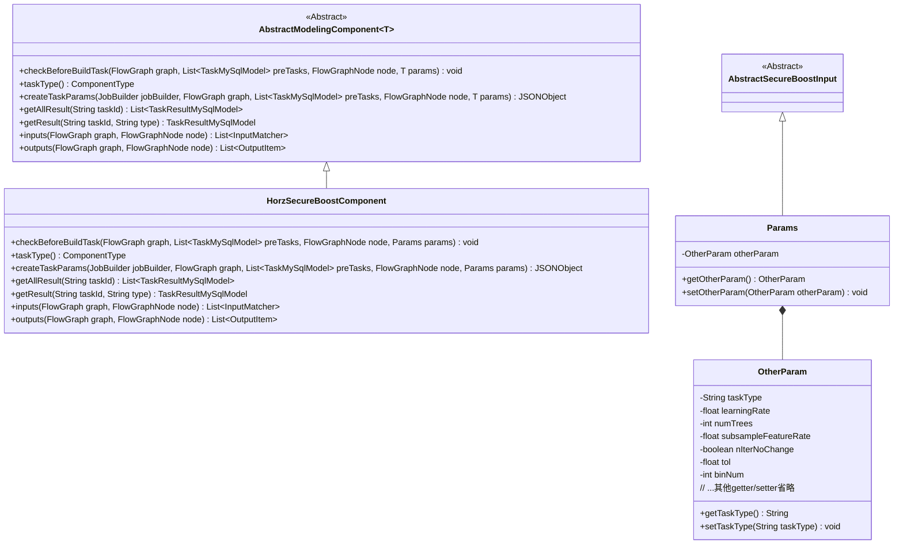
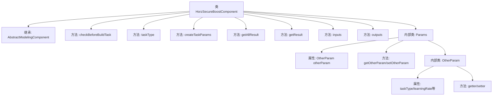
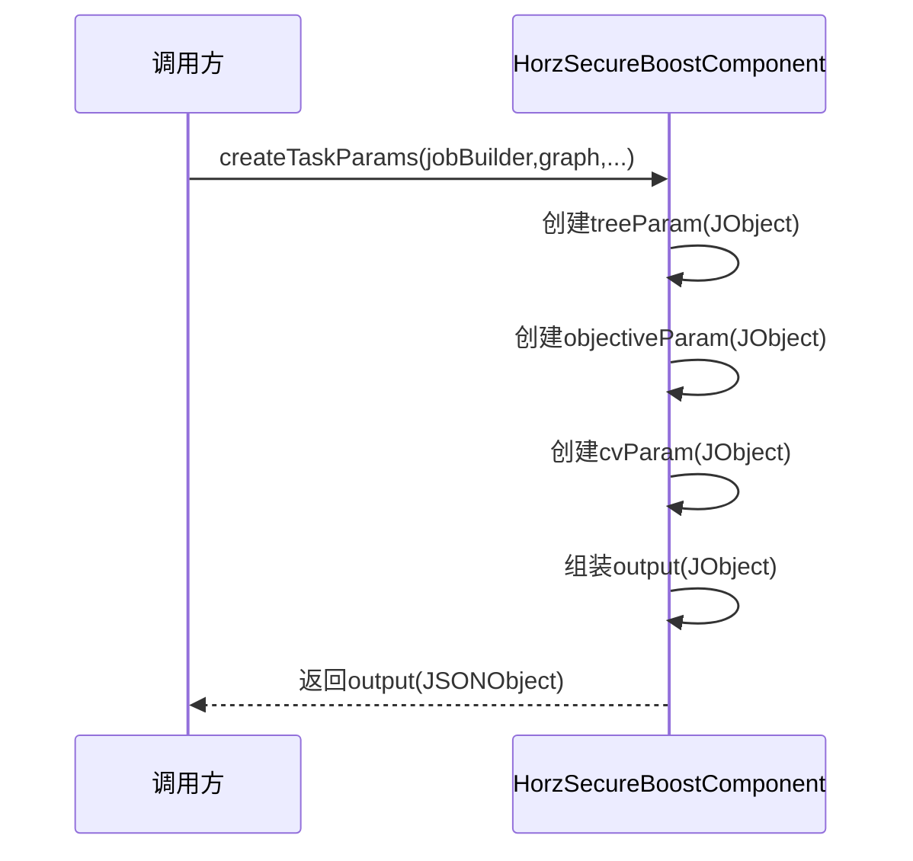

# 基础信息

|      |      |
|------|------|
| 名称 | HorzSecureBoostComponent |
| 编码语言 | .java |
| 代码路径 | WeFe/board/board-service/src/main/java/com/welab/wefe/board/service/component/modeling/HorzSecureBoostComponent.java |
| 包名 | com.welab.wefe.board.service.component.modeling |
| 依赖项 | ['com.alibaba.fastjson.JSONObject', 'com.welab.wefe.board.service.component.base.io.IODataType', 'com.welab.wefe.board.service.component.base.io.InputMatcher', 'com.welab.wefe.board.service.component.base.io.Names', 'com.welab.wefe.board.service.component.base.io.OutputItem', 'com.welab.wefe.board.service.database.entity.job.TaskMySqlModel', 'com.welab.wefe.board.service.database.entity.job.TaskResultMySqlModel', 'com.welab.wefe.board.service.exception.FlowNodeException', 'com.welab.wefe.board.service.model.FlowGraph', 'com.welab.wefe.board.service.model.FlowGraphNode', 'com.welab.wefe.board.service.model.JobBuilder', 'com.welab.wefe.common.fieldvalidate.AbstractCheckModel', 'com.welab.wefe.common.fieldvalidate.annotation.Check', 'com.welab.wefe.common.util.JObject', 'com.welab.wefe.common.web.dto.AbstractSecureBoostInput', 'com.welab.wefe.common.wefe.enums.ComponentType', 'org.springframework.stereotype.Service', 'java.util.Arrays', 'java.util.List'] |
| 概述说明 | HorzSecureBoostComponent是一个基于XGBoost的横向安全增强组件，用于构建机器学习模型。它包含参数校验、任务参数生成、输入输出定义等功能，支持树参数、目标参数和交叉验证参数配置，输出数据集和训练模型。 |

# 说明

该内容描述了一个名为HorzSecureBoostComponent的Java服务类，继承自AbstractModelingComponent，用于实现横向安全增强的机器学习任务。类中包含任务类型定义、参数校验、任务参数构建及输入输出配置。主要功能包括创建包含树参数、目标参数和交叉验证参数的JSON对象，处理任务结果，并定义输入输出数据类型。Params内部类封装了任务类型、学习率、树数量等关键参数，并通过注解进行必要性校验。整体设计支持横向联邦学习场景下的安全增强树模型训练与评估。

# 类列表 Class Summary

| 名称   | 类型  | 说明 |
|-------|------|-------------|
| HorzSecureBoostComponent | class | HorzSecureBoostComponent是水平安全增强组件，继承AbstractModelingComponent，用于创建XGBoost任务参数，包含树参数、目标参数和交叉验证参数，输入为训练和评估数据集，输出为数据集和XGBoost模型。 |

## 类 HorzSecureBoostComponent

|      |      |
|------|------|
| 访问范围 | @Service;public |
| 类型 | class |
| 名称 | HorzSecureBoostComponent |
| 说明 | HorzSecureBoostComponent是水平安全增强组件，继承AbstractModelingComponent，用于创建XGBoost任务参数，包含树参数、目标参数和交叉验证参数，输入为训练和评估数据集，输出为数据集和XGBoost模型。 |

### UML类图

这段类图展示了HorzSecureBoostComponent的继承关系和内部结构。该组件继承自泛型类AbstractModelingComponent<Params>，其中Params是包含OtherParam嵌套类的静态内部类。主要功能包括任务参数校验(createTaskParams)、结果获取(getAllResult/getResult)以及输入输出定义(inputs/outputs)。Params类封装了横向安全增强树模型的所有配置参数，包括树参数、目标函数参数和交叉验证参数等，通过OtherParam嵌套类实现参数校验功能。整体设计体现了模板方法模式，通过抽象基类定义框架，子类实现具体业务逻辑。

### 内部方法调用关系图

这段代码实现了一个横向安全增强组件(HorzSecureBoostComponent)，主要用于构建安全增强的机器学习任务。流程图展示了类继承关系和主要方法结构，其中包含参数校验、任务创建、结果获取等功能。时序图重点展示了createTaskParams方法的调用过程，该方法会创建树参数、目标参数和交叉验证参数，最终组装成JSON格式的任务参数返回。内部类Params及其嵌套类OtherParam用于封装任务配置参数，包含学习率、树数量等关键训练参数。

### 字段列表 Field List

| 名称  | 类型  | 说明 |
|-------|-------|------|

### 方法列表

| 名称  | 类型  | 说明 |
|-------|-------|------|
| taskType | ComponentType | 该方法重写父类方法，返回任务类型为水平安全增强组件。 |
| getResult | TaskResultMySqlModel | 重写方法getResult，调用父类方法获取taskId和type对应的结果。 |
| checkBeforeBuildTask | void | 检查构建任务前的条件，确保流程图中节点和前置任务满足要求，否则抛出异常。 |
| createTaskParams | JSONObject | 方法创建JSON任务参数，包含树参数（如max_depth）、目标参数（如objective）、交叉验证参数（如n_splits）及其他参数（如learning_rate），最后返回合并的JSON对象。 |
| getAllResult | List<TaskResultMySqlModel> | 这是一个Java方法，重写了父类方法，通过调用taskResultService的listAllResult方法获取指定taskId的所有任务结果列表。 |
| outputs | List<OutputItem> | 该方法返回一个包含两个OutputItem的列表：一个名为NORMAL_DATA_SET的数据集实例和一个名为TRAIN_MODEL的XGBoost模型。 |
| inputs | List<InputMatcher> | 方法重写，返回输入匹配器列表，包含训练数据集和评估数据集的匹配条件。 |

