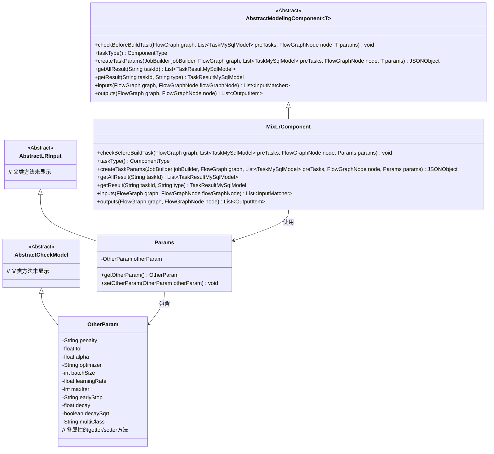
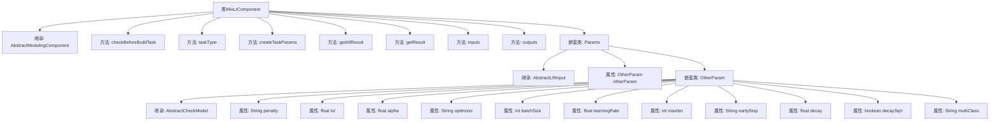

# 基础信息

|      |      |
|------|------|
| 名称 | MixLrComponent |
| 编码语言 | .java |
| 代码路径 | WeFe/board/board-service/src/main/java/com/welab/wefe/board/service/component/modeling/MixLrComponent.java |
| 包名 | com.welab.wefe.board.service.component.modeling |
| 依赖项 | ['com.alibaba.fastjson.JSONObject', 'com.welab.wefe.board.service.component.base.io.IODataType', 'com.welab.wefe.board.service.component.base.io.InputMatcher', 'com.welab.wefe.board.service.component.base.io.Names', 'com.welab.wefe.board.service.component.base.io.OutputItem', 'com.welab.wefe.board.service.database.entity.job.TaskMySqlModel', 'com.welab.wefe.board.service.database.entity.job.TaskResultMySqlModel', 'com.welab.wefe.board.service.model.FlowGraph', 'com.welab.wefe.board.service.model.FlowGraphNode', 'com.welab.wefe.board.service.model.JobBuilder', 'com.welab.wefe.common.fieldvalidate.AbstractCheckModel', 'com.welab.wefe.common.fieldvalidate.annotation.Check', 'com.welab.wefe.common.util.JObject', 'com.welab.wefe.common.web.dto.AbstractLRInput', 'com.welab.wefe.common.wefe.enums.ComponentType', 'org.springframework.stereotype.Service', 'java.util.Arrays', 'java.util.List'] |
| 概述说明 | MixLrComponent是混合逻辑回归组件，继承AbstractModelingComponent，包含参数校验、任务构建、结果获取功能，定义输入输出数据及模型类型，参数包括优化器、学习率等训练配置。 |

# 说明

MixLrComponent是一个继承自AbstractModelingComponent的服务类，专用于混合逻辑回归任务。其核心功能包括参数校验、任务参数生成及结果处理。类中定义了Params内部类，包含OtherParam子类，用于存储模型训练所需的各项参数，如惩罚方式、收敛容忍度、优化算法等，所有参数均通过@Check注解进行必要性校验。createTaskParams方法将参数转换为JSON格式输出，包含训练参数、初始化参数及交叉验证参数。组件定义了输入输出规范，输入需包含训练和评估数据集，输出包括标准数据集和训练模型。该组件类型标识为ComponentType.MixLR，并提供了任务结果查询功能。

# 类列表 Class Summary

| 名称   | 类型  | 说明 |
|-------|------|-------------|
| MixLrComponent | class | MixLrComponent是一个服务类，继承自AbstractModelingComponent，用于混合逻辑回归任务。它定义了任务类型为MixLR，并处理任务参数创建、结果获取及输入输出匹配。参数包括惩罚方式、学习率等，输出为数据集和模型。 |

## 类 MixLrComponent

|      |      |
|------|------|
| 访问范围 | @Service;public |
| 类型 | class |
| 名称 | MixLrComponent |
| 说明 | MixLrComponent是一个服务类，继承自AbstractModelingComponent，用于混合逻辑回归任务。它定义了任务类型为MixLR，并处理任务参数创建、结果获取及输入输出匹配。参数包括惩罚方式、学习率等，输出为数据集和模型。 |

### UML类图

这段代码展示了一个混合逻辑回归组件(MixLrComponent)的类结构，它继承自抽象建模组件(AbstractModelingComponent)。该组件主要负责处理机器学习任务中的混合逻辑回归模型，包含参数校验、任务创建、结果获取等功能。Params类封装了模型训练所需的各种参数，包括优化器设置、学习率调整等配置项，通过嵌套的OtherParam类进行详细参数管理。类图清晰地展示了各组件间的继承和组合关系。

### 内部方法调用关系图

该流程图展示了MixLrComponent类的完整结构，包括其继承关系、主要方法实现和嵌套类Params的详细组成。核心功能包含任务参数校验(createTaskParams)、结果获取(getAllResult/getResult)和输入输出定义(inputs/outputs)。嵌套类Params通过OtherParam封装了机器学习模型的关键超参数，如学习率、批量大小等，并通过注解实现参数校验逻辑。整体设计体现了组件化建模思想，将算法参数、数据流控制和模型训练过程进行分层管理。

### 字段列表 Field List

| 名称  | 类型  | 说明 |
|-------|-------|------|

### 方法列表

| 名称  | 类型  | 说明 |
|-------|-------|------|
| createTaskParams | JSONObject | 该方法创建任务参数JSON对象，包含惩罚系数、容差、学习率等模型参数，以及初始化、交叉验证和网格搜索配置。 |
| taskType | ComponentType | 该方法返回任务类型为MixLR的组件类型枚举值。 |
| getAllResult | List<TaskResultMySqlModel> | Java方法：通过taskId获取所有任务结果，调用taskResultService的listAllResult方法返回列表。 |
| checkBeforeBuildTask | void | 检查构建任务前的条件，包括流程图、前置任务、节点和参数。 |
| inputs | List<InputMatcher> | Java方法重写，返回包含训练和评估数据集的InputMatcher列表。 |
| outputs | List<OutputItem> | 方法outputs返回两个输出项：NORMAL_DATA_SET数据集和TRAIN_MODEL模型，分别指定数据类型为DataSetInstance和ModelFromLr。 |
| getResult | TaskResultMySqlModel | 重写方法getResult，调用父类方法并返回TaskResultMySqlModel对象，参数为taskId和type。 |

