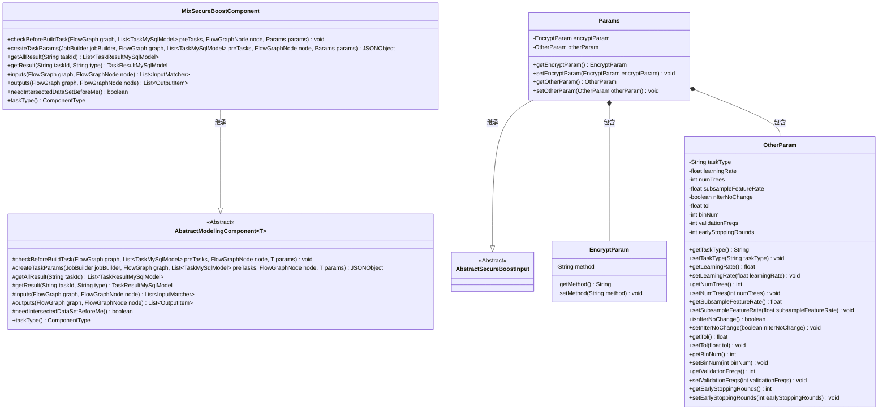

# 基础信息

|      |      |
|------|------|
| 名称 | MixSecureBoostComponent |
| 编码语言 | .java |
| 代码路径 | WeFe/board/board-service/src/main/java/com/welab/wefe/board/service/component/modeling/MixSecureBoostComponent.java |
| 包名 | com.welab.wefe.board.service.component.modeling |
| 依赖项 | ['com.alibaba.fastjson.JSONObject', 'com.welab.wefe.board.service.component.base.filter.IntersectedOutputFilter', 'com.welab.wefe.board.service.component.base.io.IODataType', 'com.welab.wefe.board.service.component.base.io.InputMatcher', 'com.welab.wefe.board.service.component.base.io.Names', 'com.welab.wefe.board.service.component.base.io.OutputItem', 'com.welab.wefe.board.service.database.entity.job.TaskMySqlModel', 'com.welab.wefe.board.service.database.entity.job.TaskResultMySqlModel', 'com.welab.wefe.board.service.exception.FlowNodeException', 'com.welab.wefe.board.service.model.FlowGraph', 'com.welab.wefe.board.service.model.FlowGraphNode', 'com.welab.wefe.board.service.model.JobBuilder', 'com.welab.wefe.common.fieldvalidate.AbstractCheckModel', 'com.welab.wefe.common.fieldvalidate.annotation.Check', 'com.welab.wefe.common.util.JObject', 'com.welab.wefe.common.web.dto.AbstractSecureBoostInput', 'com.welab.wefe.common.wefe.enums.ComponentType', 'org.springframework.stereotype.Service', 'java.util.Arrays', 'java.util.List'] |
| 概述说明 | MixSecureBoostComponent是一个混合安全增强组件，继承自AbstractModelingComponent，用于构建安全增强任务。它包含参数检查、任务参数生成、结果获取和输入输出匹配功能，支持XGBoost算法、同态加密和交叉验证。 |

# 说明

MixSecureBoostComponent是一个基于XGBoost的混合安全增强建模组件，继承自AbstractModelingComponent。它包含参数校验、任务参数创建、结果获取和输入输出定义等功能。核心参数包括加密参数（指定同态加密算法）、树参数（如最大深度、最小样本分割等）、目标函数参数、交叉验证参数以及其他参数（如学习率、树数量、特征采样比率等）。组件要求输入训练和评估数据集，输出普通数据集和XGBoost训练模型，并支持网格搜索参数配置。所有参数均通过严格校验确保必填项完整。

# 类列表 Class Summary

| 名称   | 类型  | 说明 |
|-------|------|-------------|
| MixSecureBoostComponent | class | MixSecureBoostComponent是一个基于XGBoost的混合安全增强组件，包含加密参数、树参数、目标参数和交叉验证参数，支持任务类型、学习率、树数量等配置，输出数据集和训练模型。 |

## 类 MixSecureBoostComponent

|      |      |
|------|------|
| 访问范围 | @Service;public |
| 类型 | class |
| 名称 | MixSecureBoostComponent |
| 说明 | MixSecureBoostComponent是一个基于XGBoost的混合安全增强组件，包含加密参数、树参数、目标参数和交叉验证参数，支持任务类型、学习率、树数量等配置，输出数据集和训练模型。 |

### UML类图

这段代码描述了一个混合安全增强组件`MixSecureBoostComponent`，继承自抽象建模组件`AbstractModelingComponent`，主要用于处理安全增强的机器学习任务。该组件包含参数类`Params`，其中封装了加密参数`EncryptParam`和其他任务参数`OtherParam`，用于配置XGBoost相关参数、交叉验证设置和加密方法。组件实现了任务参数生成、输入输出匹配、结果获取等核心功能，支持数据集的交叉验证和模型训练流程控制。

### 内部方法调用关系图

```mermaid
graph TD
    A["类MixSecureBoostComponent"]
    B["方法: checkBeforeBuildTask"]
    C["方法: taskType"]
    D["方法: createTaskParams"]
    E["方法: getAllResult"]
    F["方法: getResult"]
    G["方法: inputs"]
    H["方法: outputs"]
    I["方法: needIntersectedDataSetBeforeMe"]
    J["内部类: Params"]
    K["属性: EncryptParam encryptParam"]
    L["属性: OtherParam otherParam"]
    M["方法: getEncryptParam/setEncryptParam"]
    N["内部类: EncryptParam"]
    O["属性: String method"]
    P["方法: getMethod/setMethod"]
    Q["内部类: OtherParam"]
    R["属性: String taskType"]
    S["属性: float learningRate"]
    T["属性: int numTrees"]
    U["属性: float subsampleFeatureRate"]
    V["属性: boolean nIterNoChange"]
    W["属性: float tol"]
    X["属性: int binNum"]
    Y["属性: int validationFreqs"]
    Z["属性: int earlyStoppingRounds"]

    A --> B
    A --> C
    A --> D
    A --> E
    A --> F
    A --> G
    A --> H
    A --> I
    A --> J
    J --> K
    J --> L
    J --> M
    J --> N
    N --> O
    N --> P
    J --> Q
    Q --> R
    Q --> S
    Q --> T
    Q --> U
    Q --> V
    Q --> W
    Q --> X
    Q --> Y
    Q --> Z
```

该流程图展示了MixSecureBoostComponent类的结构，包括其主要方法和内部类Params的详细组成。Params类包含EncryptParam和OtherParam两个内部类，分别管理加密参数和其他任务参数。createTaskParams是核心方法，负责构建任务参数JSON对象，而inputs/outputs方法定义了数据输入输出规范。整体设计体现了联邦学习场景下安全增强的树模型组件实现。

### 字段列表 Field List

| 名称  | 类型  | 说明 |
|-------|-------|------|

### 方法列表

| 名称  | 类型  | 说明 |
|-------|-------|------|
| createTaskParams | JSONObject | 方法创建任务参数JSON，包含树参数（如max_depth）、目标参数、加密参数、交叉验证参数及其他参数（如learning_rate），最终返回组合的JSON对象。 |
| getResult | TaskResultMySqlModel | 重写getResult方法，调用父类实现获取任务结果。 |
| checkBeforeBuildTask | void | 方法检查构建任务前的条件，参数包括流程图、前置任务列表、节点和参数，可能抛出流程节点异常。 |
| taskType | ComponentType | 该方法重写taskType()，返回MixSecureBoost组件类型。 |
| getAllResult | List<TaskResultMySqlModel> | 这是一个Java方法，重写父类方法，通过taskResultService获取指定taskId的所有任务结果列表。 |
| inputs | List<InputMatcher> | 覆盖方法inputs返回两个InputMatcher：TRAIN_DATA_SET使用IntersectedOutputFilter，EVALUATION_DATA_SET使用TEST_DATA_SET_SUPPLIER。 |
| outputs | List<OutputItem> | 该方法返回两个输出项：NORMAL_DATA_SET（数据类型为DataSetInstance）和TRAIN_MODEL（数据类型为ModelFromXGBoost）。 |
| needIntersectedDataSetBeforeMe | boolean | 该方法返回true，表示需要先获取交集数据集。 |

