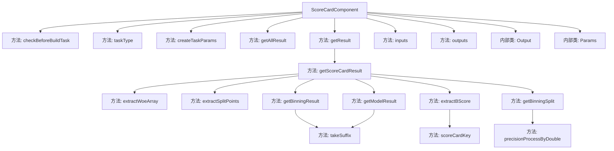

# 基础信息

|      |      |
|------|------|
| 名称 | ScoreCardComponent |
| 编码语言 | .java |
| 代码路径 | WeFe/board/board-service/src/main/java/com/welab/wefe/board/service/component/modeling/ScoreCardComponent.java |
| 包名 | com.welab.wefe.board.service.component.modeling |
| 依赖项 | ['com.alibaba.fastjson.JSONObject', 'com.welab.wefe.board.service.component.base.io.IODataType', 'com.welab.wefe.board.service.component.base.io.InputMatcher', 'com.welab.wefe.board.service.component.base.io.Names', 'com.welab.wefe.board.service.component.base.io.OutputItem', 'com.welab.wefe.board.service.database.entity.job.TaskMySqlModel', 'com.welab.wefe.board.service.database.entity.job.TaskResultMySqlModel', 'com.welab.wefe.board.service.exception.FlowNodeException', 'com.welab.wefe.board.service.model.FlowGraph', 'com.welab.wefe.board.service.model.FlowGraphNode', 'com.welab.wefe.board.service.model.JobBuilder', 'com.welab.wefe.common.fieldvalidate.AbstractCheckModel', 'com.welab.wefe.common.fieldvalidate.annotation.Check', 'com.welab.wefe.common.util.JObject', 'com.welab.wefe.common.wefe.enums.ComponentType', 'com.welab.wefe.common.wefe.enums.TaskResultType', 'org.apache.commons.compress.utils.Lists', 'org.springframework.stereotype.Service', 'java.math.BigDecimal', 'java.util.Arrays', 'java.util.List'] |
| 概述说明 | ScoreCardComponent是评分卡组件，检查前置流程需包含分箱和逻辑回归组件，生成评分卡结果并处理输出。 |

# 说明

ScoreCardComponent是一个评分卡组件，继承自AbstractModelingComponent。它在构建任务前会检查前置流程中是否包含Binning或逻辑回归组件，否则抛出异常。该组件通过createTaskParams方法生成任务参数，包含基准分p0和pdo值。getScoreCardResult方法负责计算评分卡结果，整合分箱结果、模型权重和WOE值，最终输出包含分箱区间、WOE值、分数和权重的JSON结果。组件定义了输入输出匹配器，输入需包含分箱模型和数据集，输出为JSON格式结果。Params类包含基准分p0和pdo两个必填参数。

# 类列表 Class Summary

| 名称   | 类型  | 说明 |
|-------|------|-------------|
| ScoreCardComponent | class | ScoreCardComponent是评分卡组件，检查前置流程需包含分箱和逻辑回归组件，处理参数生成任务结果，计算评分卡分数并输出JSON结果。 |

## 类 ScoreCardComponent

|      |      |
|------|------|
| 访问范围 | @Service;public |
| 类型 | class |
| 名称 | ScoreCardComponent |
| 说明 | ScoreCardComponent是评分卡组件，检查前置流程需包含分箱和逻辑回归组件，处理参数生成任务结果，计算评分卡分数并输出JSON结果。 |

### UML类图

```mermaid
classDiagram
    class AbstractModelingComponent~T~ {
        <<Abstract>>
        #void checkBeforeBuildTask(FlowGraph graph, List~TaskMySqlModel~ preTasks, FlowGraphNode node, T params)
        #JSONObject createTaskParams(JobBuilder jobBuilder, FlowGraph graph, List~TaskMySqlModel~ preTasks, FlowGraphNode node, T params)
        #List~TaskResultMySqlModel~ getAllResult(String taskId)
        #TaskResultMySqlModel getResult(String taskId, String type)
        #List~InputMatcher~ inputs(FlowGraph graph, FlowGraphNode flowGraphNode)
        #List~OutputItem~ outputs(FlowGraph graph, FlowGraphNode node)
        +ComponentType taskType()
    }

    class ScoreCardComponent {
        -String getScoreCardResult(TaskResultMySqlModel taskResult)
        -List~Double~ extractWoeArray(JObject obj)
        -List~Double~ extractSplitPoints(JObject obj)
        -JObject getBinningResult(TaskResultMySqlModel taskResult)
        -String takeSuffix(String value)
        -JObject getModelResult(TaskResultMySqlModel taskResult)
        +String scoreCardKey(String name)
        -double extractBScore(TaskResultMySqlModel taskResult)
        -String getBinningSplit(List~Double~ list, int i)
        -String precisionProcessByDouble(double value)
    }

    class Output {
        -String binning
        -Double woe
        -Double score
        -Double weight
        +String getBinning()
        +void setBinning(String binning)
        +Double getWoe()
        +void setWoe(Double woe)
        +Double getScore()
        +void setScore(Double score)
        +Double getWeight()
        +void setWeight(Double weight)
    }

    class Params {
        -double p0
        -double pdo
        +double getP0()
        +void setP0(double p0)
        +double getPdo()
        +void setPdo(double pdo)
    }

    class FlowGraph {
        +FlowGraphNode findOneNodeFromParent(FlowGraphNode node, ComponentType type)
    }

    class TaskResultMySqlModel {
        -String result
        -String jobId
        -String role
        -String name
        +String getResult()
        +void setResult(String result)
        +String getJobId()
        +String getRole()
        +String getName()
    }

    class JObject {
        +JObject create(String json)
        +JObject append(String key, Object value)
        +List~Double~ getJSONList(String key, Class~Double~ clazz)
        +JObject getJObjectByPath(String path)
        +Double getDouble(String key)
        +Double getDoubleByPath(String path)
        +String toJSONString()
    }

    ScoreCardComponent --|> AbstractModelingComponent~Params~ : 继承
    ScoreCardComponent --> FlowGraph : 使用
    ScoreCardComponent --> TaskResultMySqlModel : 使用
    ScoreCardComponent --> JObject : 使用
    ScoreCardComponent .. Output : 创建
    ScoreCardComponent .. Params : 内部类
    Params --|> AbstractCheckModel : 继承
```

该类图展示了评分卡组件的核心结构。ScoreCardComponent继承自泛型抽象类AbstractModelingComponent，实现了评分卡模型构建的核心逻辑，包括参数校验(checkBeforeBuildTask)、任务参数生成(createTaskParams)和结果处理(getScoreCardResult)。组件通过FlowGraph管理流程节点，使用JObject处理JSON数据，内部定义了Params参数类和Output输出类。整体设计体现了模板方法模式，通过继承抽象类实现具体业务逻辑，同时保持了对任务结果(TaskResultMySqlModel)和流程图的强依赖关系。

### 内部方法调用关系图

这段代码是ScoreCardComponent类的实现，主要用于构建评分卡模型。它继承自AbstractModelingComponent，包含多个关键方法：checkBeforeBuildTask用于验证前置组件是否存在，createTaskParams生成任务参数，getScoreCardResult计算评分卡结果。内部类Params用于存储基准分和PDO参数，Output类封装评分卡输出项。流程图展示了类的方法调用关系和内部类结构，体现了从参数校验到结果生成的全流程。

### 字段列表 Field List

| 名称  | 类型  | 说明 |
|-------|-------|------|

### 方法列表

| 名称  | 类型  | 说明 |
|-------|-------|------|
| inputs | List<InputMatcher> | 方法重写，返回输入匹配器列表，包含模型和数据集两种类型输入。 |
| outputs | List<OutputItem> | Java方法重写，返回包含JSON结果的OutputItem列表。 |
| checkBeforeBuildTask | void | 检查构建任务前需存在Binning或HorzFeatureBinning或MixBinning组件，以及HorzLR或VertLR或MixLR组件，否则抛出异常提示添加。 |
| taskType | ComponentType | 该方法重写父类方法，返回组件类型为ScoreCard。 |
| extractWoeArray | List<Double> | 提取JSON对象中的woeArray字段并转为Double列表。 |
| getAllResult | List<TaskResultMySqlModel> | 这是一个Java方法，重写父类方法，通过调用taskResultService的listAllResult方法获取指定taskId的所有任务结果列表。 |
| getBinningSplit | String | 方法生成分箱区间字符串，输入为数值列表和索引，输出格式为"下限,上限"。处理首项下限为-∞，其余取列表前一项值，上限取当前项值。 |
| getModelResult | JObject | 方法getModelResult根据任务结果获取模型参数。先查询符合条件的模型结果列表，若仅一条则直接提取权重；否则匹配名称后缀后提取权重。返回模型参数中的权重部分。 |
| getScoreCardResult | String | 方法getScoreCardResult根据任务结果计算评分卡结果。提取B分数、分箱结果和模型结果，遍历分箱数据计算每个分箱的分割点、WOE值、分数和权重，最终返回JSON格式的评分卡结果。 |
| extractSplitPoints | List<Double> | 提取JSON对象中的splitPoints列表并转换为Double类型返回。 |
| extractBScore | double | 该方法从任务结果中提取B分数：解析JSON结果，根据任务名生成路径，返回指定路径下的双精度数值。 |
| takeSuffix | String | 提取字符串倒数第二个字符的方法。 |
| getBinningResult | JObject | 获取分箱结果：根据任务ID、类型和角色查询分箱任务结果，匹配名称后缀后返回分箱结果路径下的数据。 |
| createTaskParams | JSONObject | 方法创建任务参数，生成包含p0和pdo的JSON对象。 |
| scoreCardKey | String | 该方法生成并返回一个以"score_"为前缀的字符串键，键名由输入参数name决定。 |
| precisionProcessByDouble | String | 该方法将双精度浮点数转换为保留两位小数的字符串，采用四舍五入规则处理。 |
| getResult | TaskResultMySqlModel | 重写方法获取任务结果，查询数据库后若存在则更新结果并返回，否则返回空。 |

