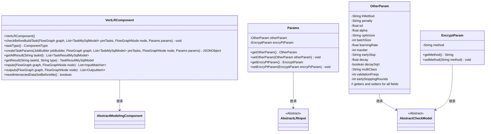

# 基础信息

|      |      |
|------|------|
| 名称 | VertLRComponent |
| 编码语言 | .java |
| 代码路径 | WeFe/board/board-service/src/main/java/com/welab/wefe/board/service/component/modeling/VertLRComponent.java |
| 包名 | com.welab.wefe.board.service.component.modeling |
| 依赖项 | ['com.alibaba.fastjson.JSONObject', 'com.welab.wefe.board.service.component.base.io.IODataType', 'com.welab.wefe.board.service.component.base.io.InputMatcher', 'com.welab.wefe.board.service.component.base.io.Names', 'com.welab.wefe.board.service.component.base.io.OutputItem', 'com.welab.wefe.board.service.database.entity.job.JobMemberMySqlModel', 'com.welab.wefe.board.service.database.entity.job.TaskMySqlModel', 'com.welab.wefe.board.service.database.entity.job.TaskResultMySqlModel', 'com.welab.wefe.board.service.exception.FlowNodeException', 'com.welab.wefe.board.service.model.FlowGraph', 'com.welab.wefe.board.service.model.FlowGraphNode', 'com.welab.wefe.board.service.model.JobBuilder', 'com.welab.wefe.common.fieldvalidate.AbstractCheckModel', 'com.welab.wefe.common.fieldvalidate.annotation.Check', 'com.welab.wefe.common.util.JObject', 'com.welab.wefe.common.web.dto.AbstractLRInput', 'com.welab.wefe.common.wefe.enums.ComponentType', 'com.welab.wefe.common.wefe.enums.TaskResultType', 'org.springframework.stereotype.Service', 'java.util.Arrays', 'java.util.List', 'java.util.stream.Collectors'] |
| 概述说明 | VertLRComponent是垂直逻辑回归组件，继承AbstractModelingComponent。检查前置样本对齐组件，支持参数配置如优化器、学习率等，输出数据集和模型。SSHE-LR仅支持两方参与。 |

# 说明

VertLRComponent是一个继承自AbstractModelingComponent的垂直逻辑回归组件，主要用于处理多方参与的机器学习任务。该组件在构建任务前会进行前置检查，包括验证是否存在样本对齐组件以及参与方数量是否符合要求。它通过createTaskParams方法生成包含多种参数的JSON对象，包括惩罚项、优化器、学习率等训练参数，以及加密方法和交叉验证设置。组件定义了输入输出匹配器，确保数据流正确性，并支持模型训练结果的获取。Params内部类封装了算法参数、加密参数等配置项，所有参数均通过注解进行必要性校验。

# 类列表 Class Summary

| 名称   | 类型  | 说明 |
|-------|------|-------------|
| VertLRComponent | class | VertLRComponent是纵向逻辑回归组件，继承自AbstractModelingComponent。主要功能包括：检查前置样本对齐组件，验证参与方数量限制，生成任务参数（如学习率、批量大小等），处理输入输出数据集及模型。支持多种参数配置，如优化算法、多分类策略等。 |

## 类 VertLRComponent

|      |      |
|------|------|
| 访问范围 | @Service;public |
| 类型 | class |
| 名称 | VertLRComponent |
| 说明 | VertLRComponent是纵向逻辑回归组件，继承自AbstractModelingComponent。主要功能包括：检查前置样本对齐组件，验证参与方数量限制，生成任务参数（如学习率、批量大小等），处理输入输出数据集及模型。支持多种参数配置，如优化算法、多分类策略等。 |

### UML类图

类图描述：
VertLRComponent是一个服务类，继承自AbstractModelingComponent，实现了垂直逻辑回归功能。它包含参数检查、任务创建、结果获取等方法。Params是它的内部参数类，包含OtherParam和EncryptParam两个嵌套类，分别存储算法参数和加密参数。这些参数类都继承自抽象基类AbstractCheckModel，具有参数校验功能。整个类图展示了垂直逻辑回归组件的核心结构和参数体系。

### 内部方法调用关系图

这段代码实现了一个垂直逻辑回归组件(VertLRComponent)，主要功能包括：1) 前置检查(checkBeforeBuildTask)确保存在样本对齐组件且参与方数量合法；2) 创建任务参数(createTaskParams)构建包含惩罚项、优化器、学习率等参数的JSON对象；3) 结果处理(getAllResult/getResult)获取训练指标和模型；4) 定义输入输出数据规范(inputs/outputs)。内部类Params封装了算法参数，包括常规参数(OtherParam)和加密参数(EncryptParam)。该组件继承自AbstractModelingComponent，属于工作流节点中的机器学习建模组件。

### 字段列表 Field List

| 名称  | 类型  | 说明 |
|-------|-------|------|

### 方法列表

| 名称  | 类型  | 说明 |
|-------|-------|------|
| checkBeforeBuildTask | void | 检查构建任务前的条件：确保存在样本对齐组件，且若使用sshe-lr方法则参与方不超过两个。 |
| getAllResult | List<TaskResultMySqlModel> | 该方法通过任务ID获取所有结果，筛选类型为metric_train和model_train的数据，并补充两种类型的重组数据后返回列表。 |
| getResult | TaskResultMySqlModel | 重写方法getResult，调用父类方法并返回TaskResultMySqlModel对象，参数为taskId和type。 |
| taskType | ComponentType | 方法重写，返回组件类型为垂直布局。 |
| createTaskParams | JSONObject | 该方法创建任务参数JSON对象，包含惩罚系数、容差、学习率、优化器等机器学习参数，以及加密方法、交叉验证等配置。 |
| inputs | List<InputMatcher> | 方法重写，返回两个InputMatcher实例，分别匹配训练数据集和评估数据集，使用预设过滤器。 |
| outputs | List<OutputItem> | 方法outputs返回两个OutputItem对象，分别包含NORMAL_DATA_SET和TRAIN_MODEL的输出项及对应数据类型。 |
| needIntersectedDataSetBeforeMe | boolean | 方法needIntersectedDataSetBeforeMe返回true，表示需要先获取交集数据集。 |

