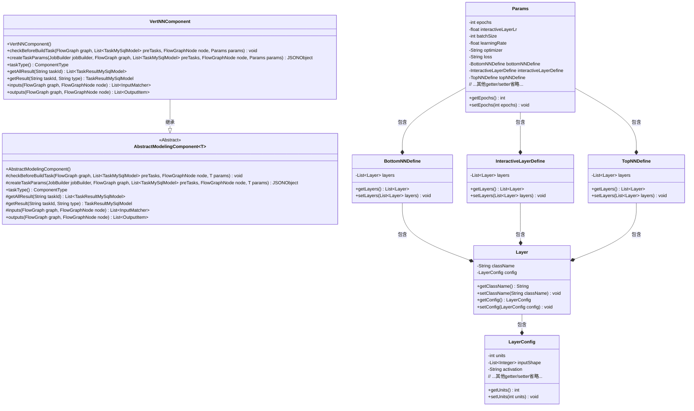
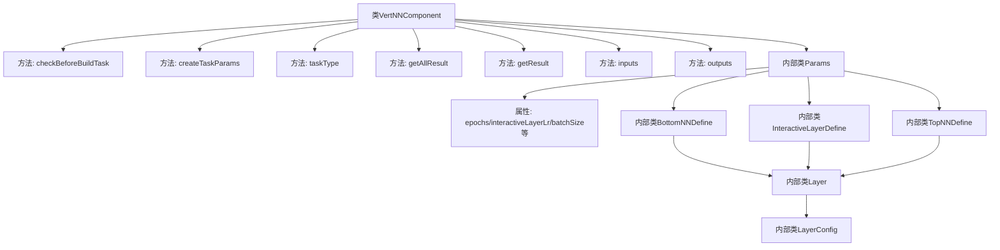
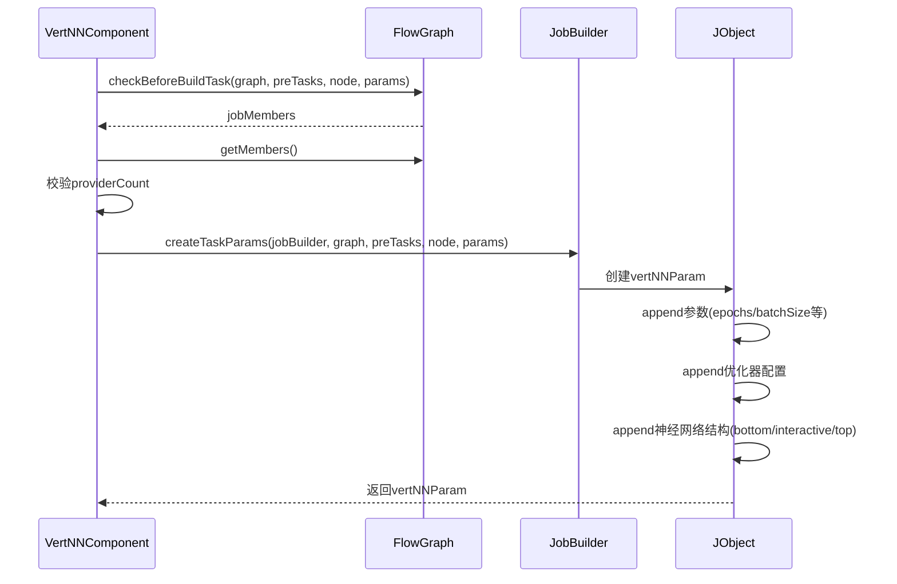

# 基础信息

|      |      |
|------|------|
| 名称 | VertNNComponent |
| 编码语言 | .java |
| 代码路径 | WeFe/board/board-service/src/main/java/com/welab/wefe/board/service/component/modeling/VertNNComponent.java |
| 包名 | com.welab.wefe.board.service.component.modeling |
| 依赖项 | ['com.alibaba.fastjson.JSONObject', 'com.welab.wefe.board.service.component.base.io.IODataType', 'com.welab.wefe.board.service.component.base.io.InputMatcher', 'com.welab.wefe.board.service.component.base.io.Names', 'com.welab.wefe.board.service.component.base.io.OutputItem', 'com.welab.wefe.board.service.database.entity.job.JobMemberMySqlModel', 'com.welab.wefe.board.service.database.entity.job.TaskMySqlModel', 'com.welab.wefe.board.service.database.entity.job.TaskResultMySqlModel', 'com.welab.wefe.board.service.exception.FlowNodeException', 'com.welab.wefe.board.service.model.FlowGraph', 'com.welab.wefe.board.service.model.FlowGraphNode', 'com.welab.wefe.board.service.model.JobBuilder', 'com.welab.wefe.common.fieldvalidate.AbstractCheckModel', 'com.welab.wefe.common.fieldvalidate.annotation.Check', 'com.welab.wefe.common.util.JObject', 'com.welab.wefe.common.wefe.enums.ComponentType', 'com.welab.wefe.common.wefe.enums.JobMemberRole', 'org.springframework.stereotype.Service', 'java.util.ArrayList', 'java.util.Arrays', 'java.util.List'] |
| 概述说明 | VertNNComponent是纵向深度学习组件，检查协作方数量并生成任务参数，包含训练参数、神经网络结构定义及输入输出配置。 |

# 说明

VertNNComponent是一个纵向深度学习组件，继承自AbstractModelingComponent，用于构建深度学习任务。它在构建任务前会检查协作方数量，确保不超过一个。组件通过createTaskParams方法生成任务参数，包括训练轮次、学习率、批量大小、优化器、损失函数等配置，并定义底层、交互层和顶层的神经网络结构。输入包括训练和评估数据集，输出为数据集实例和训练模型。Params类包含所有必要的训练参数和网络层定义，每层包含类名和配置参数如维度、激活函数等。

# 类列表 Class Summary

| 名称   | 类型  | 说明 |
|-------|------|-------------|
| VertNNComponent | class | VertNNComponent是纵向深度学习组件，检查协作方数量并生成任务参数，包含模型结构、优化器和训练配置。 |

## 类 VertNNComponent

|      |      |
|------|------|
| 访问范围 | @Service;public |
| 类型 | class |
| 名称 | VertNNComponent |
| 说明 | VertNNComponent是纵向深度学习组件，检查协作方数量并生成任务参数，包含模型结构、优化器和训练配置。 |

### UML类图

类图描述：该图展示了VertNNComponent类继承自泛型类AbstractModelingComponent~Params~的结构，其中Params作为内部类包含多个神经网络定义类（BottomNNDefine、InteractiveLayerDefine、TopNNDefine），这些定义类又包含Layer对象，Layer进一步包含LayerConfig配置项。整体呈现纵向深度学习组件的参数体系与层级关系，体现了组件对神经网络结构的参数化配置能力。

### 内部方法调用关系图

该流程图展示了VertNNComponent类的核心结构和主要方法调用关系。作为纵向深度学习组件，它通过checkBeforeBuildTask验证输入数据合规性，通过createTaskParams构建包含神经网络结构、优化器参数等配置的JSON对象。内部类Params及其嵌套类定义了完整的神经网络参数体系，包含层配置、优化策略等深度学习必需元素。时序图重点呈现了任务创建时的参数校验和配置生成流程。

### 字段列表 Field List

| 名称  | 类型  | 说明 |
|-------|-------|------|

### 方法列表

| 名称  | 类型  | 说明 |
|-------|-------|------|
| getAllResult | List<TaskResultMySqlModel> | 这是一个Java方法，重写了父类的getAllResult方法，通过taskResultService的listAllResult方法获取指定taskId的所有任务结果列表。 |
| taskType | ComponentType | 方法重写，返回组件类型为VertNN。 |
| createTaskParams | JSONObject | 方法创建任务参数JSON对象，包含训练参数如epochs、batch_size、优化器设置、损失函数、评估指标，以及神经网络结构定义（bottom、interactive、top层），配置类型为keras。 |
| checkBeforeBuildTask | void | 检查构建任务前验证协作方数量，若超过1个则报错提示仅支持单协作方。 |
| getResult | TaskResultMySqlModel | 重写父类方法，根据任务ID和类型获取MySQL模型结果。 |
| inputs | List<InputMatcher> | 方法重写，返回两个输入匹配器：训练数据集和评估数据集，分别对应过滤器和供应器。 |
| outputs | List<OutputItem> | 方法重写，返回包含数据集实例和神经网络模型的输出项列表。 |

