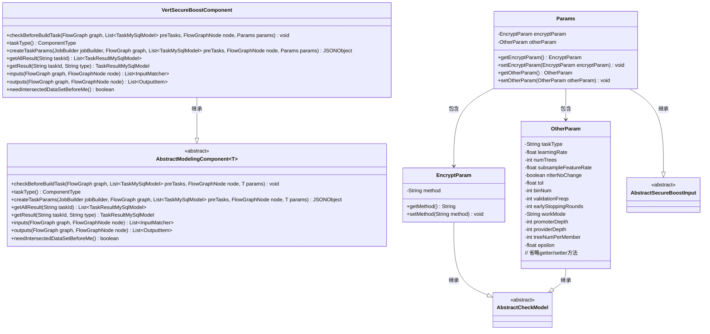
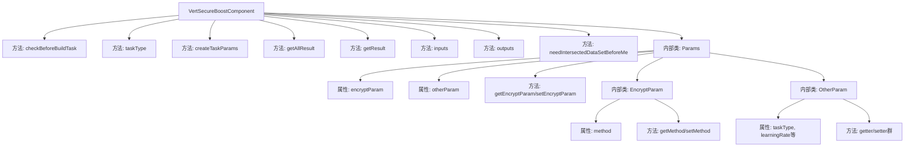
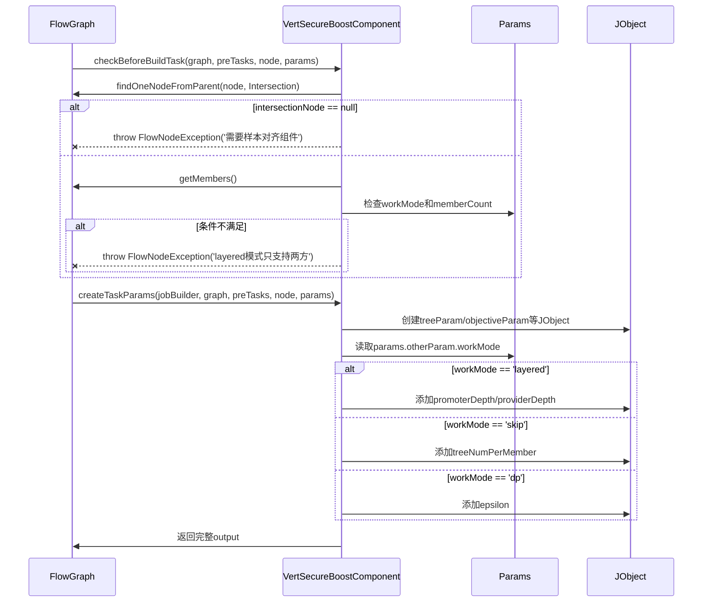

# 基础信息

|      |      |
|------|------|
| 名称 | VertSecureBoostComponent |
| 编码语言 | .java |
| 代码路径 | WeFe/board/board-service/src/main/java/com/welab/wefe/board/service/component/modeling/VertSecureBoostComponent.java |
| 包名 | com.welab.wefe.board.service.component.modeling |
| 依赖项 | ['com.alibaba.fastjson.JSONObject', 'com.welab.wefe.board.service.component.base.filter.IntersectedOutputFilter', 'com.welab.wefe.board.service.component.base.io.IODataType', 'com.welab.wefe.board.service.component.base.io.InputMatcher', 'com.welab.wefe.board.service.component.base.io.Names', 'com.welab.wefe.board.service.component.base.io.OutputItem', 'com.welab.wefe.board.service.database.entity.job.JobMemberMySqlModel', 'com.welab.wefe.board.service.database.entity.job.TaskMySqlModel', 'com.welab.wefe.board.service.database.entity.job.TaskResultMySqlModel', 'com.welab.wefe.board.service.exception.FlowNodeException', 'com.welab.wefe.board.service.model.FlowGraph', 'com.welab.wefe.board.service.model.FlowGraphNode', 'com.welab.wefe.board.service.model.JobBuilder', 'com.welab.wefe.common.fieldvalidate.AbstractCheckModel', 'com.welab.wefe.common.fieldvalidate.annotation.Check', 'com.welab.wefe.common.util.JObject', 'com.welab.wefe.common.web.dto.AbstractSecureBoostInput', 'com.welab.wefe.common.wefe.enums.ComponentType', 'org.springframework.stereotype.Service', 'java.util.Arrays', 'java.util.List'] |
| 概述说明 | VertSecureBoostComponent是安全增强的XGBoost实现，支持多种工作模式（normal/layered/skip/dp），包含参数校验、任务创建和结果处理功能，需前置样本对齐组件。 |

# 说明

VertSecureBoostComponent是一个基于XGBoost的安全增强建模组件，继承自AbstractModelingComponent。它包含参数校验逻辑，要求前置样本对齐组件，并限制layered模式仅支持两个参与方。组件支持多种工作模式（normal/layered/skip/dp），每种模式对应不同参数配置。核心功能包括创建任务参数（学习率、树数量、加密方法等）、获取任务结果、定义输入输出数据格式。参数类Params封装了加密参数、树参数、目标函数参数等配置项，包含严格的参数校验注解。组件输出包含数据集和XGBoost模型，要求前置数据必须经过对齐处理。

# 类列表 Class Summary

| 名称   | 类型  | 说明 |
|-------|------|-------------|
| VertSecureBoostComponent | class | VertSecureBoostComponent是一个安全增强的纵向联邦学习组件，继承自AbstractModelingComponent。它实现了参数校验、任务参数构建、输入输出定义等功能，支持多种工作模式（normal、layered、skip、dp），并包含树参数、目标参数、加密参数等配置。 |

## 类 VertSecureBoostComponent

|      |      |
|------|------|
| 访问范围 | @Service;public |
| 类型 | class |
| 名称 | VertSecureBoostComponent |
| 说明 | VertSecureBoostComponent是一个安全增强的纵向联邦学习组件，继承自AbstractModelingComponent。它实现了参数校验、任务参数构建、输入输出定义等功能，支持多种工作模式（normal、layered、skip、dp），并包含树参数、目标参数、加密参数等配置。 |

### UML类图

这段代码展示了一个安全增强的梯度提升树组件VertSecureBoostComponent，它继承自AbstractModelingComponent并实现了多种参数校验和任务创建功能。类图清晰地展示了组件与参数类之间的继承和包含关系，包括核心参数类Params及其嵌套类EncryptParam和OtherParam。该组件主要用于联邦学习场景下的安全树模型构建，支持多种工作模式（normal/layered/skip/dp）和参数配置，通过严格的输入校验确保模型构建的可靠性。

### 内部方法调用关系图

该流程图展示了VertSecureBoostComponent的核心结构和调用关系，包含8个主要方法和嵌套的Params参数类。时序图重点描述了checkBeforeBuildTask和createTaskParams两个关键方法的执行流程，前者验证前置条件和参与方数量，后者根据不同workMode动态构建任务参数。组件实现了联邦学习中的安全提升树算法，通过严格的参数校验和灵活的工作模式配置确保多方协作时的数据安全和算法有效性。

### 字段列表 Field List

| 名称  | 类型  | 说明 |
|-------|-------|------|

### 方法列表

| 名称  | 类型  | 说明 |
|-------|-------|------|
| getAllResult | List<TaskResultMySqlModel> | 该方法重写父类功能，通过调用taskResultService的listAllResult方法获取指定taskId的所有任务结果列表。 |
| getResult | TaskResultMySqlModel | 重写getResult方法，调用父类实现并返回TaskResultMySqlModel对象，参数为taskId和type。 |
| createTaskParams | JSONObject | 该方法创建XGBoost任务参数JSON对象，包含树参数、目标参数、加密参数、交叉验证参数等，并根据工作模式添加不同字段。 |
| checkBeforeBuildTask | void | 检查构建任务前条件：需存在样本对齐组件；若为layered模式且参与方超过两个则报错。 |
| taskType | ComponentType | 方法重写，返回组件类型为VertSecureBoost。 |
| inputs | List<InputMatcher> | 该方法重写inputs方法，返回两个InputMatcher对象，分别匹配训练数据集和评估数据集，使用IntersectedOutputFilter和TEST_DATA_SET_SUPPLIER进行处理。 |
| outputs | List<OutputItem> | 方法outputs返回两个输出项：NORMAL_DATA_SET数据集和TRAIN_MODEL的XGBoost模型。 |
| needIntersectedDataSetBeforeMe | boolean | 方法needIntersectedDataSetBeforeMe返回true，表示在执行当前操作前需要先获取交集数据集。 |

