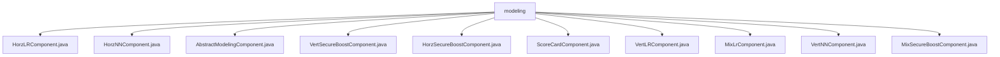

# 基础信息

|      |      |
|------|------|
| 名称 | modeling |
| 编码语言 | .java |
| 代码路径 | WeFe/board/board-service/src/main/java/com/welab/wefe/board/service/component/modeling |
| 包名 | docs.board.board-service.src.main.java.com.welab.wefe.board.service.component.modeling |
| 概述说明 | 多个继承AbstractModelingComponent的机器学习组件类，包括逻辑回归、神经网络、安全增强树模型和评分卡等，实现参数校验、任务创建、结果处理功能，支持不同联邦学习场景。 |

# 说明

## 概述  
该模块是联邦学习建模组件集合，核心职责是实现多种机器学习算法的分布式训练，包括逻辑回归、神经网络、XGBoost等，支持横向、纵向和混合数据划分场景。接口规范统一采用createTaskParams构建JSON参数，通过Params内部类封装算法配置，例如HorzLRComponent的惩罚系数或VertNNComponent的神经网络层定义。关键数据结构包含训练参数（如学习率、迭代次数）、模型结构（如树深度、网络层）和校验注解。外部依赖包括JSON处理库、XGBoost框架和Spring服务容器。例如ScoreCardComponent依赖分箱模型，VertSecureBoostComponent要求前置样本对齐。

## 主要业务场景  
模块支持联邦学习全流程，典型场景如横向逻辑回归训练（HorzLRComponent）或纵向XGBoost建模（VertSecureBoostComponent）。交互模式统一为：输入训练/评估数据集→参数校验→生成JSON任务配置→输出模型和指标。功能完整性体现在支持算法（如逻辑回归、评分卡）、训练模式（如DP加密）和评估流程。例如MixSecureBoostComponent支持网格搜索，VertNNComponent定义三层网络结构。API类型涵盖参数构建、结果合并（类似MapReduce）和前置校验，集成案例包括HorzNNComponent的TensorFlow对接和ScoreCardComponent的WOE值转换。

### 包内部结构视图

该流程图展示了WeFe项目中board-service模块下modeling组件的类结构关系。所有组件类都直接隶属于modeling目录，包括横向/纵向的多种机器学习算法实现组件（如HorzLRComponent、VertSecureBoostComponent等）以及抽象基类AbstractModelingComponent，共10个叶子节点完整覆盖了给定的全部路径信息。

# 文件列表

| 名称   | 类型  | 说明 |
|-------|------|-------------|
| [HorzLRComponent.java](HorzLRComponent.md) | file | HorzLRComponent是水平逻辑回归组件，继承AbstractModelingComponent，包含参数校验、任务参数生成、输入输出定义等功能，主要处理训练数据和模型输出。 |
| [HorzNNComponent.java](HorzNNComponent.md) | file | HorzNNComponent是水平神经网络组件，继承AbstractModelingComponent，包含参数校验、任务创建、输入输出定义及神经网络层配置。 |
| [AbstractModelingComponent.java](AbstractModelingComponent.md) | file | 抽象类AbstractModelingComponent定义了训练数据集过滤器和测试/验证数据集供应商，包含获取任务结果的方法，处理训练损失数据排序和结果合并。 |
| [VertSecureBoostComponent.java](VertSecureBoostComponent.md) | file | VertSecureBoostComponent是安全增强的XGBoost实现，支持多种工作模式（normal/layered/skip/dp），包含参数校验、任务创建和结果处理功能，需前置样本对齐组件。 |
| [HorzSecureBoostComponent.java](HorzSecureBoostComponent.md) | file | HorzSecureBoostComponent是一个基于XGBoost的横向安全增强组件，用于构建机器学习模型。它包含参数校验、任务参数生成、输入输出定义等功能，支持树参数、目标参数和交叉验证参数配置，输出数据集和训练模型。 |
| [ScoreCardComponent.java](ScoreCardComponent.md) | file | ScoreCardComponent是评分卡组件，检查前置流程需包含分箱和逻辑回归组件，生成评分卡结果并处理输出。 |
| [VertLRComponent.java](VertLRComponent.md) | file | VertLRComponent是垂直逻辑回归组件，继承AbstractModelingComponent。检查前置样本对齐组件，支持参数配置如优化器、学习率等，输出数据集和模型。SSHE-LR仅支持两方参与。 |
| [MixLrComponent.java](MixLrComponent.md) | file | MixLrComponent是混合逻辑回归组件，继承AbstractModelingComponent，包含参数校验、任务构建、结果获取功能，定义输入输出数据及模型类型，参数包括优化器、学习率等训练配置。 |
| [VertNNComponent.java](VertNNComponent.md) | file | VertNNComponent是纵向深度学习组件，检查协作方数量并生成任务参数，包含训练参数、神经网络结构定义及输入输出配置。 |
| [MixSecureBoostComponent.java](MixSecureBoostComponent.md) | file | MixSecureBoostComponent是一个混合安全增强组件，继承自AbstractModelingComponent，用于构建安全增强任务。它包含参数检查、任务参数生成、结果获取和输入输出匹配功能，支持XGBoost算法、同态加密和交叉验证。 |

