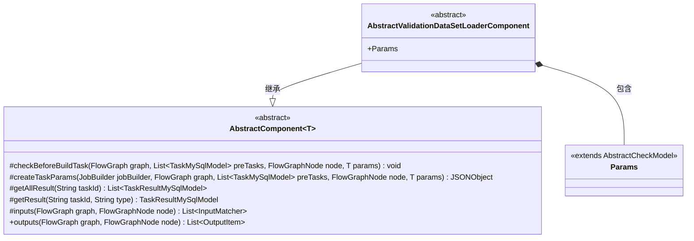
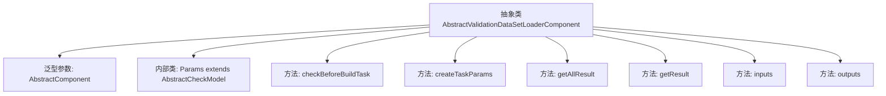

# 基础信息

|      |      |
|------|------|
| 名称 | AbstractValidationDataSetLoaderComponent |
| 编码语言 | .java |
| 代码路径 | WeFe/board/board-service/src/main/java/com/welab/wefe/board/service/component/temp/AbstractValidationDataSetLoaderComponent.java |
| 包名 | com.welab.wefe.board.service.component.temp |
| 依赖项 | ['com.alibaba.fastjson.JSONObject', 'com.welab.wefe.board.service.component.base.AbstractComponent', 'com.welab.wefe.board.service.component.base.io.IODataType', 'com.welab.wefe.board.service.component.base.io.InputMatcher', 'com.welab.wefe.board.service.component.base.io.Names', 'com.welab.wefe.board.service.component.base.io.OutputItem', 'com.welab.wefe.board.service.database.entity.job.TaskMySqlModel', 'com.welab.wefe.board.service.database.entity.job.TaskResultMySqlModel', 'com.welab.wefe.board.service.exception.FlowNodeException', 'com.welab.wefe.board.service.model.FlowGraph', 'com.welab.wefe.board.service.model.FlowGraphNode', 'com.welab.wefe.board.service.model.JobBuilder', 'com.welab.wefe.common.fieldvalidate.AbstractCheckModel', 'java.util.Arrays', 'java.util.List'] |
| 概述说明 | 抽象类AbstractValidationDataSetLoaderComponent继承AbstractComponent，实现任务参数创建、结果获取、输入输出匹配等方法，包含静态Params类。 |

# 说明

这是一个抽象类AbstractValidationDataSetLoaderComponent，继承自AbstractComponent，泛型参数为内部类Params。该类主要定义了数据验证集加载功能，包含多个重写方法：checkBeforeBuildTask用于构建前检查，createTaskParams创建任务参数，getAllResult和getResult获取任务结果，inputs定义输入匹配器（要求NORMAL_DATA_SET类型的BoardDataSet），outputs返回空值。内部静态类Params继承AbstractCheckModel，用于参数传递。整体结构为流程图中数据处理节点提供了基础框架。

# 类列表 Class Summary

| 名称   | 类型  | 说明 |
|-------|------|-------------|
| AbstractValidationDataSetLoaderComponent | class | 抽象类AbstractValidationDataSetLoaderComponent继承自AbstractComponent，包含参数检查、任务参数创建、结果获取及输入输出定义等方法，Params为内部静态类。 |

## 类 AbstractValidationDataSetLoaderComponent

|      |      |
|------|------|
| 访问范围 | public abstract |
| 类型 | class |
| 名称 | AbstractValidationDataSetLoaderComponent |
| 说明 | 抽象类AbstractValidationDataSetLoaderComponent继承自AbstractComponent，包含参数检查、任务参数创建、结果获取及输入输出定义等方法，Params为内部静态类。 |

### UML类图

这段代码描述了一个抽象类`AbstractValidationDataSetLoaderComponent`，它继承自泛型类`AbstractComponent<Params>`，并实现了多个数据处理相关的方法。其中`Params`是内部静态类，继承自`AbstractCheckModel`。该类主要用于数据验证集的加载处理，包含输入输出匹配、任务参数创建、结果查询等功能，体现了组件化设计思想。所有方法均为受保护或公开的抽象方法，需要子类实现具体逻辑。

### 内部方法调用关系图

该流程图展示了一个抽象数据验证集加载组件的类结构。核心是继承自AbstractComponent的抽象类，包含6个主要方法：前置检查、任务参数创建、结果查询（批量/单条）、输入输出定义。内部类Params用于参数校验，所有方法均围绕流程图的构建与验证展开，体现了组件化设计思想。

### 字段列表 Field List

| 名称  | 类型  | 说明 |
|-------|-------|------|

### 方法列表

| 名称  | 类型  | 说明 |
|-------|-------|------|
| outputs | List<OutputItem> | 重写outputs方法，返回空列表，接收FlowGraph和FlowGraphNode参数。 |
| getAllResult | List<TaskResultMySqlModel> | 方法getAllResult根据taskId获取任务结果列表，当前返回null。 |
| checkBeforeBuildTask | void | 检查构建任务前的条件，包括流程图、前置任务、节点和参数，可能抛出异常。 |
| getResult | TaskResultMySqlModel | 方法重写，根据任务ID和类型获取结果，当前返回空。 |
| inputs | List<InputMatcher> | Java方法重写，返回包含Data.NORMAL_DATA_SET和BoardDataSet类型的InputMatcher列表。 |
| createTaskParams | JSONObject | 方法createTaskParams用于生成任务参数，返回JSONObject。参数包括JobBuilder、FlowGraph、前置任务列表、节点和参数。当前实现返回null。 |

