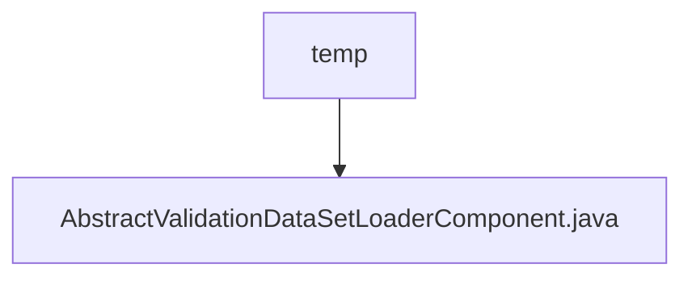

# 基础信息

|      |      |
|------|------|
| 名称 | temp |
| 编码语言 | .java |
| 代码路径 | WeFe/board/board-service/src/main/java/com/welab/wefe/board/service/component/temp |
| 包名 | docs.board.board-service.src.main.java.com.welab.wefe.board.service.component.temp |
| 概述说明 | 抽象类AbstractValidationDataSetLoaderComponent继承AbstractComponent，实现任务参数创建、结果获取、输入输出匹配等方法，包含静态Params类。 |

# 说明

这是一个抽象类AbstractValidationDataSetLoaderComponent，继承自AbstractComponent，泛型参数为内部类Params。该类主要定义了数据验证集加载功能，包含多个重写方法：checkBeforeBuildTask用于构建前检查，createTaskParams创建任务参数，getAllResult和getResult获取任务结果，inputs定义输入匹配器（要求NORMAL_DATA_SET类型的BoardDataSet），outputs返回空值。内部静态类Params继承AbstractCheckModel，用于参数传递。整体结构为流程图中数据处理节点提供了基础框架。

### 包内部结构视图

该流程图展示了WeFe项目中一个临时组件目录的结构关系。根节点"temp"表示临时组件目录，它包含一个具体的Java实现文件"AbstractValidationDataSetLoaderComponent.java"。这种结构常见于项目开发过程中存放临时或实验性代码的目录，通常用于功能开发或测试阶段。

# 文件列表

| 名称   | 类型  | 说明 |
|-------|------|-------------|
| [AbstractValidationDataSetLoaderComponent.java](AbstractValidationDataSetLoaderComponent.md) | file | 抽象类AbstractValidationDataSetLoaderComponent继承AbstractComponent，实现任务参数创建、结果获取、输入输出匹配等方法，包含静态Params类。 |

