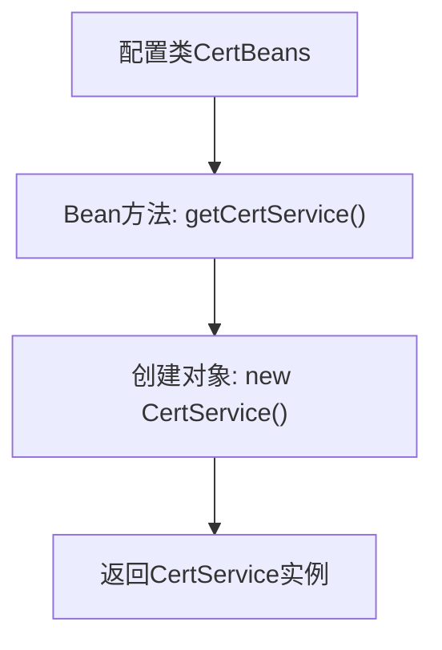

# 基础信息

|      |      |
|------|------|
| 名称 | CertBeans |
| 编码语言 | .java |
| 代码路径 | WeFe/board/board-service/src/main/java/com/welab/wefe/board/service/config/CertBeans.java |
| 包名 | com.welab.wefe.board.service.config |
| 依赖项 | ['com.webank.cert.toolkit.service.CertService', 'org.springframework.context.annotation.Bean', 'org.springframework.context.annotation.Configuration'] |
| 概述说明 | Java配置类CertBeans定义了一个Bean方法getCertService，返回CertService实例。 |

# 说明

这是一个名为CertBeans的Java配置类，使用@Configuration注解标记。类中定义了一个名为getCertService的Bean方法，使用@Bean注解标注。该方法创建并返回一个新的CertService实例。这个配置类的作用是提供CertService的Bean定义，供Spring容器管理。整个配置简洁明了，没有额外的依赖或参数设置。

# 类列表 Class Summary

| 名称   | 类型  | 说明 |
|-------|------|-------------|
| CertBeans | class | Java配置类CertBeans定义了一个Bean方法getCertService，返回CertService实例。 |


## 类 CertBeans

|      |      |
|------|------|
| 访问范围 | @Configuration;public |
| 类型 | class |
| 名称 | CertBeans |
| 说明 | Java配置类CertBeans定义了一个Bean方法getCertService，返回CertService实例。 |


### UML类图

```mermaid
classDiagram
    class CertBeans {
        +CertService getCertService() CertService
    }
    class CertService {
    }
    CertBeans --> CertService : <<create>> 
    // CertBeans配置类负责创建CertService实例
    // 通过@Bean注解将CertService纳入Spring容器管理
```

这段代码展示了一个Spring配置类CertBeans，它通过@Bean注解定义了一个工厂方法getCertService()，用于创建并返回CertService实例。类图清晰地表明了CertBeans对CertService的创建依赖关系，符合Spring IoC容器的管理方式。该配置类使得CertService可以被其他组件通过依赖注入的方式使用，体现了Spring框架的核心控制反转特性。整个结构简洁但完整，符合企业级应用的标准配置模式。


### 内部方法调用关系图



该流程图描述了Spring配置类CertBeans的核心逻辑。CertBeans类通过@Configuration注解标记为配置类，其中定义了一个@Bean注解的方法getCertService()。当Spring容器启动时，会调用该方法创建一个CertService实例并纳入容器管理。整个过程展示了从配置类到Bean实例生成的完整流程，体现了Spring依赖注入的基本原理。

### 字段列表 Field List

| 名称  | 类型  | 说明 |
|-------|-------|------|

### 方法列表

| 名称  | 类型  | 说明 |
|-------|-------|------|
| getCertService | CertService | Spring Bean定义，创建并返回CertService实例。 |


