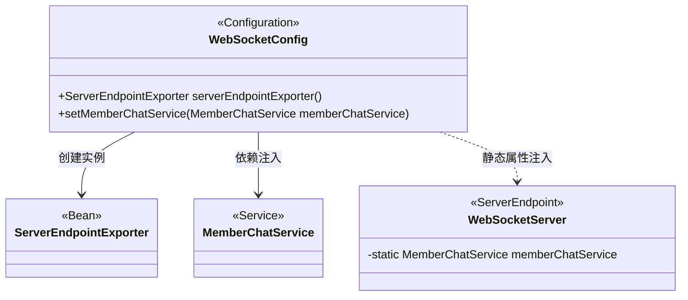
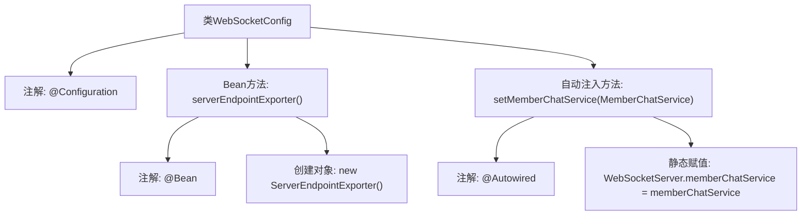

# 基础信息

|      |      |
|------|------|
| 名称 | WebSocketConfig |
| 编码语言 | .java |
| 代码路径 | WeFe/board/board-service/src/main/java/com/welab/wefe/board/service/config/WebSocketConfig.java |
| 包名 | com.welab.wefe.board.service.config |
| 依赖项 | ['com.welab.wefe.board.service.service.MemberChatService', 'com.welab.wefe.board.service.service.WebSocketServer', 'org.springframework.beans.factory.annotation.Autowired', 'org.springframework.context.annotation.Bean', 'org.springframework.context.annotation.Configuration', 'org.springframework.web.socket.server.standard.ServerEndpointExporter'] |
| 概述说明 | WebSocket配置类，注册端点导出器并手动注入聊天服务到全局变量。 |

# 说明

该配置类用于WebSocket服务端设置。首先定义了一个ServerEndpointExporter Bean，用于自动注册带有@ServerEndpoint注解的WebSocket端点。其次通过自动装配方式，将MemberChatService注入到WebSocketServer的静态变量中，解决了SpringBoot WebSocket因每个客户端连接创建独立实例而导致的依赖注入失效问题。

# 类列表 Class Summary

| 名称   | 类型  | 说明 |
|-------|------|-------------|
| WebSocketConfig | class | WebSocket配置类，注册ServerEndpointExporter以支持WebSocket端点，并通过自动注入为WebSocketServer设置全局MemberChatService。 |

## 类 WebSocketConfig

|      |      |
|------|------|
| 访问范围 | @Configuration;public |
| 类型 | class |
| 名称 | WebSocketConfig |
| 说明 | WebSocket配置类，注册ServerEndpointExporter以支持WebSocket端点，并通过自动注入为WebSocketServer设置全局MemberChatService。 |

### UML类图

这段代码展示了Spring Boot中WebSocket的配置类WebSocketConfig，它通过@Bean注解注册ServerEndpointExporter来扫描@ServerEndpoint注解的端点，并通过setter方法将MemberChatService静态注入到WebSocketServer中。类图清晰地呈现了配置类与三个关键组件（ServerEndpointExporter、MemberChatService和WebSocketServer）之间的关系，其中WebSocketServer作为服务端点持有静态的MemberChatService引用，这种设计解决了WebSocket单例与Spring Bean管理的冲突问题。

### 内部方法调用关系图

该流程图描述了SpringBoot WebSocket配置类的核心结构。类通过@Configuration标记为配置类，提供两个关键功能：1) 通过@Bean注册ServerEndpointExporter以支持@ServerEndpoint注解；2) 通过@Autowired自动注入MemberChatService到WebSocketServer的静态变量，解决WebSocket多实例导致的依赖注入问题。箭头清晰展示了注解与方法、方法内部逻辑的层级调用关系。

### 字段列表 Field List

| 名称  | 类型  | 说明 |
|-------|-------|------|

### 方法列表

| 名称  | 类型  | 说明 |
|-------|-------|------|
| setMemberChatService | void | 使用@Autowired注解注入MemberChatService，并将其赋值给WebSocketServer的静态成员变量memberChatService。 |
| serverEndpointExporter | ServerEndpointExporter | 该代码定义了一个Spring Bean，用于导出WebSocket端点，以便支持WebSocket通信。 |

