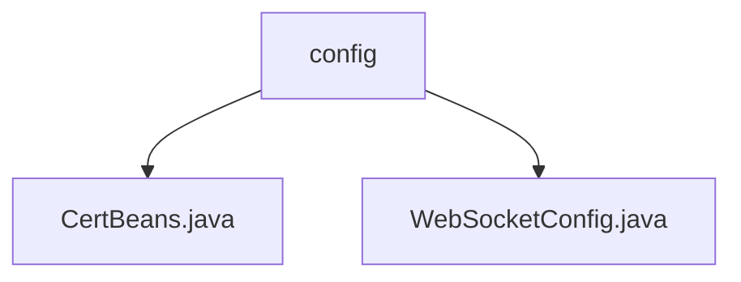

# 基础信息

|      |      |
|------|------|
| 名称 | config |
| 编码语言 | .java |
| 代码路径 | WeFe/board/board-service/src/main/java/com/welab/wefe/board/service/config |
| 包名 | docs.board.board-service.src.main.java.com.welab.wefe.board.service.config |
| 概述说明 | CertBeans是Java配置类，提供CertService的Bean定义。WebSocketConfig配置类注册WebSocket端点并解决依赖注入问题。 |

# 说明

## 概述  
该模块核心职责是提供Spring容器管理的Bean配置，包含证书服务和WebSocket服务两类配置。接口规范涉及@Bean方法定义和静态依赖注入，关键数据结构包括CertService和ServerEndpointExporter。外部依赖仅需Spring框架基础组件。例如CertBeans创建无参CertService实例，WebSocketConfig通过静态变量解决WebSocket依赖注入问题。

## 主要业务场景  
模块支持两种典型场景：证书服务初始化和WebSocket服务部署。业务流程采用标准Spring Bean管理机制，类似工厂模式生成服务实例。交互模式包含自动注册（如@ServerEndpoint处理）和跨实例依赖共享（如静态MemberChatService注入）。完整功能覆盖从基础配置到实时通信需求，例如证书校验和成员聊天双业务集成。

### 包内部结构视图

该流程图展示了WeFe项目中board-service模块的配置文件结构。根节点"config"下包含两个Java配置文件：CertBeans.java和WebSocketConfig.java，分别用于证书管理和WebSocket配置。这种层级关系清晰地反映了项目配置模块的组织方式，便于开发者快速定位相关配置文件。

# 文件列表

| 名称   | 类型  | 说明 |
|-------|------|-------------|
| [CertBeans.java](CertBeans.md) | file | Java配置类CertBeans定义了一个Bean方法getCertService，返回CertService实例。 |
| [WebSocketConfig.java](WebSocketConfig.md) | file | WebSocket配置类，注册端点导出器并手动注入聊天服务到全局变量。 |

