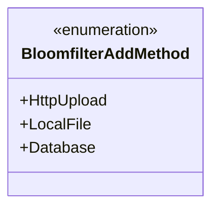
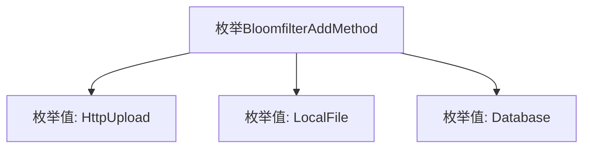

# 基础信息

|      |      |
|------|------|
| 名称 | BloomfilterAddMethod |
| 编码语言 | .java |
| 代码路径 | WeFe/board/board-service/src/main/java/com/welab/wefe/board/service/constant/BloomfilterAddMethod.java |
| 包名 | com.welab.wefe.board.service.constant |
| 依赖项 | [] |
| 概述说明 | BloomfilterAddMethod枚举定义了三种添加方法：HttpUpload、LocalFile和Database。 |

# 说明

这是一个名为BloomfilterAddMethod的枚举类型，定义了三种添加布隆过滤器数据的方法：HttpUpload表示通过HTTP上传方式添加，LocalFile表示通过本地文件方式添加，Database表示通过数据库方式添加。枚举类型简洁明了地列出了三种不同的数据来源途径。

# 类列表 Class Summary

| 名称   | 类型  | 说明 |
|-------|------|-------------|
| BloomfilterAddMethod | enum | BloomfilterAddMethod枚举定义了三种布隆过滤器添加方式：HttpUpload、LocalFile和Database。 |

## 类 BloomfilterAddMethod

|      |      |
|------|------|
| 访问范围 | public |
| 类型 | enum |
| 名称 | BloomfilterAddMethod |
| 说明 | BloomfilterAddMethod枚举定义了三种布隆过滤器添加方式：HttpUpload、LocalFile和Database。 |

### UML类图

这段类图展示了一个名为BloomfilterAddMethod的枚举类型，包含三个枚举常量：HttpUpload、LocalFile和Database。该枚举可能用于表示布隆过滤器数据添加的不同方法来源，如通过HTTP上传、本地文件加载或数据库读取。枚举类型在类图中用<<enumeration>>标记，清晰地表明了其不可实例化且固定值的特性。

### 内部方法调用关系图

该流程图展示了BloomfilterAddMethod枚举的结构，包含三个枚举值：HttpUpload、LocalFile和Database。枚举用于定义布隆过滤器添加数据的三种不同方法，分别对应HTTP上传、本地文件读取和数据库查询三种数据来源方式。每个枚举值都是该枚举类型的实例，可用于类型安全的配置选项或模式选择。

### 字段列表 Field List

| 名称  | 类型  | 说明 |
|-------|-------|------|

### 方法列表

| 名称  | 类型  | 说明 |
|-------|-------|------|

