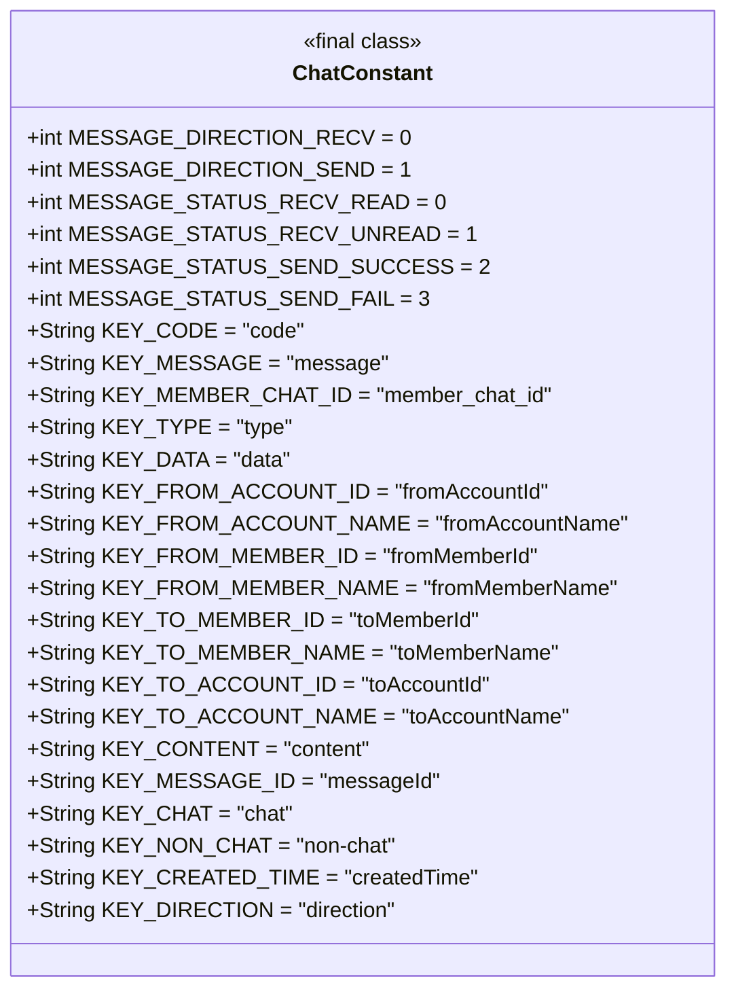
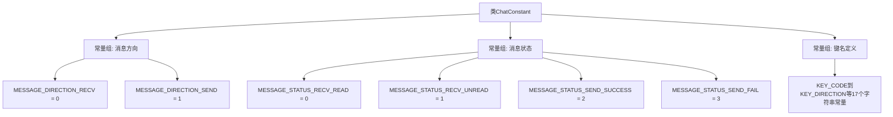

# 基础信息

|      |      |
|------|------|
| 名称 | ChatConstant |
| 编码语言 | .java |
| 代码路径 | WeFe/board/board-service/src/main/java/com/welab/wefe/board/service/constant/ChatConstant.java |
| 包名 | com.welab.wefe.board.service.constant |
| 依赖项 | [] |
| 概述说明 | ChatConstant类定义了消息方向、状态常量及键名，用于消息收发处理和数据结构标识。 |

# 说明

该代码定义了一个名为ChatConstant的公共类，包含消息方向和状态的静态常量，以及用于聊天系统的键值对字符串常量。消息方向常量区分接收和发送，状态常量涵盖已读、未读、发送成功和发送失败。键值对常量用于标识代码、消息内容、成员ID、账户信息、消息ID、聊天类型、创建时间和方向等关键字段。这些常量为聊天功能提供了标准化的命名和值。

# 类列表 Class Summary

| 名称   | 类型  | 说明 |
|-------|------|-------------|
| ChatConstant | class | ChatConstant类定义了消息方向、状态常量及键名，包括接收/发送状态、已读/未读标识及各类消息相关键值。 |

## 类 ChatConstant

|      |      |
|------|------|
| 访问范围 | public |
| 类型 | class |
| 名称 | ChatConstant |
| 说明 | ChatConstant类定义了消息方向、状态常量及键名，包括接收/发送状态、已读/未读标识及各类消息相关键值。 |

### UML类图

该代码定义了一个名为ChatConstant的final类，包含多个静态常量字段，用于表示消息方向、状态以及各种键名。这些常量在聊天系统中用于标识消息属性、状态和数据结构中的键值对，便于代码中统一引用和维护。类图中展示了所有公有静态常量字段及其类型和默认值。

### 内部方法调用关系图

该流程图展示了ChatConstant类的三组常量定义结构：消息方向常量(接收/发送)、消息状态常量(已读/未读/发送成功/失败)以及键名字符串常量组。所有常量均为public final静态类型，用于统一管理聊天模块的协议字段和状态码，形成清晰的常量分类层级关系。

### 字段列表 Field List

| 名称  | 类型  | 说明 |
|-------|-------|------|
| KEY_CONTENT = "content" | String | 定义了一个公共静态常量字符串KEY_CONTENT，值为"content"。 |
| KEY_MESSAGE = "message" | String | 定义静态常量字符串KEY_MESSAGE，值为"message"。 |
| KEY_CODE = "code" | String | 定义常量字符串KEY_CODE，值为"code"。 |
| KEY_FROM_MEMBER_ID = "fromMemberId" | String | 定义静态常量字符串KEY_FROM_MEMBER_ID，值为"fromMemberId"。 |
| KEY_TYPE = "type" | String | 定义了一个公共静态不可变字符串常量KEY_TYPE，其值为"type"。 |
| MESSAGE_DIRECTION_RECV = 0 | int | 定义静态常量MESSAGE_DIRECTION_RECV，值为0，表示消息接收方向。 |
| KEY_FROM_MEMBER_NAME = "fromMemberName" | String | 定义静态常量字符串KEY_FROM_MEMBER_NAME，值为"fromMemberName"。 |
| KEY_DATA = "data" | String | 定义常量字符串KEY_DATA，值为"data"。 |
| KEY_FROM_ACCOUNT_ID = "fromAccountId" | String | 定义静态常量字符串KEY_FROM_ACCOUNT_ID，值为"fromAccountId"。 |
| KEY_TO_ACCOUNT_ID = "toAccountId" | String | 定义常量字符串KEY_TO_ACCOUNT_ID，值为"toAccountId"，用于标识目标账户ID。 |
| KEY_FROM_ACCOUNT_NAME = "fromAccountName" | String | 定义静态常量字符串KEY_FROM_ACCOUNT_NAME，值为"fromAccountName"。 |
| MESSAGE_STATUS_RECV_UNREAD = 1 | int | 消息状态常量：未读接收消息，值为1。 |
| MESSAGE_STATUS_SEND_SUCCESS = 2 | int | 消息发送成功状态码为2。 |
| MESSAGE_STATUS_RECV_READ = 0 | int | 消息状态：已接收并阅读，值为0。 |
| KEY_TO_ACCOUNT_NAME = "toAccountName" | String | 定义静态常量字符串KEY_TO_ACCOUNT_NAME，值为"toAccountName"。 |
| KEY_MEMBER_CHAT_ID = "member_chat_id" | String | 定义常量字符串KEY_MEMBER_CHAT_ID，值为"member_chat_id"。 |
| KEY_TO_MEMBER_ID = "toMemberId" | String | 定义静态常量字符串KEY_TO_MEMBER_ID，值为"toMemberId"。 |
| MESSAGE_STATUS_SEND_FAIL = 3 | int | 定义静态常量MESSAGE_STATUS_SEND_FAIL，值为3，表示消息发送失败状态。 |
| KEY_TO_MEMBER_NAME = "toMemberName" | String | 定义静态常量字符串KEY_TO_MEMBER_NAME，值为"toMemberName"。 |
| MESSAGE_DIRECTION_SEND = 1 | int | 定义静态常量MESSAGE_DIRECTION_SEND，值为1，表示消息发送方向。 |
| KEY_MESSAGE_ID = "messageId" | String | 定义常量字符串KEY_MESSAGE_ID，值为"messageId"，用于标识消息ID。 |
| KEY_CHAT = "chat" | String | 定义静态常量KEY_CHAT，值为"chat"，不可修改。 |
| KEY_NON_CHAT = "non-chat" | String | 定义不可变静态字符串常量KEY_NON_CHAT，值为"non-chat"。 |
| KEY_CREATED_TIME = "createdTime" | String | 定义常量字符串KEY_CREATED_TIME，值为"createdTime"，表示创建时间键名。 |
| KEY_DIRECTION = "direction" | String | 定义静态常量字符串KEY_DIRECTION，值为"direction"。 |

### 方法列表

| 名称  | 类型  | 说明 |
|-------|-------|------|

