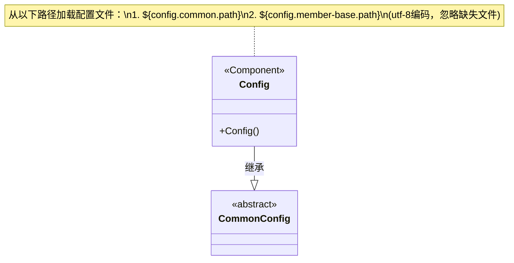
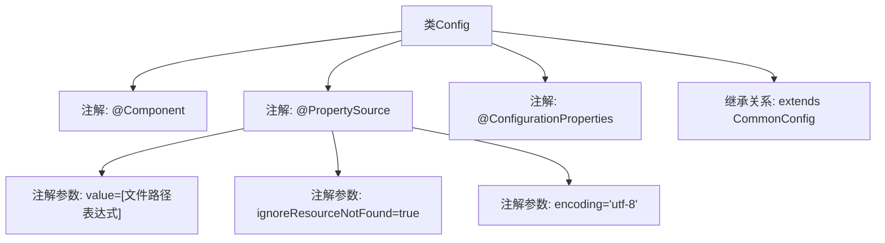

# 基础信息

|      |      |
|------|------|
| 名称 | Config |
| 编码语言 | .java |
| 代码路径 | WeFe/board/board-service/src/main/java/com/welab/wefe/board/service/constant/Config.java |
| 包名 | com.welab.wefe.board.service.constant |
| 依赖项 | ['com.welab.wefe.common.web.config.CommonConfig', 'org.springframework.boot.context.properties.ConfigurationProperties', 'org.springframework.context.annotation.PropertySource', 'org.springframework.stereotype.Component'] |
| 概述说明 | 该代码定义了一个配置类Config，继承CommonConfig，通过@PropertySource加载外部配置文件，支持UTF-8编码，忽略缺失文件。 |

# 说明

该代码片段定义了一个名为Config的Spring组件类，继承自CommonConfig。通过@Component注解将其注册为Spring容器管理的Bean。使用@PropertySource注解加载两个外部配置文件路径，路径通过${config.common.path}和${config.member-base.path}属性动态指定。设置ignoreResourceNotFound为true允许配置文件不存在时不报错，并指定文件编码为UTF-8。@ConfigurationProperties注解表明该类将绑定外部配置属性。整体实现了一个可扩展的配置类，支持多环境配置文件加载。

# 类列表 Class Summary

| 名称   | 类型  | 说明 |
|-------|------|-------------|
| Config | class | Java配置类，加载外部属性文件，支持UTF-8编码，忽略缺失文件，继承通用配置。 |

## 类 Config

|      |      |
|------|------|
| 访问范围 | @Component;@PropertySource(;        value = {;                "file:${config.common.path}",;                "file:${config.member-base.path}";        },;        ignoreResourceNotFound = true,;        encoding = "utf-8";);@ConfigurationProperties;public |
| 类型 | class |
| 名称 | Config |
| 说明 | Java配置类，加载外部属性文件，支持UTF-8编码，忽略缺失文件，继承通用配置。 |

### UML类图

这段类图展示了Spring框架中的配置类继承关系。Config类作为@Component组件，通过@PropertySource注解从两个外部文件路径动态加载配置（支持UTF-8编码且允许文件缺失），同时继承自抽象父类CommonConfig。这种设计实现了配置信息的层级化管理，既复用父类的公共配置结构，又支持通过外部文件灵活覆盖属性值，是典型的Spring Boot配置解决方案。

### 内部方法调用关系图

该流程图展示了Config类的结构，它是一个Spring组件（@Component），通过@PropertySource注解加载外部配置文件，支持多路径配置且忽略缺失文件，指定UTF-8编码。同时标记为配置属性类（@ConfigurationProperties），并继承CommonConfig父类。图中清晰呈现了注解层级关系和类继承体系。

### 字段列表 Field List

| 名称  | 类型  | 说明 |
|-------|-------|------|

### 方法列表

| 名称  | 类型  | 说明 |
|-------|-------|------|

